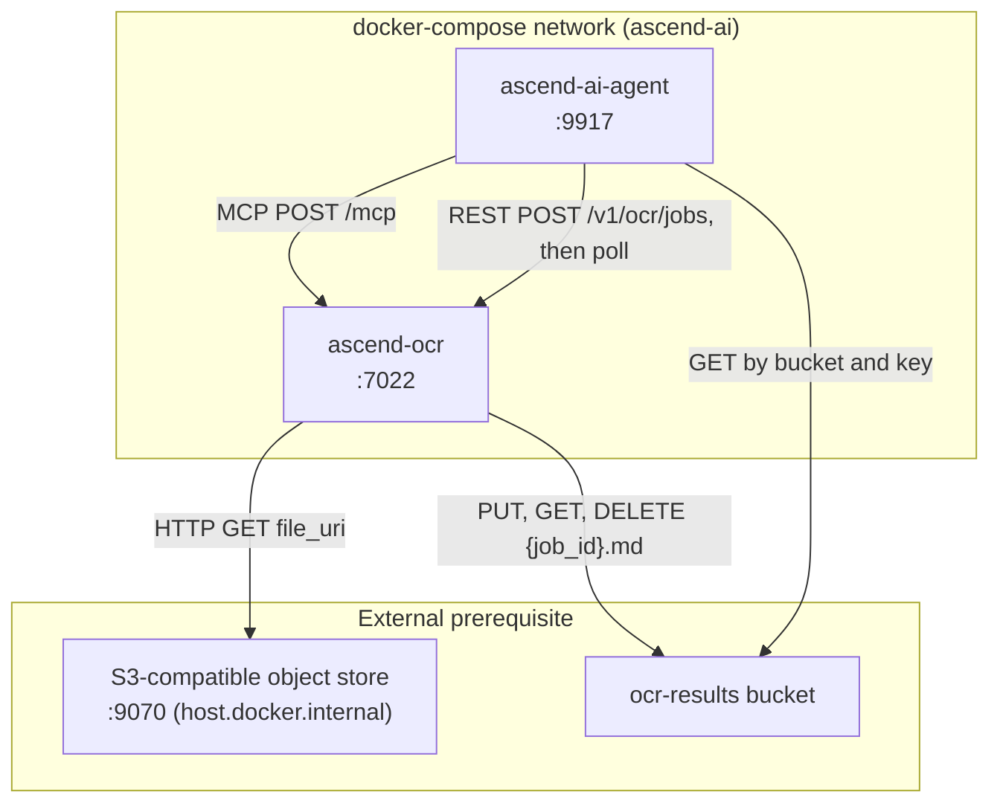

# 7. Deployment View

---

### docker-compose placement

ascend-ocr runs as the `ascend-ocr` service in `compose.yaml` (root of the monorepo). It is grouped
with the other non-scraper support services - Docling Serve, Unstructured API, WeatherMCP, ascend-audio-scribe, AscendMemory.


```mermaid
graph TB
    subgraph "docker-compose network (ascend-ai)"
        Agent["ascend-ai-agent<br/>:9917"]
        PaddleOCR["ascend-ocr<br/>:7022"]
    end

    subgraph "External prerequisite"
        ObjectStore["S3-compatible object store<br/>:9070 (host.docker.internal)"]
        Bucket["ocr-results bucket"]
    end

    Agent -->|"MCP POST /mcp"| PaddleOCR
    Agent -->|"REST POST /v1/ocr/jobs, then poll"| PaddleOCR
    PaddleOCR -->|"HTTP GET file_uri"| ObjectStore
    PaddleOCR -->|"PUT, GET, DELETE {job_id}.md"| Bucket
    Agent -->|"GET by bucket and key"| Bucket
```

The object store is not a compose service; it runs on the host and is reached via `host.docker.internal:9070`.
Locally it is provided by a self-hosted S3-compatible emulator. Since
[ADR-009](../decisions/ADR-009-results-in-object-storage.md) it is not only a source of documents but the one
external service this module depends on: every successful reading writes one Markdown object to
`OCR_RESULT_S3_BUCKET`.

**What the bucket has to allow, and what it must not.** The credentials this service is given need `HeadBucket`,
`CreateBucket`, `PutObject`, `GetObject` and `DeleteObject` on that one bucket. The bucket must allow neither
anonymous listing nor anonymous reads: the job identifier is the only credential a result has, listing would
enumerate every result, and a public read would put a document's extracted text one guess away from anyone who can
reach the store.

**The bucket is this service's alone.** It is deliberately not the agent's `knowledge-base`, whose contents the
agent's manual ingestion lists and indexes as source documents, which would turn every OCR result into a new source
document. Because nothing else writes to `ocr-results`, an object lifecycle rule that expires everything older than
`OCR_JOB_RETENTION_SECONDS` is correct there and is the recommended way to collect an object left behind by a partial
failure, which the service itself cannot distinguish from another writer's object.

**The jobs directory.** Job records live at `OCR_JOBS_DIR` inside the container, which survives a restart and not a
recreate. The text survives either way, because it is in the bucket. What a recreate destroys is therefore the
address rather than the text: an operator can still fetch `{job_id}.md`, and a caller holding the identifier cannot,
because the service answers `JOB_NOT_FOUND`. Mount a volume at `OCR_JOBS_DIR` if the address must survive a recreate
too. That is a documented option rather than a default.

The network alias `ascend-ocr` (and the hostname `ascend-ocr`) allows the ascend-ai-agent to reach the
service by name inside the compose network.

---

### Healthcheck wiring

The Dockerfile `HEALTHCHECK` is deliberately pointed at `/health`, not `/ready`
(`apps/ascend-ocr/Dockerfile:58` sets no explicit `HEALTHCHECK` instruction - the base image default applies, or the
compose `healthcheck` stanza should be set). The operator should configure the load balancer or Kubernetes
`readinessProbe` to poll `/ready` so traffic is held until `engine_warm=true`. See
[ADR-004](../decisions/ADR-004-liveness-readiness-split.md).

---

### Environment variables

| Variable | Default | Description |
| :--- | :--- | :--- |
| `API_HOST` | `0.0.0.0` | Bind address for Uvicorn. |
| `API_PORT` | `7022` | Listen port. |
| `LOG_LEVEL` | `INFO` | Uvicorn log level (`DEBUG`, `INFO`, `WARNING`, `ERROR`, `CRITICAL`). |
| `DEFAULT_LANGUAGE` | `en` | Language warmed up at startup; used when `lang` is absent from the request. |
| `MAX_FILE_SIZE_MB` | `50` | Cap on uploaded or fetched file size in megabytes. |
| `ENGINE_CACHE_MAX_SIZE` | `2` | Maximum number of `PaddleOCR` engines held in the LRU cache, which is keyed by model pair rather than by language. The pre-cached default pair plus one slot that stays empty while every supported language reads with that pair, and holds a language opted back in with a pair of its own. |
| `OCR_TEXT_DETECTION_MODEL` | `PP-OCRv6_small_det` | Detection model for every language the default pair covers. See [ADR-007](../decisions/ADR-007-explicit-ocr-model-selection.md). |
| `OCR_TEXT_RECOGNITION_MODEL` | `PP-OCRv6_small_rec` | Recognition model for the same languages. The Dockerfile bakes whichever pair these two name. |
| `SUPPORTED_LANGUAGES` | `en,pl,de,fr,es,it,pt,nl,ch,japan` | Allowlist of valid language codes. A submission in any other code is refused with 400 `UNSUPPORTED_LANGUAGE` before anything is queued. `ru` and `korean` are switched off, see [ADR-011](../decisions/ADR-011-explicit-preprocessing-and-straighten.md). |
| `MCP_FILE_URI_ROOT` | _(unset)_ | Enables `file://` support; URIs must resolve inside this directory. Unset = `file://` disabled. |
| `MCP_ALLOWED_HOSTS` | _(empty)_ | Comma-separated hostnames exempt from the SSRF IP block. Set to `host.docker.internal,localhost,127.0.0.1` for the standard compose stack, since the S3-compatible object store is reached over the host-published endpoint. |
| `MCP_DOWNLOAD_TIMEOUT_SECONDS` | `30` | Total timeout for the `aiohttp` download session. |
| `OCR_WORKER_COUNT` | `1` | Inference workers and admission-gate permits, from one setting. See "Memory model and the single worker" below. |
| `OCR_PAGE_ALLOWANCE_HEADROOM` | `4.5` | The only configured time input: a page is allowed this multiple of its own engine's worst measured page, 112.95 s on the small pair every supported language reads with, 4.5 times a dense Polish A4 prose page measured at 25.1 s with the engine's threads capped to the container's CPUs (the earlier 50.4 s was measured with PaddleOCR's 10 threads throttled under 4 CPUs). See [ADR-010](../decisions/ADR-010-quality-modes-and-service-side-rendering.md). |
| `OCR_DISPATCH_MARGIN_SECONDS` | `5` | Headroom subtracted from the worker's own budget. |
| `OCR_QUALITY_NORMAL` | `150:1024` | The `normal` quality mode's render resolution and detector bound, as one pair. |
| `OCR_QUALITY_HIGH` | `300:1536` | The `high` quality mode's pair, and the default a caller gets. See [ADR-010](../decisions/ADR-010-quality-modes-and-service-side-rendering.md). |
| `OCR_MAX_SOURCE_PIXELS` | `89478485` | Decompression-bomb ceiling on a raster image frame, checked from the file header before decode. |
| `OCR_POOL_REBUILD_MAX_CONSECUTIVE` | `3` | Consecutive failed pool rebuilds before the service gives up and stays not-ready. |
| `OCR_JOB_MAX_PAGES` | `100` | Page ceiling per document, and the only page ceiling. |
| `OCR_JOBS_DIR` | `<system temp>/ascend-ocr-jobs` | Job records, submitted bytes and progress files. Mount a volume here if records must survive a container recreate. |
| `OCR_JOB_RETENTION_SECONDS` | `3600` | How long a finished record and its stored object live after the work finished. |
| `OCR_JOB_MAX_RETAINED` | `1000` | Finished records retained before the oldest is evicted. |
| `OCR_JOB_QUEUE_MAX_PAGES` | `200` | Pages that may be waiting. Cannot be below `OCR_JOB_MAX_PAGES`. |
| `OCR_JOB_QUEUE_MAX_DOCUMENTS` | `8` | Documents that may be waiting. |
| `OCR_RESULT_S3_ENDPOINT` | `http://localhost:9070` | Where results are written. |
| `OCR_RESULT_S3_PUBLIC_ENDPOINT` | the endpoint | The address a presigned URL carries. |
| `OCR_RESULT_S3_BUCKET` | `ocr-results` | Headed and created at startup. |
| `OCR_RESULT_S3_ACCESS_KEY`, `OCR_RESULT_S3_SECRET_KEY` | empty | Static credentials. Never printed in the banner or a log line. |

The `compose.yaml` service block sets `API_PORT`, `API_HOST`, `LOG_LEVEL`, `DEFAULT_LANGUAGE` and
`MAX_FILE_SIZE_MB` explicitly, plus the four result-store variables: `OCR_RESULT_S3_ENDPOINT` to
`http://host.docker.internal:9070`, `OCR_RESULT_S3_PUBLIC_ENDPOINT` to `http://localhost:9070`,
`OCR_RESULT_S3_BUCKET` to `ocr-results`, and the credentials from the host environment. It no longer sets
`OCR_REQUEST_TIMEOUT` or `OCR_PAGE_TIMEOUT_SECONDS`: both are deleted, and the per-page allowance is derived in
code from `OCR_PAGE_ALLOWANCE_HEADROOM` and each engine's measured worst page. It also
sets `MCP_ALLOWED_HOSTS` to `host.docker.internal,localhost,127.0.0.1` and `MCP_DOWNLOAD_TIMEOUT_SECONDS` to 30,
which is what lets the MCP e2e tests reach the host-published object store without any manual addition. See
[e2e/testing/6-mcp-ocr-test.md](../../../e2e/testing/6-mcp-ocr-test.md).

---

### Memory model and the single worker

The container carries a 4 GiB memory limit and a 4.0 CPU limit (`compose.yaml`). Every engine runs as many compute
threads as that CPU limit allows: `build_engine` passes `cpu_threads` equal to `detect_cpu_limit()`, which reads the
cgroup quota (`src/config/cpu_limits.py`), and OpenCV is capped to the same number at import. The argument is passed
explicitly because PaddleOCR otherwise hands paddlex its own default of 10 threads, which overrides
`PADDLE_PDX_CPU_NUM_THREADS`, so before 2026-09-25 the worker ran about 8 busy threads under the 4-CPU quota and was
throttled in nearly every scheduling period. The times in the first two tables below were measured before that fix,
and the third table measures them again with the cap in force. Peak memory for one OCR call on
the `PP-OCRv6_small` pair, the cgroup's `memory.peak` in a Linux container with 4 CPUs, worst of three runs:

| Page | Mode | Peak | Time, fastest of three |
| :--- | :--- | :--- | :--- |
| A4 at 300 dots per inch, 2480 x 3508, 50 lines | `high` | 1016 MiB | 20.5 s |
| 4200 x 4200, 50 lines, the high mode's worst case | `high` | 1236 MiB | 24.6 s |
| 3162 x 4200 photo read with `straighten`, the worst of six photos | `high` | 2771 MiB | 28.4 s |
| 2100 x 2100, 50 lines, the normal mode's worst case | `normal` | 858 MiB | 18.3 s |

Dense prose pages, measured the same way on image `385d160c20a0` with the recognition batch of 1 ([ADR-011](../decisions/ADR-011-explicit-preprocessing-and-straighten.md), second
amendment), are slower than every page above, and the straightened one set the page allowance until the thread cap:

| Page | Mode | Peak | Time |
|---|---|---|---|
| Dense English A4 prose at 300 dpi, 50 lines, 4162 characters | `high` | 1115 MiB | 47.4 s |
| The same page, straightened | `high` | 1972 MiB | 50.4 s |
| Dense Polish A4 prose at 300 dpi, 48 lines, 4000 characters | `high` | 1074 MiB | 42.0 s |
| The dense English page | `normal` | 822 MiB | 41.8 s |

On the same image the 4200 x 4200 page above took 22.3 s at 1220 MiB and the 778 x 932 px scan fixture
`argent-saga-chronicles-page1.png` 28.2 s at 752 MiB. No dense page peaked above a figure the banner already prices.

Measured again with the thread cap in force, on image `9c100951f59b`, the same probe and container set-up, on a host
54 to 92 percent busy (a busy host only makes a time longer, so each fastest-of-three is an upper bound), the page
times roughly halve and the dense Polish page sets the page allowance, 4.5 x 25.1 s = 112.95 s ([ADR-011](../decisions/ADR-011-explicit-preprocessing-and-straighten.md), third amendment):

| Page | Mode | Peak | Time, fastest of three |
|---|---|---|---|
| Dense English A4 prose at 300 dpi, 50 lines, 4162 characters | `high` | 1132 MiB | 22.1 s |
| The same page, straightened | `high` | 1958 MiB | 24.9 s |
| Dense Polish A4 prose at 300 dpi, 48 lines, 4000 characters | `high` | 1070 MiB | 25.1 s |
| The dense English page | `normal` | 827 MiB | 22.7 s |
| 4200 x 4200, 50 lines | `high` | 1213 MiB | 15.8 s |
| 3162 x 4200 flat phone photo read with `straighten` | `high` | 2636 MiB | 19.5 s |
| `argent-saga-chronicles-page1.png`, 778 x 932 | `high` | 807 MiB | 15.6 s |

No page peaked above a figure the banner already prices.

Straightening roughly doubles a call: the same six photos read plain peaked between 1097 and 1161 MiB. Each quality
mode's detector bound caps what detection sees whatever the page's own resolution, which is why that bound exists
(see [ADR-006](../decisions/ADR-006-detector-input-bound.md)). A loaded engine holds about 333 MiB, of which about
124 MiB is the Python and Paddle runtime every process carries, so a further engine idling in the cache costs about
209 MiB. The API process at rest holds 259 MiB. Each page of a document adds about 11.5 MiB of retained result on
top, once, and that one term is carried forward from the older fit rather than re-measured. A direct run of the whole
service on the 4200 x 4200 English page peaked at 1367 MiB for the container, API process included.

These figures supersede the ones earlier revisions of this page carried. The probe behind those sampled memory at
intervals on the owner's machine and missed the peak, so its statement that one page costs about 440 MB was wrong,
and so were the 394, 441, 501 and 808 MiB it gave for the small pair.

`ru` and `korean` are switched off. They loaded `PP-OCRv5_server_det`, which the container measurement put at
9297 MiB and 71.2 s on the A4 page and 12754 MiB and 96.0 s on the 4200 x 4200 page in `high` mode, and 5958 MiB and
51.4 s in `normal` mode, the worst of them above the 12 GiB limit the container then carried. The 517, 510, 539, 720
and 807 figures the earlier probe gave for that detector are superseded with the rest. See
[ADR-011](../decisions/ADR-011-explicit-preprocessing-and-straighten.md).

The earlier fitted model,

```text
peak_MiB = 635 + 5302 x megapixels_of_the_largest_single_page + 11.5 x pages
```

fitted at a correlation of 0.9993 (see `openspec/changes/stop-ocr-getting-stuck-on-large-jobs/design.md`, "The
measured memory model"), was fitted on `PP-OCRv5_server_det` under PaddleOCR 3.6.0, and the memory blow-up it
describes was a defect of that version. Under 3.7.0 it is void for every pair, the one it was fitted on included: it
said an A4 page at 144 dots per inch would cost 11.0 GiB, and the same detector on the same page with detection
unbounded measures 720 MB. (Corrected 2026-09-25: the 720 MB figure came from the probe that missed the peak, and
the fitted model is not void for `PP-OCRv5_server_det` after all: it runs 22 to 41 percent above the container measurement of that detector (11,727 MiB predicted against 9297 measured on the A4 page at 300 dpi, 18,015 against 12,754 on the 4200 x 4200 page, 7275 against 5958 on the 2100 x 2100 page), and eleven to fifteen times above it on the small pair. The banner still uses it only for a pair or an input nobody measured, as an upper bound.)

**The limit is 4 GiB.** It was 12 GiB while the earlier probe's figures stood. The worst straightened call,
2771 MiB, plus the API process at rest, 259 MiB, plus room for one idle engine comes to about 3.1 GiB, and the photos
behind the straightened figure are real phone photos of one printed page rather than synthetic pages.

**`OCR_WORKER_COUNT` is a change to the queue's promise, and a memory multiplier.** One document is read at a time,
and every statement the queue makes about how long a submission waits is computed against that, so raising the count
changes the promise as well as the throughput. It also multiplies the peak:
`service_peak_MiB ~= api_process_MiB + per_call_peak_MiB * OCR_WORKER_COUNT`. One priced straightened call is 2859 of
the container's 4096 MiB, so a second worker would price the service at 5977 MiB and the banner warns, and nothing
has measured two concurrent inferences on this hardware either. The setting deliberately governs both
the `ProcessPoolExecutor`'s `max_workers` and the admission gate's permit count, so the two cannot drift apart.

The startup banner (`src/config/startup_banner.py`) prints the per-call estimate and the resulting service-wide
ceiling for the running configuration, plus one line per quality mode naming its render resolution, its detector
bound and the largest input one inference can receive in it. The estimate is model-aware and mode-aware. For every
engine a supported language can load it prices both quality modes, keeps the costlier, and prints it on one line,
plain and straightened. It then takes a straightened call on the worst engine, plus the measured 209 MiB for each idle
engine `ENGINE_CACHE_MAX_SIZE` lets sit beside it, capped at the number of distinct engines the supported languages
can actually reach, and adds the API process at rest once, whatever the worker count. Every engine line says whether
its figure is measured or fitted. A mode's worst input is a square at the largest
page's long side, 14 inches, rendered at that mode's resolution. For each engine in each mode the banner uses a
measurement of that exact input when one exists, and otherwise the smallest measurement whose input and whose
detection input both cover it.

| Engine and measurement | Input | Detection input | Figure the banner uses |
| :--------------------- | :---- | :-------------- | :--------------------- |
| Engine and measurement | Input | Detection input | Figure the banner uses |
| :--------------------- | :---- | :-------------- | :--------------------- |
| `PP-OCRv6_small_det` / `PP-OCRv6_small_rec`, the normal mode's worst case | 2100 x 2100 | 1024 x 1024 | 858 MiB, measured |
| The same pair, bounded A4 | A4 at 300 dots per inch, 2480 x 3508 | 1086 x 1536 | 1016 MiB, measured |
| The same pair, the high mode's worst case | 4200 x 4200 | 1536 x 1536 | 1236 MiB, measured |
| A straightened call on any pair | | | The plain figure plus 1623 MiB, the largest straighten overhead measured on one photo |
| The same pair, a mode whose worst input no measurement above covers | | | The fitted model, labelled fitted |
| Any other pair, including one an operator configures | | | The fitted model, labelled fitted, an upper bound 22 to 41 percent high on the one detector both it and the container measured |
| Each idle engine the cache holds beside the one reading | | | 209 MiB, measured, a loaded engine's 333 MiB less the 124 MiB runtime |
| The API process at rest | | | 259 MiB, measured, added once |

The straighten overhead is priced per call rather than per input because the unwarping model is the same whichever
pair reads the page, and because no square was measured straightened. The six photos, each 3162 x 4200 and read in
`high` mode, gave these peaks plain and straightened: 1161 and 2651 MiB flat, 1125 and 2682 MiB angled, 1097 and
2666 MiB bent, 1125 and 2655 MiB and 1137 and 2735 MiB crumpled, and 1148 and 2771 MiB turned 90 degrees. The largest
difference, 1623 MiB, is the one the banner adds.

The measured figures come from a Linux container with 4 CPUs on 2026-09-25, image `7b2cb25e7360`, PaddleOCR 3.7.0,
the cgroup's `memory.peak` for a process that loads one engine and reads one page, the worst of three runs, with the
time the fastest of three. The squares and the A4 page are synthetic rendered text with 50 lines, and the photos are
the owner's own phone photos of one printed page. The banner prints this provenance on a line of its own. A direct
run of the service on the 4200 x 4200 page peaked at 1367 MiB against the 259 + 1236 = 1495 MiB the banner prices for
a plain call, so the pricing errs high.

At the shipped defaults normal mode reads at 150 dots per inch with detection bounded to 1024, so its worst input is
a 2100 x 2100 square, 4.41 megapixels, of which detection sees at most 1024 x 1024. That square is measured, so the
small pair prices at 858 MiB there, 2481 MiB straightened. High mode reads at 300 dots per inch with detection bounded
to 1536, so its worst input is the measured 4200 x 4200 square, and the small pair prices at 1236 MiB, 2859 MiB
straightened. Every supported language reads with that one pair, so the cache's second slot holds nothing, and the
service prices at 259 + 2859 = 3118 MiB, 76 percent of the 4 GiB container limit, so the warning below does not fire.
The fitted figure the banner printed before any measurement, 13,343 MiB, exceeded the old 12 GiB limit and warned at
every boot.

**Warn, don't refuse, when the arithmetic doesn't fit.** The same module reads this container's own cgroup memory
ceiling (`src/config/memory_limits.py`, `/sys/fs/cgroup/memory.max` on cgroup v2, falling back to
`/sys/fs/cgroup/memory/memory.limit_in_bytes` on v1) and logs a `WARNING`, distinct from the `INFO` banner block,
when the computed service-wide peak meets or exceeds it. It never refuses to start. A hard refusal was considered and
rejected: the cgroup limit reads as unlimited (`None`) on a bare host process, in this module's own test suite, and
on any deployment without a memory cgroup, so a refusal keyed on it would block every one of those outright, not only
a genuinely oversized configuration. And even a correctly-read limit is not the whole story - the incident that
produced this section's own memory model was a host-level kill with this container's own cgroup ceiling never
reached, so a refusal gated on the per-container number would not even have caught the failure this document exists
to explain. A warning an operator can act on, printed the moment the risk becomes knowable, is what this container's
own visibility can honestly support.

**More than one worker is safe today.** It was not, in three specific ways that stayed invisible until
`OCR_WORKER_COUNT` became a real runtime setting rather than a fixed constant: the readiness signal for "a job is
past its own budget" was a single shared variable that concurrent jobs silently clobbered, the pool-rebuild path
could freeze the entire event loop - not only OCR dispatch - for as long as an unrelated healthy job on a different
worker took to finish, and only the first configured worker was ever proactively warmed at startup, leaving the rest
to pay their own warm-up cost inside a live request. All three are fixed and covered by tests; the full account, with
the exact measurements that proved each one, is in the amendment titled "the overrun signal at more than one worker"
in [ADR-004](../decisions/ADR-004-liveness-readiness-split.md).

---

### Multi-stage Docker build

The Dockerfile uses a two-stage build (`apps/ascend-ocr/Dockerfile`). The builder stage installs dependencies and
pre-caches every model pair a supported language or the default language can reach, by calling `preload_models()`
(line 23), which builds one engine per pair `Settings.reachable_model_pairs()` returns, so the baked models cannot
drift from the deployed configuration. At the shipped defaults that is the one `PP-OCRv6_small` pair, and no
PP-OCRv5 server detector or `korean_` or `eslav_` recogniser is baked. The runtime stage copies site-packages, binaries, and the pre-cached `.paddlex`
model directory from the builder. This means:

- Model downloads do not happen at container start, for any supported language.
- Cold-start warm-up in the lifespan is a model-loading step, not a download step.
- Changing the deployed pair and rebuilding bakes the new pair, with no second edit in the build.
- `ru` and `korean` are not supported languages, so a request in either is refused and never reaches a download.

The runtime container runs as a non-root user (`appuser`).
