# 10. Quality Requirements

---

### Quality tree

```mermaid
graph TB
    Quality["Quality"]
    Quality --> Security
    Quality --> Operational
    Quality --> Contractual
    Quality --> Testability

    Security --> S1["SSRF guard blocks private IPs for http(s):// URIs"]
    Security --> S2["file:// disabled by default; jailed to MCP_FILE_URI_ROOT when enabled"]
    Security --> S3["No internal detail in error responses (stack frames, file paths)"]
    Security --> S4["Non-root container user (appuser)"]

    Operational --> O1["/ready returns not-ready until engine warm - no cold-start traffic"]
    Operational --> O2["Startup banner prints all runtime config at INFO level"]
    Operational --> O3["Evictions from LRU cache logged at INFO for capacity tuning"]
    Operational --> O4["What the service is working on is listable, and the wait is a number"]
    Operational --> O5["Work in flight at a restart is failed with a retryable reason, never left hanging"]

    Contractual --> C1["schema_version on every stored result's description"]
    Contractual --> C2["Breaking REST changes use /v2/ prefix. A removed path is deleted and answers 404."]
    Contractual --> C3["Breaking MCP changes use a new tool name, or removal with no stub"]
    Contractual --> C4["Both surfaces offer the same four operations and agree on everything observable"]

    Testability --> T1["Unit tests with pytest-mock for all exception paths"]
    Testability --> T2["Integration tests via asgi-lifespan + httpx (no live ascend-ocr)"]
    Testability --> T3["E2e capability tests via Bruno collection - behavior assertions, not log substrings"]
```

---

### Quality scenarios

| Quality | Scenario | Expected behaviour |
| :--- | :--- | :--- |
| Security | MCP caller sends `file_uri="http://169.254.169.254/latest/meta-data/"` | `_validate_host` resolves to a link-local address, raises `UnsafeUriError`, returns `{"code":"UNSAFE_URI","detail":"URI is not permitted"}` with HTTP 400. |
| Security | MCP caller sends `file_uri="file:///etc/passwd"` with no `MCP_FILE_URI_ROOT` set | `_read_jailed_file` raises `UnsafeUriError` immediately (root unset check), returns `UNSAFE_URI`. |
| Security | REST response for an engine crash includes the PaddleOCR stack trace | Handler returns `{"code":"OCR_FAILED","detail":"OCR processing failed"}` only; full exception logged at ERROR server-side. |
| Operational | Container starts cold; load balancer polls `/ready` | Returns `{"status":"not-ready","engine_warm":false}` until lifespan `warm_up_engine` completes (5-15 s), then `ready`. |
| Operational | Language `xx` (not in allowlist) requested via REST | `OcrService._get_engine` raises `ValueError` before any allocation; caller gets `UNSUPPORTED_FILE_TYPE` or `OCR_FAILED` (via the `OcrProcessingError` wrapper in `rest_endpoints.py:63-65`). |
| Contractual | Caller checks `schema_version` before deserialising | The result description a successful job carries holds `schema_version` `"1"` in the current implementation (`src/model/ocr_models.py`). Consumers can branch on this without inspecting fields. |
| Operational | A caller submits a hundred page document while another is being read | The submission is answered in upload time with a queue position and the pages ahead of it, the wait is bounded by `OCR_JOB_QUEUE_MAX_PAGES` multiplied by the allowance, and it is never failed for having waited. |
| Operational | A caller stops polling and walks away | The reading continues to completion, the result sits in the bucket for `OCR_JOB_RETENTION_SECONDS`, and the service deletes both the record and the object afterwards with nobody asking. |
| Operational | The service restarts while a document is being read | Startup recovery fails that record with `SERVICE_RESTARTED` and `retryable` true, before the runner takes anything new, so no caller polls work nothing will finish. |
| Operational | The object store is unreachable when a reading finishes | The upload retries a bounded number of times, then the job finishes with `RESULT_STORE_UNAVAILABLE` and `retryable` true. `/ready` is unaffected, because the service can still take work. |

---

### Security non-goals

ascend-ocr is a container service inside a private docker-compose network. These security properties are explicitly
out of scope at the service boundary:

- **Authentication and authorisation.** There is no API key, JWT, or mTLS on port 7022. The docker-compose network
  is the trust boundary. Callers that reach the port can call any endpoint.
- **Content sniffing.** A response with `Content-Type: image/png` whose bytes are a zip bomb still reaches the OCR
  engine. The size cap (`MAX_FILE_SIZE_MB`) is the only guard. Magic-byte sniffing via `python-magic` is a known
  future hardening item (noted in [ADR-001](../decisions/ADR-001-mcp-file-transport-uri-only.md)).
- **Rate limiting.** The slowapi limiter caps submissions at `RATE_LIMIT_OCR` and every other operation at
  `RATE_LIMIT_DEFAULT`, per caller address. That bounds request rate, not work: a single client can still fill the
  queue to its two bounds, after which every further submission is refused with `QUEUE_FULL` until work drains.
- **Who may read a result.** Possession of a job identifier is the whole access control. The identifier is 128 bits
  from a cryptographic source and never derived from the input, but `GET /v1/ocr/jobs` hands out the identifier of
  every piece of work in flight to anyone who can reach the port. That is acceptable only while the deployment is
  single user on a private network, and the answer when it stops being acceptable is authentication, not a shorter
  identifier. See the disclosure section of
  [ADR-008](../decisions/ADR-008-every-request-is-a-job.md).
