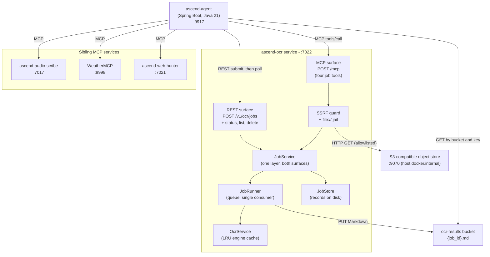
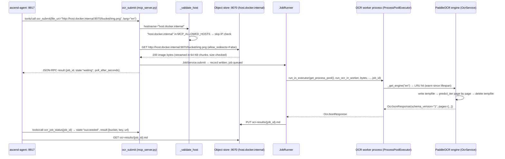

# ascend-ocr - Diagrams

---

### C4 Container diagram

ascend-ocr has no database: job records are files under `OCR_JOBS_DIR` and the recognised text goes to the
`ocr-results` bucket. Model weights are baked into the container image at build time. Two outbound network calls
exist: the MCP tool's URI fetch, gated by the SSRF guard, and the result store's own reads and writes. The object
store is an external prerequisite, not a compose service; locally it is provided by a self-hosted S3-compatible
emulator. See [ADR-008](../decisions/ADR-008-every-request-is-a-job.md) and
[ADR-009](../decisions/ADR-009-results-in-object-storage.md).

---

### MCP runtime happy path

If `host.docker.internal` is not in `MCP_ALLOWED_HOSTS`, `_validate_host` resolves it to a private RFC1918 address and
raises `UnsafeUriError`, returning `{"code":"UNSAFE_URI","detail":"URI is not permitted"}` to the agent. See
[ADR-001](../decisions/ADR-001-mcp-file-transport-uri-only.md).
