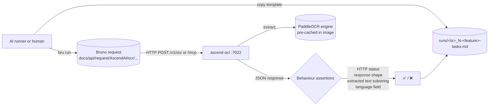

# ascend-ocr: end-to-end capability tests

Manual / AI-runnable e2e suite for the ascend-ocr standalone module. Each test exercises **one OCR capability**
end-to-end against a live ascend-ocr container on port 7022. Assertions are observable behaviour only — HTTP status
codes, response body shape, and extracted text substrings. ascend-ocr holds no persisted state — the only in-process
state is the warmed OCR engine cache, which is initialised at startup and keyed by language. Where a test requires a
cold engine for a previously unseen language, the reset step is to restart the container.

## What's here

```text
apps/ascend-ocr/e2e/
├── README.md                            # this file
├── fixtures/                            # canary images (referenced by the OCR specs)
│   └── README.md
└── testing/                             # numbered specs + templates/ + runs/
    ├── README.md
    ├── 1-invalid-input-test.md          # immutable spec (lowest cost — no model invocation, no fixture)
    ├── 2-ocr-english-test.md
    ├── 3-ocr-polish-test.md
    ├── 4-ocr-default-language-test.md
    ├── 5-mcp-tools-list-test.md
    ├── 6-mcp-ocr-test.md
    ├── 7-ready-endpoint-test.md
    ├── 8-mcp-ssrf-rejection-test.md
    ├── 9-mcp-bad-scheme-test.md
    ├── 10-mcp-credentials-rejection-test.md
    ├── 11-mcp-file-uri-jail-test.md
    ├── 12-ocr-unsupported-mime-test.md
    ├── templates/                       # run-record templates (immutable), one per spec
    │   ├── README.md
    │   ├── 1-invalid-input-tasks.template.md
    │   ├── 2-ocr-english-tasks.template.md
    │   ├── 3-ocr-polish-tasks.template.md
    │   ├── 4-ocr-default-language-tasks.template.md
    │   ├── 5-mcp-tools-list-tasks.template.md
    │   ├── 6-mcp-ocr-tasks.template.md
    │   ├── 7-ready-endpoint-tasks.template.md
    │   ├── 8-mcp-ssrf-rejection-tasks.template.md
    │   ├── 9-mcp-bad-scheme-tasks.template.md
    │   ├── 10-mcp-credentials-rejection-tasks.template.md
    │   ├── 11-mcp-file-uri-jail-tasks.template.md
    │   └── 12-ocr-unsupported-mime-tasks.template.md
    └── runs/
        ├── README.md
        └── <UTC-timestamp>_<N>-<feature>-tasks.md   # one per executed test (gitignored)
```

Tests are number-prefixed by setup cost. Twelve specs fall into two execution classes: reject-fast specs (1, 5, 7, 8,
9, 10, 11, 12) return before any `engine.predict` call and finish in well under 2 seconds; engine-bound specs (2, 3,
4, 6) invoke PaddleOCR's blocking OCR engine and must run one at a time. `1` is rejected at the FastAPI validation
layer; `2`-`4` exercise the REST surface against canary PNGs; `5` is an MCP `tools/list` probe; `6` exercises the MCP
`ocr_process` tool against an object-store URL fetched over HTTP, not a container-side file path; `7` reads `/ready`;
`8`-`11` are MCP guard rejections (SSRF, bad scheme, credentials-in-URI, `file://` jail); `12` is a REST magic-byte
rejection on an unsupported MIME type. See [testing/README.md](testing/README.md) "Execution order" for the full
fan-out shape.

The Bruno collection isn't here. It lives at the **repo root** under
`docs/api/request/AscendAI/ocr/` so it stays a portable API client artifact. Each spec references the matching
Bruno request file under that path.

## Flow



Every spec follows the same template:

1. **What this verifies.** Bullet list of behaviours.
2. **Prerequisites.** Concrete check commands the runner executes before starting. Each command is its own code
   block; the prose around it states what success looks like.
3. **Reset state.** One command per code block, executed in order, to wipe state so the test is reproducible. Most
   ascend-ocr tests do not need reset; OCR is stateless except for the warmed engine cache populated at startup.
4. **Run.** One or more numbered steps. Each step is a single Bruno CLI invocation (or a `curl` MCP handshake for
   tests that hit `/mcp`). Steps wait for HTTP 200 before continuing.
5. **Expected.** Observable behaviour only: HTTP status, response JSON shape, extracted text substring matches, the
   echoed `language` value, the populated `pages[*].lines[*].text` content. No log substrings.
6. **Fixtures.** Paths to local files the test reads. OCR specs all reference fixtures under
   [`apps/ascend-ocr/e2e/fixtures/`](fixtures/).

The paired `templates/<N>-<feature>-tasks.template.md` is the runner's checklist for one execution: prerequisites,
reset state, run steps, expected, verdict, plus **Result summary** (with **Input tokens**, **Output tokens**, **Time**
fields) and **Additional tasks I did** (anything done outside the spec). The runner copies the template from
[testing/templates/](testing/templates/) into [testing/runs/](testing/runs/) as
`<UTC-timestamp>_<N>-<feature>-tasks.md` and fills it in. ascend-ocr specs make no paid call (local OCR engine only),
so [docs/E2E_COST.md](../../../docs/E2E_COST.md) records this module as a zero-cost row rather than tracking tokens here.

## Parallelism and execution order

ascend-ocr holds no per-user state — only the warmed-engine cache keyed by language code. The execution constraints:

| Constraint | Tests | Why |
| :--- | :--- | :--- |
| Engine-bound: run one at a time | 2, 3, 4, 6 | Each invokes PaddleOCR's blocking `engine.predict` inside the OCR worker process, CPU-only on the container's 4-core budget. A single call measures 60 to 110 seconds of full round trip, the upper end when other module suites are hitting the same host (84.3, 99.9 and 105.6 seconds for specs 4, 3 and 2 during the 2026-09-03 sweep). Running two concurrently saturates every core and risks exhausting `OCR_REQUEST_TIMEOUT=300`. Never with each other, and the next row says what else must be idle. |
| Engine-bound: run alone, no runner of any suite active | 2, 3, 4, 6 | The engine is single-threaded (defect register A47), so inference runs at one core's speed and any other runner on the host, from this suite or from any other module's sweep, competes for that core. Measured on 2026-09-10 with the same English fixture: 59.2 seconds on a quiet host, 160.9 seconds on a loaded one, past the 150 second per-page budget compose sets. A loaded host turns a passing spec into a timeout, so raising the budget is not the fix. Start one of these four only when nothing else is running anywhere, not even a reject-fast spec of this suite, and start nothing else until it has returned. |
| Reject-fast: safe in parallel | 1, 5, 7, 8, 9, 10, 11, 12 | Each returns before any `engine.predict` call (FastAPI validation, `tools/list`, `/ready`, an MCP guard rejection, or the magic-byte sniffer), finishing in well under 2 seconds. Safe to run all eight in parallel up to the runner's default cap of 5 concurrent. |
| Cold engine for new language | none today | All shipped models (`en`, `pl`) are pre-cached at image build time and warmed at startup; the first call for a known language does not pay an engine-load cost. Add a reset row here if a future test exercises a language outside the pre-cached set. |

Recommended layout: dispatch all 8 reject-fast specs in parallel first (runner cap of 5, queue 3; usually under 90
seconds in aggregate), wait for every one of them to return, then dispatch the 4 engine specs one at a time with no
other runner active anywhere on the host, from this suite or from any other module's sweep, and hold every other
suite's sweep until the last engine spec has returned. See [testing/README.md](testing/README.md) "Execution order"
for the canonical fan-out shape and measured timings.

## Prerequisites before any test

1. Docker compose stack up: `docker compose up -d --build ascend-ocr` (or include in the full `ascend-ai` stack).
2. `curl -fsS http://localhost:7022/health` returns HTTP 200 with `{"status":"ok",...}`.
3. Bruno CLI installed: `bru --version` returns a version string. Install once with `npm install -g @usebruno/cli`.
4. Canary fixtures present under `apps/ascend-ocr/e2e/fixtures/` (see [`fixtures/README.md`](fixtures/README.md) for the
   generation recipe). Tests 2-4 and 6 fail without them; test 12 needs `not-an-image.txt` from the same directory.
5. For test 6: the object store is reachable at `http://localhost:9070` and the ascend-ocr container's
   `MCP_ALLOWED_HOSTS` includes `host.docker.internal` (the MCP tool fetches the fixture back out over HTTP after the
   spec uploads it, rather than reading a container-mounted path).

If the ascend-ocr startup log shows the warmup step failed for the default language, fix that before running the suite
— every OCR call will otherwise pay an engine-load cost on the first hit.

## Running tests

Install Bruno CLI once.

```powershell
npm install -g @usebruno/cli
```

Run one capability.

```powershell
cd docs/api/request/AscendAI
```

```powershell
bru run "ocr/ocr.yml" --env ascend-local
```

Run the whole suite (Bruno's directory mode).

```powershell
cd docs/api/request/AscendAI
```

```powershell
bru run "ocr" --env ascend-local
```

## Capability tests

Numbered by setup cost. Easiest first.

| #  | Spec | What it proves |
| :- | :--- | :--- |
| 1  | [testing/1-invalid-input-test.md](testing/1-invalid-input-test.md) | `POST /v1/ocr` without the required `file` multipart part is rejected with HTTP 422 by FastAPI's request validation before any OCR engine call. |
| 2  | [testing/2-ocr-english-test.md](testing/2-ocr-english-test.md) | `POST /v1/ocr` with `argent-saga-chronicles-page1.png` and `lang=en` returns HTTP 200 and an `OcrJsonResponse` whose concatenated `pages[*].lines[*].text` contains the canary substring `Argent Saga`, `Aenaria`, or `Halen Veyr`. |
| 3  | [testing/3-ocr-polish-test.md](testing/3-ocr-polish-test.md) | `POST /v1/ocr` with `argent-saga-chronicles-page1-polish.png` and `lang=pl` returns HTTP 200 and the concatenated extracted text contains `Saga Świetlna`, `Aenaria`, or `Eklipsą`, plus at least one Polish-specific accented character (`ś`, `ż`, `ą`, `ę`, `ć`, `ó`, `ł`, `ń`, `ź`). |
| 4  | [testing/4-ocr-default-language-test.md](testing/4-ocr-default-language-test.md) | `POST /v1/ocr` with `argent-saga-chronicles-page1.png` and NO `lang` field defaults to the server's `DEFAULT_LANGUAGE` (`en` out of the box) and extracts the canary substring. |
| 5  | [testing/5-mcp-tools-list-test.md](testing/5-mcp-tools-list-test.md) | `tools/list` over the MCP transport advertises a tool named `ocr_process` with `file_uri` (required) and `lang` (optional) parameters. |
| 6  | [testing/6-mcp-ocr-test.md](testing/6-mcp-ocr-test.md) | `tools/call` for `ocr_process` with `file_uri` set to an object-store URL returns a JSON-RPC `result` whose extracted text contains the canary substring. The fixture is uploaded to the object store's `e2e-fixtures` bucket during Reset state; ascend-ocr fetches it over HTTP, no container mount involved. |
| 7  | [testing/7-ready-endpoint-test.md](testing/7-ready-endpoint-test.md) | `GET /ready` returns HTTP 200 with `status="ready"`, `engine_warm=true` once lifespan warm-up has completed. Distinct from `/health` per ADR-004. |
| 8  | [testing/8-mcp-ssrf-rejection-test.md](testing/8-mcp-ssrf-rejection-test.md) | The MCP SSRF guard rejects a link-local IMDS target (`169.254.169.254`) unless it is on `MCP_ALLOWED_HOSTS`, without any outbound connection attempt. |
| 9  | [testing/9-mcp-bad-scheme-test.md](testing/9-mcp-bad-scheme-test.md) | The MCP tool rejects any scheme other than `http`, `https`, or `file` (`ftp://`, `data:`, `gopher://`) with a `UNSAFE_URI` error. |
| 10 | [testing/10-mcp-credentials-rejection-test.md](testing/10-mcp-credentials-rejection-test.md) | The MCP tool rejects URIs carrying `user:pass@` userinfo before any DNS lookup or fetch, and the credentials never reach the logs. |
| 11 | [testing/11-mcp-file-uri-jail-test.md](testing/11-mcp-file-uri-jail-test.md) | `file://` URIs are rejected when `MCP_FILE_URI_ROOT` is unset (default secure posture); when set, a `realpath` escape attempt is still rejected by the jail. |
| 12 | [testing/12-ocr-unsupported-mime-test.md](testing/12-ocr-unsupported-mime-test.md) | `POST /v1/ocr` rejects a payload whose magic bytes do not match an allowed image/PDF signature, even when `Content-Type` lies, with HTTP 400 `UNSUPPORTED_FILE_TYPE`. |

## Adding a new test

1. Add the Bruno request(s) under `docs/api/request/AscendAI/ocr/testing/<request>.yml`.
2. Pick the next number prefix that matches the test's setup cost.
3. Write `testing/<N>-<capability>-test.md` using the template structure (**What this verifies / Prerequisites /
   Reset state / Run / Expected / Fixtures**). Assert behaviour, not logs.
4. Write `testing/templates/<N>-<capability>-tasks.template.md` mirroring the spec's checkboxes, with
   `## Result summary` containing the **Input tokens / Output tokens / Time** fields at the bottom.
5. Add a row to the capability table above.
