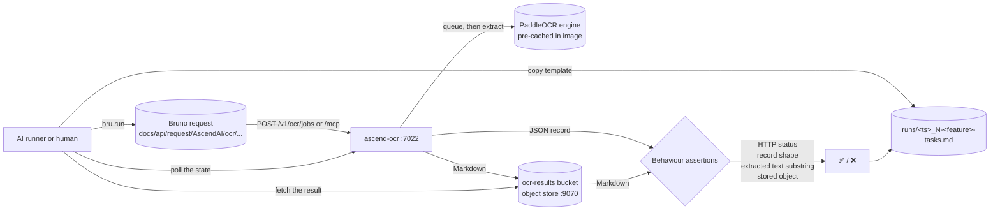

# ascend-ocr: end-to-end capability tests

Manual / AI-runnable e2e suite for the ascend-ocr standalone module. Each test exercises **one OCR capability**
end-to-end against a live ascend-ocr container on port 7022. Assertions are observable behaviour only: HTTP status
codes, response body shape, persisted state in the object store, and extracted text substrings.

**ascend-ocr now holds persisted state, in two places.** Every request is a job
([ADR-008](../docs/architecture/decisions/ADR-008-every-request-is-a-job.md)): the record lives as a file under
`OCR_JOBS_DIR` inside the container, and every successful reading writes one Markdown object to the `ocr-results`
bucket in the platform's object store
([ADR-009](../docs/architecture/decisions/ADR-009-results-in-object-storage.md)). Both survive the end of a run, and
both are what the reset step below removes. The service removes them itself at the end of their retention window,
which is an hour by default, so a suite run started inside that hour sees the previous run's leftovers unless it
resets first.

The third piece of state is the warmed OCR engine cache, which is initialised at startup and keyed by the model pair
a language resolves to. Where a test requires a cold engine for a previously unseen language, the reset step is to
restart the container.

Before running this suite, or any other e2e suite, pick a run scenario or a service suite from [docs/E2E_RUN_SCENARIOS.md](../../../docs/E2E_RUN_SCENARIOS.md). To run only this suite, use its entry under [Service suites](../../../docs/E2E_RUN_SCENARIOS.md#ascend-ocr-service-suite).

## What's here

```text
apps/ascend-ocr/e2e/
├── README.md                            # this file
├── fixtures/                            # canary images (referenced by the OCR specs)
│   └── README.md
└── testing/                             # numbered specs + templates/ + runs/
    ├── README.md
    ├── 1-invalid-input-test.md          # immutable spec (lowest cost, no model invocation)
    ├── 2-ocr-english-test.md
    ├── 3-ocr-polish-test.md
    ├── 4-ocr-default-language-test.md
    ├── 5-mcp-tools-list-test.md
    ├── 6-mcp-ocr-test.md
    ├── 7-ready-endpoint-test.md
    ├── 8-mcp-ssrf-rejection-test.md
    ├── 9-mcp-bad-scheme-test.md
    ├── 10-mcp-credentials-rejection-test.md
    ├── 11-mcp-file-uri-jail-test.md
    ├── 12-ocr-unsupported-mime-test.md
    ├── 13-long-document-test.md         # twenty five pages, the ceiling the old surface could never carry
    ├── 14-job-listing-test.md           # what the service is working on, and what that listing hands out
    ├── 15-cancel-running-job-test.md    # a cancel stops the worker mid-document, and the worker comes back
    ├── 16-queue-full-test.md            # a submission past the queue bound is refused with 503 QUEUE_FULL
    ├── 17-ocr-rotated-photo-test.md     # a phone photo turned 90 degrees, turned upright by page orientation alone
    ├── 18-ocr-straighten-crumpled-photo-test.md  # a crumpled page read with straighten=true, all 21 lines present
    ├── 19-ocr-crumpled-photo-default-test.md     # the same page in normal mode, not straightened by default
    ├── 20-mcp-unsupported-language-test.md       # ocr_submit refuses lang korean before fetching the URI
    ├── templates/                       # run-record templates (immutable), one per spec
    │   ├── README.md
    │   ├── 1-invalid-input-tasks.template.md
    │   ├── 2-ocr-english-tasks.template.md
    │   ├── 3-ocr-polish-tasks.template.md
    │   ├── 4-ocr-default-language-tasks.template.md
    │   ├── 5-mcp-tools-list-tasks.template.md
    │   ├── 6-mcp-ocr-tasks.template.md
    │   ├── 7-ready-endpoint-tasks.template.md
    │   ├── 8-mcp-ssrf-rejection-tasks.template.md
    │   ├── 9-mcp-bad-scheme-tasks.template.md
    │   ├── 10-mcp-credentials-rejection-tasks.template.md
    │   ├── 11-mcp-file-uri-jail-tasks.template.md
    │   ├── 12-ocr-unsupported-mime-tasks.template.md
    │   ├── 13-long-document-tasks.template.md
    │   ├── 14-job-listing-tasks.template.md
    │   ├── 15-cancel-running-job-tasks.template.md
    │   ├── 16-queue-full-tasks.template.md
    │   ├── 17-ocr-rotated-photo-tasks.template.md
    │   ├── 18-ocr-straighten-crumpled-photo-tasks.template.md
    │   ├── 19-ocr-crumpled-photo-default-tasks.template.md
    │   └── 20-mcp-unsupported-language-tasks.template.md
    └── runs/
        ├── README.md
        └── <UTC-timestamp>_<N>-<feature>-tasks.md   # one per executed test (gitignored)
```

Tests are number-prefixed by setup cost. Twenty specs fall into two execution classes. Reject-fast specs (1, 5, 7,
8, 9, 10, 11, 12, 20) return before any inference, and all but spec 11 finish in well under 2 seconds. Engine-bound specs
(2, 3, 4, 6, 13, 14, 15, 16, 17, 18, 19) put one or more documents through the single OCR worker and must run one at a
time. `1` covers the three refusals at the request boundary: a submission with no file, the removed synchronous
endpoint, and a submission in a language the service does not read (`korean`). `2`-`4` submit a canary PNG over REST
and collect the Markdown the job leaves in the bucket. `5` is an MCP `tools/list` probe that asserts the four job
tools and the absence of the removed one. `6` does the whole submit, poll, collect path through the MCP tools against
an object-store URL fetched over HTTP, not a container-side file path. `7` reads `/ready`. `8`-`11` are MCP guard
rejections (SSRF, bad scheme, credentials-in-URI, `file://` jail, the last also against a throwaway container with the
root set). `12` is a REST magic-byte rejection on an unsupported MIME type. `13` reads a twenty five page document,
which the service refused outright before the job surface existed. `14` reads the listing of work in flight, with the
same twenty five page document on the worker so the queue behind it stays still long enough to read. `15`
cancels a document while the worker is reading it and proves the worker stops and comes back. `16` fills the queue to
its document bound and asserts the next submission is refused with 503 `QUEUE_FULL` and a `Retry-After` header. `17`
to `19` read the owner's own phone photos of one printed page: `17` a photo turned 90 degrees, read without
straightening, `18` a crumpled photo read with `straighten=true`, and `19` the same crumpled photo in `normal` mode
with no `straighten` part, to prove the default does not straighten. `20` is the MCP counterpart of spec 1's language
refusal: `ocr_submit` with `lang` `korean` is refused with `UNSUPPORTED_LANGUAGE` before the URI is fetched.
See [testing/README.md](testing/README.md) "Execution order" for the full fan-out shape.

The Bruno collection isn't here. It lives at the **repo root** under
`docs/api/request/AscendAI/ocr/` so it stays a portable API client artifact. Each spec references the matching
Bruno request file under that path.

## Flow


```mermaid
flowchart LR
    Runner[AI runner or human] -->|copy template| Record[(runs/&lt;ts&gt;_N-&lt;feature&gt;-tasks.md)]
    Runner -->|bru run| Req[(Bruno request<br/>docs/api/request/AscendAI/ocr/...)]
    Req -->|POST /v1/ocr/jobs or /mcp| Paddle[ascend-ocr :7022]
    Paddle -->|queue, then extract| Engine[(PaddleOCR engine<br/>pre-cached in image)]
    Paddle -->|Markdown| Bucket[(ocr-results bucket<br/>object store :9070)]
    Runner -->|poll the state| Paddle
    Runner -->|fetch the result| Bucket
    Paddle -->|JSON record| Verify{Behaviour assertions}
    Bucket -->|Markdown| Verify
    Verify -->|HTTP status<br/>record shape<br/>extracted text substring<br/>stored object| Result[✅ / ❌]
    Result --> Record
```

Every spec follows the same template:

1. **What this verifies.** Bullet list of behaviours.
2. **Prerequisites.** Concrete check commands the runner executes before starting. Each command is its own code
   block; the prose around it states what success looks like.
3. **Reset state.** One command per code block, executed in order, to wipe state so the test is reproducible. Any
   spec that submits a document needs one, because the run leaves a job record and a result object behind. Specs
   that are refused at the request boundary do not.
4. **Run.** One or more numbered steps. Each step is a single Bruno CLI invocation (or, for tests that hit `/mcp`, a
   `curl` `initialize` call followed by `ocr/testing/mcp-initialized.yml`, which sends the `notifications/initialized`
   notification the MCP protocol requires before any tool call). Steps wait for HTTP 200 before continuing, except
   the notification, which answers HTTP 202.
5. **Expected.** Observable behaviour only: HTTP status, response JSON shape, the job record's state, the echoed
   `language` value, and substring matches in the Markdown stored in the bucket. No log substrings, with one sanctioned
   exception: spec 10 asserts that a refused credential never reaches the container log, a security property with no
   other observable. The rule and the exception are in [testing/README.md](testing/README.md) "Cross-cutting
   conventions".
6. **Fixtures.** Paths to local files the test reads. OCR specs all reference fixtures under
   [`apps/ascend-ocr/e2e/fixtures/`](fixtures/).

The paired `templates/<N>-<feature>-tasks.template.md` is the runner's checklist for one execution: prerequisites,
reset state, run steps, expected, verdict, plus **Result summary** (with **Input tokens**, **Output tokens**, **Time**
fields) and **Additional tasks I did** (anything done outside the spec). The runner copies the template from
[testing/templates/](testing/templates/) into [testing/runs/](testing/runs/) as
`<UTC-timestamp>_<N>-<feature>-tasks.md` and fills it in. ascend-ocr specs make no paid call (local OCR engine only),
so [docs/E2E_COST.md](../../../docs/E2E_COST.md) records this module as a zero-cost row rather than tracking tokens here.

## Resetting between runs

Two commands remove everything a suite run leaves behind. Run both from the repository root before a run whose
assertions depend on a clean slate, which is every spec that submits a document and both specs that read a listing.

Drop every job record the service holds.

```bash
docker exec ascend-ocr sh -c 'rm -f /tmp/ascend-ocr-jobs/*'
```

Drop every stored result. The command names the `ocr-results` bucket literally, which belongs to this service alone.
Never issue a command that sweeps buckets instead of naming one, because the same object store also backs other
projects on this machine.

```bash
curl -fsS "http://localhost:9070/ocr-results?list-type=2" | grep -o "<Key>[^<]*</Key>" | sed -e "s/<Key>//" -e "s|</Key>||" | xargs -I {} curl -fsS -X DELETE "http://localhost:9070/ocr-results/{}"
```

Confirm both are empty.

```bash
curl -fsS http://localhost:7022/v1/ocr/jobs
```

Expect `{"jobs":[]}`.

```bash
curl -fsS "http://localhost:9070/ocr-results?list-type=2"
```

Expect a `ListBucketResult` with no `<Key>` elements.

Neither command is destructive beyond this service: the jobs directory holds nothing but records named for their own
job identifier, and the bucket holds nothing but this service's own results.

Git Bash on Windows rewrites a command-line argument that starts with `/` into a Windows path before Docker sees it.
The first reset command is safe as written, because its Linux path sits inside the quoted `sh -c` string. A bare
Linux path argument is not, for instance `docker exec ascend-ocr cat /sys/fs/cgroup/memory.peak`,
`docker exec ascend-ocr ls /tmp/ascend-ocr-jobs`, or any `docker exec` or `docker run -e NAME=/path` that names a
container path directly. In Git Bash, run those with `MSYS_NO_PATHCONV=1` set, for example:

```bash
MSYS_NO_PATHCONV=1 docker exec ascend-ocr cat /sys/fs/cgroup/memory.peak
```

PowerShell and Linux or macOS shells need nothing extra.

## Parallelism and execution order

The execution constraints:

| Constraint | Tests | Why |
| :--- | :--- | :--- |
| Engine-bound: run one at a time | 2, 3, 4, 6, 13, 14, 15, 16, 17, 18, 19 | Each puts at least one document through the single OCR worker, CPU-only on the container's 4-core budget. The service now queues rather than refusing, so two of these running at once do not fail each other, they serialise: the second waits for the first, and both take longer in wall time than either alone. Never with each other, and the next row says what else must be idle. |
| Engine-bound: run alone, no runner of any suite active | 2, 3, 4, 6, 13, 14, 15, 16, 17, 18, 19 | The one OCR worker reads one document at a time and uses every CPU the container is given (`cpu_threads` set to the container's CPU limit, defect register F57). A second engine-bound spec would wait in the queue behind the first, and any other runner on the host, from this suite or from any other module's sweep, takes CPU away from inference, so the recorded timings stop being true. Measured on 2026-09-10 with the English fixture: 59.2 seconds on a quiet host, 160.9 seconds on a loaded one, on the slower and heavier `PP-OCRv5_server` pair the service ran then. The failure mode has changed with the job surface: nothing times out at the HTTP layer any more, because no connection is held. What a loaded host does instead is push a page past its engine's page allowance (112.95 s on the small pair at the default `OCR_PAGE_ALLOWANCE_HEADROOM`), which stops the whole document with `OCR_FAILED`. That is a real failure, not a flake, and the fix is the host or the allowance rather than a retry. Start one of these eleven only when nothing else is running anywhere, not even a reject-fast spec of this suite. |
| Reject-fast: safe in parallel | 1, 5, 7, 8, 9, 10, 11, 12, 20 | Each returns before anything is queued (FastAPI validation, the unsupported-language refusal, `tools/list`, `/ready`, an MCP guard rejection, or the magic-byte sniffer), finishing in well under 2 seconds. Spec 11 is the one exception to the timing: its jail steps start a throwaway `ascend-ocr-jail` container on `127.0.0.1:7023` with `MCP_FILE_URI_ROOT` set, wait for it to come up, and remove it, which takes up to about two minutes and warms an engine that reads nothing. Safe to run all nine in parallel up to the runner's default cap of 5 concurrent. Specs 1, 9, 11, 12 and 20 each assert an empty job listing, so they need `/ready` to report nothing queued and nothing running before they start. |
| Needs a clean queue and a clean bucket | 2, 3, 4, 6, 13, 14, 15, 16, 17, 18, 19 | Each asserts either a listing, a queue count or the absence of a record, so a previous run's leftovers make them fail for the wrong reason. Run the two reset commands above first. |
| Cold engine for new language | none today | All shipped models (`en`, `pl`) are pre-cached at image build time and warmed at startup; the first call for a known language does not pay an engine-load cost. Add a reset row here if a future test exercises a language outside the pre-cached set. |

Recommended layout: dispatch all 9 reject-fast specs in parallel first (runner cap of 5, queue 4, 4 minutes 35
seconds in aggregate in the sweep of 2026-09-25), wait for every one of them to return and for `ascend-ocr-jail` to be
gone, then dispatch the 11 engine specs one at a time with no other runner active anywhere on the host, from this
suite or from any other module's sweep, and hold every other suite's sweep until the last engine spec has returned:
2, 3, 4, 6, 17, 18 and 19 first, then 15, then 16, then 14, then 13. Specs 15 and 16 each cancel a running document,
which replaces the worker, so they run after the shorter engine specs. Specs 14 and 13 each read the twenty five page
document to the end, 172.1 seconds of processing on image `7605748a6afa` on 2026-09-25, and spec 14 reads two single
pages after it, so these two long specs run last, spec 14 and then spec 13. The whole 20-spec suite ran as one sweep
on 2026-09-25 on that image and all 20 specs passed. See [testing/README.md](testing/README.md) "Execution order" for
the canonical fan-out shape and measured timings.

## Prerequisites before any test

1. Docker compose stack up: `docker compose up -d --build ascend-ocr` (or include in the full `ascend-ai` stack).
2. `curl -fsS http://localhost:7022/health` returns HTTP 200 with `{"status":"ok",...}`.
3. Bruno CLI installed: `bru --version` returns a version string. Install once with `npm install -g @usebruno/cli`.
4. Canary fixtures present under `apps/ascend-ocr/e2e/fixtures/` (see [`fixtures/README.md`](fixtures/README.md) for the
   generation recipe). Tests 1 to 4, 6 and 14 to 16 fail without the canary PNGs. Tests 13, 14, 15 and 16 need
   `halcyon-ledger-25-pages.pdf`. Test 12 needs `not-an-image.txt` from the same directory. Tests 17 to 19 need the
   straightening photos, and tests 17 and 18 also need `straightening-test-page.txt`. The photos cannot be
   regenerated.
5. The object store is reachable at `http://localhost:9070`, because every successful reading writes its result
   there. `docker logs ascend-ocr 2>&1 | grep "Result store"` should show the endpoint with `[answered]`; a
   `[did NOT answer]` line means every job will finish with `RESULT_STORE_UNAVAILABLE`.
6. For test 6: the ascend-ocr container's `MCP_ALLOWED_HOSTS` includes `host.docker.internal` (the MCP tool fetches
   the fixture back out over HTTP after the spec uploads it, rather than reading a container-mounted path).

If the ascend-ocr startup log shows the warmup step failed for the default language, fix that before running the suite,
because every OCR call will otherwise pay an engine-load cost on the first hit.

## Running tests

Install Bruno CLI once.

```powershell
npm install -g @usebruno/cli
```

Run one capability.

```powershell
cd docs/api/request/AscendAI
```

```powershell
bru run "ocr/ocr.yml" --env ascend-local
```

That one answers 202 with a job identifier. Read the state, and collect the Markdown once it says `succeeded`.

```powershell
bru run "ocr/ocr-job-status.yml" --env ascend-local --env-var "ocrJobId=<job_id>"
```

```powershell
bru run "ocr/ocr-job-result.yml" --env ascend-local --env-var "ocrResultUrl=<result.url>"
```

Run the whole suite (Bruno's directory mode).

```powershell
cd docs/api/request/AscendAI
```

```powershell
bru run "ocr" --env ascend-local
```

## Capability tests

Numbered by setup cost. Easiest first.

| #  | Spec | What it proves |
| :- | :--- | :--- |
| 1  | [testing/1-invalid-input-test.md](testing/1-invalid-input-test.md) | `POST /v1/ocr/jobs` without the required `file` multipart part is rejected with HTTP 422 before anything is queued, and a submission with `lang=korean`, a language the service no longer reads, is refused with HTTP 400 `UNSUPPORTED_LANGUAGE` and no identifier. The listing is empty afterwards. |
| 2  | [testing/2-ocr-english-test.md](testing/2-ocr-english-test.md) | Submitting `argent-saga-chronicles-page1.png` with `lang=en` answers 202 with an identifier, the state reaches `succeeded`, and the Markdown in the bucket carries `Argent Saga`, `Aenaria`, or `Halen Veyr` under a `## Page 1` heading. |
| 3  | [testing/3-ocr-polish-test.md](testing/3-ocr-polish-test.md) | The same path with `argent-saga-chronicles-page1-polish.png` and `lang=pl`: the Markdown carries `Saga Świetlna`, `Aenaria`, or `Eklipsą`, plus at least one Polish-specific accented character (`ś`, `ż`, `ą`, `ę`, `ć`, `ó`, `ł`, `ń`, `ź`). |
| 4  | [testing/4-ocr-default-language-test.md](testing/4-ocr-default-language-test.md) | The same path with NO `lang` part: the record carries the server's `DEFAULT_LANGUAGE` (`en` out of the box) and the Markdown carries the canary substring. |
| 5  | [testing/5-mcp-tools-list-test.md](testing/5-mcp-tools-list-test.md) | `tools/list` advertises exactly `ocr_submit`, `ocr_job_status`, `ocr_list_jobs` and `ocr_cancel_job`, `ocr_submit` advertises `quality` (`normal` or `high`, default `high`) and `straighten` (default `false`), and the removed `ocr_process` is not advertised under any name. |
| 6  | [testing/6-mcp-ocr-test.md](testing/6-mcp-ocr-test.md) | `ocr_submit` with `file_uri` set to an object-store URL answers with a job record, `ocr_job_status` reaches `succeeded`, and the stored Markdown carries the canary substring. The fixture is uploaded to the object store's `e2e-fixtures` bucket during Reset state, and ascend-ocr fetches it over HTTP, no container mount involved. |
| 7  | [testing/7-ready-endpoint-test.md](testing/7-ready-endpoint-test.md) | `GET /ready` returns HTTP 200 with `status="ready"`, `engine_warm=true` once lifespan warm-up has completed, and reports `jobs_queued` and `jobs_running`. Distinct from `/health` per ADR-004. |
| 8  | [testing/8-mcp-ssrf-rejection-test.md](testing/8-mcp-ssrf-rejection-test.md) | The MCP SSRF guard rejects a link-local IMDS target (`169.254.169.254`) unless it is on `MCP_ALLOWED_HOSTS`, without any outbound connection attempt. |
| 9  | [testing/9-mcp-bad-scheme-test.md](testing/9-mcp-bad-scheme-test.md) | The MCP tool rejects an `ftp://` URI, a `data:` URI and a bare Windows path (read as the scheme `c`) with `UNSAFE_URI`, the scheme guard naming each scheme, and queues nothing. |
| 10 | [testing/10-mcp-credentials-rejection-test.md](testing/10-mcp-credentials-rejection-test.md) | The MCP tool rejects URIs carrying `user:pass@` userinfo before any DNS lookup or fetch, and the credentials never reach the logs. |
| 11 | [testing/11-mcp-file-uri-jail-test.md](testing/11-mcp-file-uri-jail-test.md) | `file://` URIs are rejected when `MCP_FILE_URI_ROOT` is unset (default secure posture) and nothing is queued. On a throwaway `ascend-ocr-jail` container started with the root set, a path that `realpath` resolves outside the root is refused by the jail itself, and the container is removed afterwards. |
| 12 | [testing/12-ocr-unsupported-mime-test.md](testing/12-ocr-unsupported-mime-test.md) | `POST /v1/ocr/jobs` rejects a payload whose magic bytes do not match an allowed image/PDF signature, even when `Content-Type` lies, with HTTP 400 `UNSUPPORTED_FILE_TYPE`, and nothing reaches the queue. |
| 13 | [testing/13-long-document-test.md](testing/13-long-document-test.md) | A twenty five page document, which the service refused outright when the page ceiling was derived from a request timeout, is accepted, read to completion with observable progress, and produces one Markdown object carrying all twenty five page headings and the canary from page 24. |
| 14 | [testing/14-job-listing-test.md](testing/14-job-listing-test.md) | `GET /v1/ocr/jobs` is empty on an idle service, and with the twenty five page document on the worker and two single pages behind it reports the running document first and the waiting ones in submission order with contiguous positions, never lists finished work, and agrees with `ocr_list_jobs` on the MCP surface. |
| 15 | [testing/15-cancel-running-job-test.md](testing/15-cancel-running-job-test.md) | `DELETE /v1/ocr/jobs/{job_id}` on the twenty five page document while the worker is reading it answers 204, the record reads `cancelled` with `pages_done` no longer moving, no result object exists in the bucket, and the next document, submitted once `/ready` reads `ready`, has nothing ahead of it, waits in the queue less than 5 seconds (`started_at` minus `submitted_at`) and succeeds, proving the worker was replaced rather than left reading. |
| 16 | [testing/16-queue-full-test.md](testing/16-queue-full-test.md) | With the twenty five page document on the worker and eight single page images waiting, the ninth submission is refused with HTTP 503, `QUEUE_FULL` and `Retry-After: 30`, issues no identifier, and leaves the listing and the readiness counters unchanged, while `/ready` stays `ready`. |
| 17 | [testing/17-ocr-rotated-photo-test.md](testing/17-ocr-rotated-photo-test.md) | A full resolution phone photo turned 90 degrees, submitted without `straighten`, is accepted as one page, turned upright by page orientation alone, and read with all 21 lines of the test page found. The state echoes `straighten` `false` and `quality` `high`. |
| 18 | [testing/18-ocr-straighten-crumpled-photo-test.md](testing/18-ocr-straighten-crumpled-photo-test.md) | A crumpled page photo submitted with `straighten=true` is read with all 21 lines of the test page present and at least 15 of its 21 canary phrases found word for word, the canaries avoiding the inverted exclamation mark the engine never outputs and the `ź` and `ż` it may swap. The state echoes `straighten` `true`. |
| 19 | [testing/19-ocr-crumpled-photo-default-test.md](testing/19-ocr-crumpled-photo-default-test.md) | The same crumpled photo submitted with `quality=normal` and no `straighten` part is read to one page of Markdown, and the state echoes `straighten` `false` and `quality` `normal`, proving the service does not straighten unless asked. |
| 20 | [testing/20-mcp-unsupported-language-test.md](testing/20-mcp-unsupported-language-test.md) | `ocr_submit` with a well-formed URI and `lang` `korean` is refused with `UNSUPPORTED_LANGUAGE` and `Supported languages:`, never echoing the language, before the URI is fetched, and nothing is queued. |

## Adding a new test

1. Add the Bruno request(s) under `docs/api/request/AscendAI/ocr/testing/<request>.yml`. A spec that submits a
   document needs at least three: the submission, the status read, and the fetch of the stored result.
2. Pick the next number prefix that matches the test's setup cost.
3. Write `testing/<N>-<capability>-test.md` using the template structure (**What this verifies / Prerequisites /
   Reset state / Run / Expected / Fixtures**). Assert behaviour, not logs.
4. Write `testing/templates/<N>-<capability>-tasks.template.md` mirroring the spec's checkboxes, with
   `## Result summary` containing the **Input tokens / Output tokens / Time** fields at the bottom.
5. Add a row to the capability table above.
