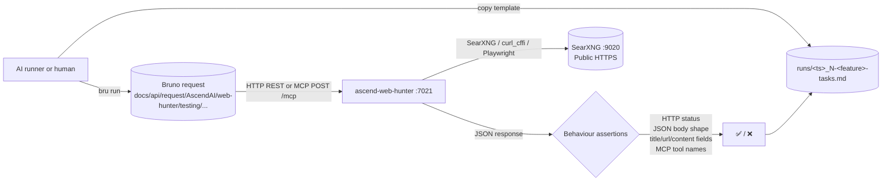

# ascend-web-hunter: end-to-end capability tests

Manual / AI-runnable e2e suite for the ascend-web-hunter module. Each test exercises **one capability** end-to-end
against a live ascend-web-hunter container on port 7021. Assertions are observable behaviour only — HTTP status
codes, JSON response body shape and content, the MCP `tools/list` enumeration, and the MCP `tools/call` payload.
ascend-web-hunter keeps no per-user state beyond a Redis-backed session cache keyed by URL / extraction context;
the search path itself is stateless. Where a test needs reproducible upstream conditions, the reset step calls
the appropriate Redis key wipe.

Before running this suite, or any other e2e suite, pick a run scenario from [docs/E2E_RUN_SCENARIOS.md](../../../docs/E2E_RUN_SCENARIOS.md).

## What's here

```text
apps/ascend-web-hunter/e2e/
├── README.md                            # this file
├── fixtures/                            # canary inputs and seed data
│   ├── README.md
│   ├── session-clear-seed.json          # synthetic session record seeded by test 8
│   └── session-status-expired-seed.json # synthetic session record seeded by test 9
├── harness/                             # scripted-login helper for test 7
│   └── seed_authenticated_session.py
└── testing/                             # numbered specs + templates/ + runs/
    ├── README.md
    ├── 1-invalid-input-test.md          # immutable spec (lowest cost — no SearXNG, no internet egress)
    ├── 2-search-happy-path-test.md
    ├── 3-read-example-com-test.md
    ├── 4-mcp-tools-list-test.md
    ├── 5-mcp-search-test.md
    ├── 6-tiered-scraping-test.md
    ├── 7-authenticated-realworld-scraping-test.md
    ├── 8-session-clear-test.md
    ├── 9-session-status-test.md
    ├── 10-session-establish-test.md
    ├── 11-captcha-solve-and-capture-test.md
    ├── 12-clearance-reuse-test.md
    ├── templates/                       # run-record templates (immutable), one per spec
    │   ├── README.md
    │   ├── 1-invalid-input-tasks.template.md
    │   ├── 2-search-happy-path-tasks.template.md
    │   ├── 3-read-example-com-tasks.template.md
    │   ├── 4-mcp-tools-list-tasks.template.md
    │   ├── 5-mcp-search-tasks.template.md
    │   ├── 6-tiered-scraping-tasks.template.md
    │   ├── 7-authenticated-realworld-scraping-tasks.template.md
    │   ├── 8-session-clear-tasks.template.md
    │   ├── 9-session-status-tasks.template.md
    │   ├── 10-session-establish-tasks.template.md
    │   ├── 11-captcha-solve-and-capture-tasks.template.md
    │   └── 12-clearance-reuse-tasks.template.md
    └── runs/
        ├── README.md
        └── <UTC-timestamp>_<N>-<capability>-tasks.md   # one per executed test (gitignored)
```

Tests are number-prefixed by setup cost. `1` runs offline (REST validator short-circuit, no SearXNG hit); `2` needs
SearXNG reachable; `3` needs outbound HTTPS to `example.com` via the tiered extraction stack (curl_cffi tier is
sufficient); `4` only needs the ascend-web-hunter process itself; `5` needs SearXNG again via the MCP path; `6` needs
FlareSolverr plus outbound HTTPS to real sites for a per-tier regression sweep (curl_cffi, FlareSolverr, Playwright);
`7` needs FlareSolverr, a real-world URL matrix and the saucedemo login-seed harness under
[harness/](harness/seed_authenticated_session.py), with no human step; `8` and
`9` only need the ascend-web-hunter process and Redis reachable via `docker exec` — no outbound egress at all; `10`
needs no egress either but launches a real headful Playwright browser held by a background monitor for up to 10
minutes — see its own spec for why that keeps it out of the cheap tier despite not touching SearXNG, FlareSolverr,
or any external site. Spec `11` needs FlareSolverr, NoVNC and a human to tick the hCaptcha widget on the democaptcha
demo form, and asserts the capture that solve leaves behind, so it runs last and only on a human's go. Spec `12`
needs FlareSolverr and outbound HTTPS to one Cloudflare-protected site, and proves the stored clearance is reused on
a second read of that site with no human, so it runs after spec `6`, which reads the same site. Twelve specs in all,
eleven of them automated.

The Bruno collection isn't here. It lives at the **repo root** under
`docs/api/request/AscendAI/web-hunter/testing/` so it stays a portable API client artifact. Each spec references
the matching Bruno request file under that path. (The pre-existing ad-hoc requests directly under
`docs/api/request/AscendAI/web-hunter/` are kept untouched as dev-time fixtures; e2e specs only point at the
`testing/` subfolder.)

## Flow



Every spec follows the same template:

1. **What this verifies.** Bullet list of behaviours.
2. **Prerequisites.** Concrete check commands the runner executes before starting. Each command is its own code
   block; the prose around it states what success looks like.
3. **Reset state.** One command per code block, executed in order, to wipe state so the test is reproducible. Most
   ascend-web-hunter tests do not need reset; the v2 read tests can optionally flush the Redis session cache.
4. **Run.** One or more numbered steps. Each step is a single Bruno CLI invocation (or, for MCP tests, a `curl`
   handshake followed by Bruno). Steps wait for HTTP 200 before continuing.
5. **Expected.** Observable behaviour only: HTTP status, JSON body shape, list-element keys (`title`, `url`,
   `content`), MCP tool registry contents. No log substrings.
6. **Fixtures.** Paths to local files the test reads (none for the current suite).

The paired `templates/<N>-<feature>-tasks.template.md` is the runner's checklist for one execution: prerequisites,
reset state, run steps, expected, verdict, plus **Result summary** (with **Input tokens**, **Output tokens**,
**Start (UTC)**, **End (UTC)**, **Duration** fields) and **Additional tasks I did** (anything done outside the
spec). The runner copies the template from [testing/templates/](testing/templates/) into [testing/runs/](testing/runs/)
as `<UTC-timestamp>_<N>-<feature>-tasks.md` and fills it in. ascend-web-hunter specs make no paid call (SearXNG,
curl_cffi, FlareSolverr, and Playwright only), so [docs/E2E_COST.md](../../../docs/E2E_COST.md) records this module as a
zero-cost row rather than tracking tokens here.

## Parallelism and execution order

ascend-web-hunter holds no per-user state in Postgres or Qdrant — only a Redis session cache for the extraction
pipeline plus an in-process blocklist. The execution constraints:

| Constraint | Tests | Why |
| :--- | :--- | :--- |
| Redis-cache shared key | 3 | The v2 read test for `example.com` may share a Redis cache key with any other read against the same URL. Two concurrent runs against the same URL are still safe (the cache is read-after-write idempotent), but a deterministic cold run can flush the URL's key first. Also conflicts with test 8: test 8's idempotent-clear call for `example.com` asserts `cleared_cache_entries=0`, which fails if test 3 has already populated that domain's per-process read cache. |
| No cross-test interference | 1, 2, 4, 5 | Search calls write only to ephemeral SearXNG cache (out of process). MCP-list and invalid-input tests touch no upstream service. |
| Domain-scoped Redis session/cookie cache | 6 | Mutates Redis session keys for its own target domains (`en.wikipedia.org`, `scrapingcourse.com`, `quotes.toscrape.com`). No overlap with test 3's `example.com` key. Safe in parallel with 1, 2, 4, 5. |
| Domain-scoped Redis session keys, fully automated | 7 | Part 1 (matrix) and Part 2 (automated saucedemo login) may fan out across parallel runners, with Part 2's three steps kept in order on one runner. No human step since the hCaptcha solve moved to test 11. Mutates Redis session keys for the matrix domains and `saucedemo.com`, with no overlap with test 6's domains. Its reset flushes every `session:*` key, so it must not run while test 11 holds its democaptcha capture between its two calls, and row u's 428 holds the single NoVNC browser test 11's human needs. |
| Domain-scoped Redis session key, no egress | 8 | Mutates only `session:example.net:default`, seeded and removed by the test itself. Conflicts with test 10, which writes `session:example.net:e2e-establish` as a side effect of `session/establish` (see test 10's own spec): a different key, but one that would appear in the `session:*` scan this test compares before and after. Also conflicts with test 3: test 3's read of `example.com` populates the same per-domain read cache that test 8's idempotent-clear call for `example.com` asserts is empty (`cleared_cache_entries=0`), so running them together fails that assertion. Safe in parallel with 1, 2, 4, 5, 9. Its final "no collateral damage" check compares the whole `session:*` key set against a pre-test baseline. That comparison is meaningful only when test 8 runs in isolation, since any test that mutates any session key while it is running, not only test 3 or 10, makes it fail. |
| Domain-scoped Redis session key, no egress | 9 | Mutates only `session:example.org:default`, seeded twice and removed by the test itself. No overlap with test 8's or test 10's `example.net` key or any other test's domains. Safe in parallel with 1, 2, 4, 5, 8, 10. |
| `session:example.net:e2e-establish`, plus a long-lived background browser | 10 | `session/establish` was assumed to write no session record until this spec was run live against port 7021, which showed otherwise within 15 seconds: the monitor's "cleared" check accepts any unchallenged page, so it captures an (often empty) session on the very first poll, as though a challenge had just been solved. See the spec's "Two behaviours this spec found live, not assumed" section. This test writes `session:example.net:e2e-establish` and cleans the key up itself. That is not the key test 8 seeds and clears, but test 8 compares a scan of `session:*` before and after its run, so this key would appear in that scan and fail it. It also leaves a real headful Playwright browser + NoVNC monitor running in the `ascend-web-hunter` container for up to 10 minutes after its own assertions pass if the monitor does not resolve within one poll cycle. Avoid running it back to back with itself for the same reason. |
| Human-in-the-loop, must run on the main session | 11 | Call 1's read of the democaptcha hCaptcha demo form surfaces a `vnc_url` a human must open, and the capture check then proves the solve left `session:democaptcha.com:default` behind with the `hmt_id` cookie. Reuse is not asserted here, that is test 12's job. It cannot be delegated to a fanned-out subagent whose output is never shown to the user. Mutates `session:democaptcha.com:default` and holds the single shared NoVNC browser while the human window is open, so it conflicts with any spec that opens that window (test 7's row u, test 10) and with test 7's `session:*` flush. Runs alone, last, and only on a human's go. |
| Domain-scoped Redis session key, shared with test 6, fully automated | 12 | Mutates `session:scrapingcourse.com:default` and the reader's in-process read cache for that domain, the same site and key test 6's Cloudflare row writes, so it must not run alongside test 6 and runs after it. Its key would appear in the `session:*` scan tests 8 and 10 compare, so it must not run alongside them either, and test 7's reset flushes every `session:*` key, which would wipe the capture between its two calls. On the A61 failure path its Call 2 opens the single shared NoVNC browser. Safe in parallel with 1, 2, 3, 4, 5, 9. No human. |

Recommended layout: run test 1 first (offline, fail-fast on validator bugs without burning egress), then tests
2, 4, 5, 9 in parallel or sequential (none needs FlareSolverr or Playwright), then test 6 (highest egress cost,
needs FlareSolverr and Playwright), then test 12 (after test 6 because both write `session:scrapingcourse.com:default`,
and before test 7 because test 7's reset would wipe its capture), then test 7 (also FlareSolverr and Playwright, fully
automated now, after test 6 because its reset flushes every `session:*` key), then tests 8 and 10 one at a time (never
together: test 10's `session:example.net:e2e-establish` key would appear in the `session:*` scan test 8 compares
before and after), with test 10 last of the two, since its assertions finish in seconds but the background browser it
can leave running should not overlap with a repeat of itself either. Test 11 runs last of all, alone, and only on a
human's go, because its human solve needs the main session and the single NoVNC browser.

## Prerequisites before any test

1. Docker compose stack up: the `ascend-scrapper` project group needs to be running — `ascend-web-hunter`,
   `searxng`, and `flaresolverr` containers all healthy.
2. `curl -fsS http://localhost:7021/health` returns HTTP 200 with `{"status":"ok"}`.
3. `curl -fsS "http://localhost:9020/search?q=test&format=html"` returns HTTP 200 with HTML content (proves SearXNG
   is reachable from the host).
4. Bruno CLI installed: `bru --version` returns a version string. Install once with `npm install -g @usebruno/cli`.

When the scraping file runs alone with `COMPOSE_PROFILES=redis` and `REDIS_URL=redis://redis:6379/0` in `.env`, the
session store is the container `ascend-scrapper-redis`, so every `docker exec redis` command in these specs targets
that container instead.

If the ascend-web-hunter startup readiness banner shows any `[FAILED]` rows for upstream services, fix the
connectivity before running the suite.

## Running tests

Install Bruno CLI once.

```powershell
npm install -g @usebruno/cli
```

Run one capability.

```powershell
cd docs/api/request/AscendAI
```

```powershell
bru run "web-hunter/testing/search-stable-query.yml" --env ascend-local
```

Run the whole `testing/` suite (Bruno's directory mode).

```powershell
cd docs/api/request/AscendAI
```

```powershell
bru run "web-hunter/testing" --env ascend-local
```

## Capability tests

Numbered by setup cost. Easiest first.

| #  | Spec | What it proves |
| :- | :--- | :--- |
| 1  | [testing/1-invalid-input-test.md](testing/1-invalid-input-test.md) | `GET /api/v1/web/search` with a blank `query` returns HTTP 400; with an over-length `query` returns HTTP 400. No SearXNG egress required. |
| 2  | [testing/2-search-happy-path-test.md](testing/2-search-happy-path-test.md) | `GET /api/v1/web/search?query=OpenStreetMap&limit=3` returns HTTP 200 with a JSON array of ≥ 1 result; each entry has `title`, `url`, `content`. |
| 3  | [testing/3-read-example-com-test.md](testing/3-read-example-com-test.md) | `POST /api/v2/web/read` with `https://www.example.com/` returns HTTP 200, `status="success"`, and the extracted content contains `"Example Domain"`. |
| 4  | [testing/4-mcp-tools-list-test.md](testing/4-mcp-tools-list-test.md) | MCP `tools/list` returns an entry with `name="web_search"` and one with `name="web_read"`, each carrying a `query` (or `url`) parameter in its input schema. |
| 5  | [testing/5-mcp-search-test.md](testing/5-mcp-search-test.md) | MCP `tools/call` for `web_search` with a stable query returns a structured result containing ≥ 1 entry with `title`, `url`, `content`. |
| 6  | [testing/6-tiered-scraping-test.md](testing/6-tiered-scraping-test.md) | `POST /api/v2/web/read` against a tier-mapped list (Wikipedia static, `scrapingcourse.com` Cloudflare, `quotes.toscrape.com/js/` JS-rendered) returns HTTP 200 `status="success"` with the per-tier canary content. Highest egress cost — needs FlareSolverr + Playwright, runs last. |
| 7  | [testing/7-authenticated-realworld-scraping-test.md](testing/7-authenticated-realworld-scraping-test.md) | Two automated parts, no human step. Part 1: a difficulty-graded real-world URL matrix (easy/medium/hard/very-hard static+JS+WAF → `success`, dead domain → `hard-fail` HTTP 400, LinkedIn/indeed-auth login walls → `intervention` HTTP 428) where gated canaries hard-assert and live sites assert a valid terminal verdict (success or intervention). Five retail anti-bot rows (Allegro plus Amazon PL/US/UK/SE product pages) are best-effort on which branch fires and content-gated on the success branch: a `200`/`success` must carry the requested product page's identity canary (ISBN-13 / ASIN / model code) and none of the measured interstitial or block-page markers, so an anti-bot interstitial can never be recorded as a successful scrape. A row answering HTTP 409 with `status="novnc_busy"` is not a verdict: the runner waits the response's `Retry-After` seconds and re-runs the row, up to 3 attempts in total, records each attempt and each 409 body's `holder_url` in the run record, and fails the row only on the third 409. Part 2: a 2-call login-reuse behaviour, where a scripted login on a stable SPA (`saucedemo.com`, public demo creds hardcoded, no secrets) seeds `storage_state` and proves browser-tier authenticated capture and replay. The human-solved hCaptcha that used to be Part 3 is test 11. |
| 8  | [testing/8-session-clear-test.md](testing/8-session-clear-test.md) | `POST /api/v2/web/session/clear`, the operator-recovery path for a poisoned session. A session seeded directly in Redis for `example.net` is removed (`existed=true`, key gone from Redis afterward). A call against `example.com`, which never carried one, is a documented no-op (HTTP 200, `existed=false`, not a 404 or 500). No FlareSolverr, Playwright, or human needed, so it is the cheapest test in the suite alongside 1 and 4. Do not run in parallel with test 10: its `session:example.net:e2e-establish` key would appear in the `session:*` scan this test compares before and after. |
| 9  | [testing/9-session-status-test.md](testing/9-session-status-test.md) | `POST /api/v2/web/session/status` across all three states its own type declares: `none` for a URL that never carried a session, `expired` for one seeded with a `saved_at` outside the 14-day auth TTL, and `active` for the same key re-seeded with a fresh `saved_at`. Redis-only, no egress — same cost tier as 1, 4, and 8. |
| 10 | [testing/10-session-establish-test.md](testing/10-session-establish-test.md) | `POST /api/v2/web/session/establish`, the proactive counterpart to passive NoVNC capture. Asserts the immediate response (`status="login_required"`, echoed `target`, non-empty `vnc_url`), plus a live-verified finding this spec documents rather than assumes: the background monitor's "cleared" check accepts any unchallenged page, so it captures an (often empty) session on the very first poll, about 15 seconds in, even though nobody solved a challenge. Makes no priced call and needs no human, but launches a real headful Playwright browser that can be held by a background monitor for up to 10 minutes, the highest per-run resource cost in this module's suite. Do not run in parallel with test 8 (the `session:example.net:e2e-establish` key this test writes would appear in the `session:*` scan test 8 compares before and after) or with itself. See the spec's own cost note. |
| 11 | [testing/11-captcha-solve-and-capture-test.md](testing/11-captcha-solve-and-capture-test.md) | Human-solved hCaptcha and its capture on the democaptcha demo form (`https://democaptcha.com/demo-form-eng/hcaptcha.html`), whose `hcaptcha.com/1/api.js` script is a block signature for every automated tier. Call 1 with no session answers HTTP 428, `status="human_intervention_required"` and a `vnc_url` the main agent prints for the human. After the human ticks the widget and submits the form through NoVNC, `session:democaptcha.com:default` holds the `hmt_id` cookie hCaptcha sets on the checkbox click (proof a human acted, not that the image task was solved). Reuse of the capture is not asserted here: the form renders its widget on every load, so a second read of it can never show reuse (register A60), and spec 12 proves reuse on a site whose wall disappears once the clearance is stored. Runs alone, last, main session only, on a human's go. |
| 12 | [testing/12-clearance-reuse-test.md](testing/12-clearance-reuse-test.md) | Stored Cloudflare clearance reused on a second read of the same site, fully automated. Call 1 reads `https://www.scrapingcourse.com/cloudflare-challenge` with no stored session and must answer HTTP 200, `status="success"` and at least 50 characters of content (measured 2026-09-10: `3-flaresolverr` in 25.2 seconds), leaving `session:scrapingcourse.com:default` behind with a `cf_clearance` cookie in its `waf` entry. Call 2 reads the same page as `?reuse=1`, a different address so the reader's five-minute in-memory read cache cannot answer it, and must answer HTTP 200, `status="success"`, at least 50 characters of content, no `vnc_url`, never a 428, and faster than Call 1. Both calls' `mode` and duration go into the run record. A 428 on Call 2 is a FAIL and is register defect A61 until its fix lands. Runs after test 6, which reads the same site, and not alongside tests 6, 7, 8 or 10. No human. |

## Adding a new test

1. Add the Bruno request(s) under `docs/api/request/AscendAI/web-hunter/testing/<request>.yml`.
2. Pick the next number prefix that matches the test's setup cost.
3. Write `testing/<N>-<capability>-test.md` using the template structure (**What this verifies / Prerequisites /
   Reset state / Run / Expected / Fixtures**). Assert behaviour, not logs.
4. Write `testing/templates/<N>-<capability>-tasks.template.md` mirroring the spec's checkboxes, with
   `## Result summary` containing the **Input tokens / Output tokens / Start (UTC) / End (UTC) / Duration** fields
   at the bottom.
5. Add a row to the capability table above.
