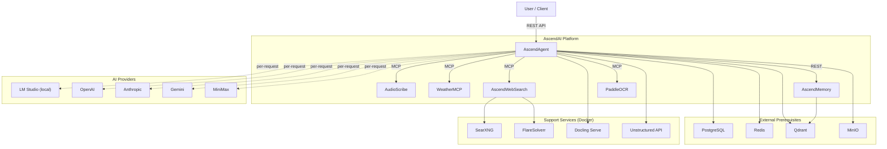

# 2. System Context

## Context Diagram

## External Interfaces

| Interface | Protocol | Direction | Purpose |
|---|---|---|---|
| User REST API | HTTP/JSON, multipart | Inbound | Prompt with optional image/document/provider/model |
| LLM Provider APIs | HTTP/JSON | Outbound | Chat completion (OpenAI-compatible or Anthropic SDK) |
| MCP Tool Services | Streamable HTTP (JSON-RPC) | Outbound | Tool discovery and invocation |
| AscendMemory | REST API | Outbound | Semantic memory insert/search/delete |
| PostgreSQL | TCP (JDBC) | Outbound | Persistent chat history, ingestion metadata |
| Redis | TCP | Outbound | Short-term chat history cache |
| Qdrant | HTTP/gRPC | Outbound | Vector similarity search (RAG + memory) |
| MinIO | S3 API | Outbound | Document object storage for ingestion |
