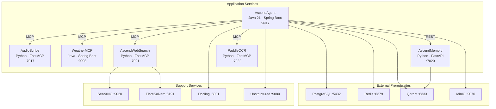
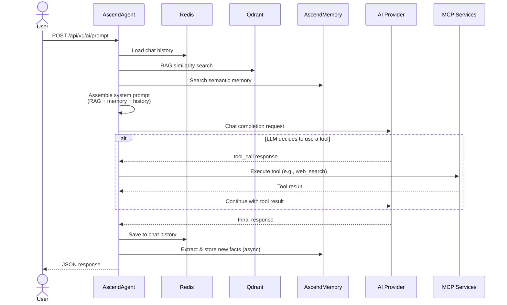
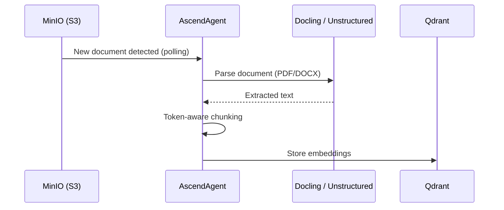

# 3. Building Block View

## Level 1: Service Decomposition

## Service Responsibilities

| Service | Role | Tech Stack | Communication |
|---|---|---|---|
| **AscendAgent** | Central gateway — receives user prompts, routes to AI providers, assembles context (RAG + memory + history), dispatches MCP tool calls | Java 21, Spring Boot 3.5, Spring AI 1.1 | REST API (inbound), MCP client (outbound) |
| **AudioScribe** | Audio transcription — local (faster-whisper/GPU), OpenAI Whisper API, or HuggingFace. Supports multi-track Audacity projects | Python 3.11, FastMCP | MCP server + REST API |
| **WeatherMCP** | Current weather data provider | Java 21, Spring Boot 3.5, Spring AI | MCP server |
| **AscendWebSearch** | Web search via SearXNG + multi-tiered content extraction with Cloudflare bypass | Python 3.12, FastMCP, Playwright | MCP server + REST API |
| **AscendMemory** | Semantic memory — stores/searches user-scoped facts using mem0ai + Qdrant | Python 3.11, FastAPI, mem0ai | REST API + MCP server |
| **PaddleOCR** | OCR text extraction from images, multi-language | Python 3.11, FastMCP, PaddleOCR | MCP server + REST API |

## How Services Interact

### Prompt Flow (happy path)

### Document Ingestion Flow

## Detailed Module Documentation

Each module has its own `AGENTS.md` with build instructions, architecture details, and conventions:

- [AscendAgent](../../AscendAgent/AGENTS.md) — includes internal arc42 docs in `AscendAgent/docs/architecture/`
- [AudioScribe](../../AudioScribe/AGENTS.md)
- [AscendWebSearch](../../AscendWebSearch/AGENTS.md)
- [AscendMemory](../../AscendMemory/AGENTS.md)
- [WeatherMCP](../../WeatherMCP/AGENTS.md)
- [PaddleOCR](../../PaddleOCR/AGENTS.md)
