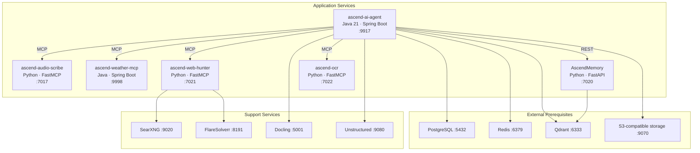
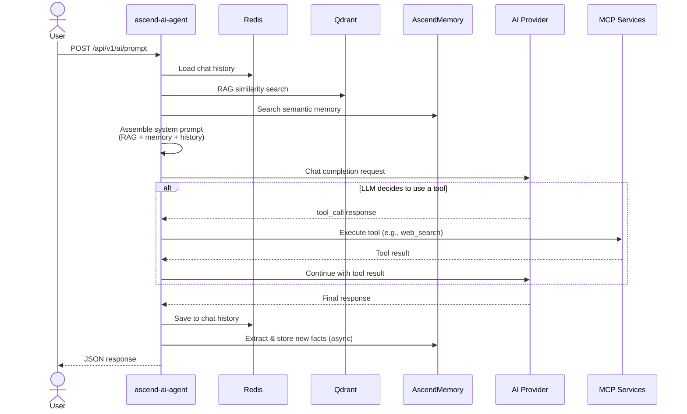
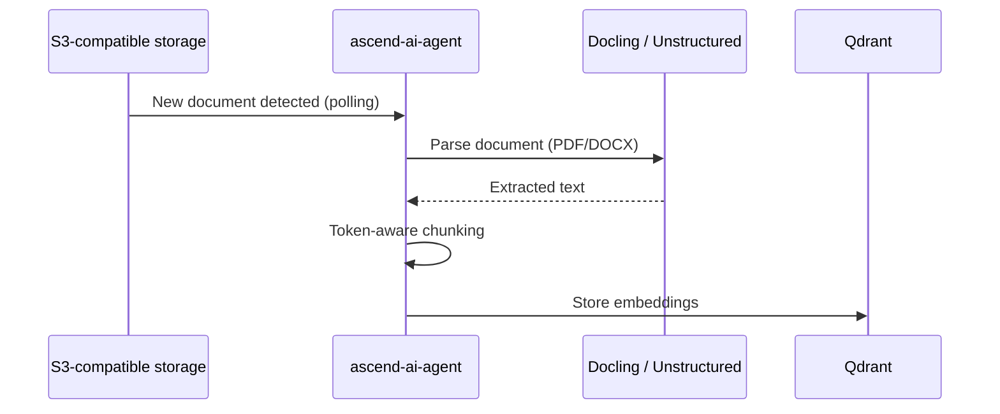

# 3. Building Block View

---

### Level 1: service decomposition

```mermaid
graph TB
    subgraph "Application Services"
        Agent["ascend-ai-agent<br/>Java 21 · Spring Boot<br/>:9917"]
        AudioScribe["ascend-audio-scribe<br/>Python · FastMCP<br/>:7017"]
        Weather["ascend-weather-mcp<br/>Java · Spring Boot<br/>:9998"]
        WebHunter["ascend-web-hunter<br/>Python · FastMCP<br/>:7021"]
        Memory["AscendMemory<br/>Python · FastAPI<br/>:7020"]
        PaddleOCR["ascend-ocr<br/>Python · FastMCP<br/>:7022"]
    end

    subgraph "External Prerequisites"
        Postgres["PostgreSQL :5432"]
        Redis["Redis :6379"]
        Qdrant["Qdrant :6333"]
        S3["S3-compatible storage :9070"]
    end

    subgraph "Support Services"
        SearXNG["SearXNG :9020"]
        Flare["FlareSolverr :8191"]
        Docling["Docling :5001"]
        Unstructured["Unstructured :9080"]
    end

    Agent -->|"MCP"| AudioScribe
    Agent -->|"MCP"| Weather
    Agent -->|"MCP"| WebHunter
    Agent -->|"MCP"| PaddleOCR
    Agent -->|"REST"| Memory
    Agent --> Postgres
    Agent --> Redis
    Agent --> Qdrant
    Agent --> S3
    Agent --> Docling
    Agent --> Unstructured
    WebHunter --> SearXNG
    WebHunter --> Flare
    Memory --> Qdrant
```

---

### Service responsibilities

| Service                                                    | Role                                                                                                                       | Tech Stack                                 | Communication                       |
| :--------------------------------------------------------- | :------------------------------------------------------------------------------------------------------------------------- | :----------------------------------------- | :---------------------------------- |
| **[ascend-ai-agent](../../../apps/ascend-ai-agent/AGENTS.md)**          | Central gateway: receives user prompts, routes to AI providers, assembles context (RAG + memory + history), dispatches MCP tool calls. | Java 21, Spring Boot 3.5, Spring AI 1.1    | REST API (in), MCP client (out)     |
| **[ascend-audio-scribe](../../../apps/ascend-audio-scribe/AGENTS.md)**          | Audio transcription: local (faster-whisper / GPU), OpenAI Whisper API, or HuggingFace. Supports multi-track Audacity projects. | Python 3.11, FastMCP                       | MCP server + REST API               |
| **[ascend-weather-mcp](../../../apps/ascend-weather-mcp/AGENTS.md)**            | Current weather data provider.                                                                                             | Java 21, Spring Boot 3.5, Spring AI        | MCP server                          |
| **[ascend-web-hunter](../../../apps/ascend-web-hunter/AGENTS.md)**  | Web search via SearXNG + multi-tiered content extraction with Cloudflare bypass.                                           | Python 3.12, FastMCP, Playwright           | MCP server + REST API               |
| **[AscendMemory](../../../apps/ascend-memory/AGENTS.md)**        | Semantic memory: stores and searches user-scoped facts using mem0ai + Qdrant.                                              | Python 3.11, FastAPI, mem0ai               | REST API + MCP server               |
| **[ascend-ocr](../../../apps/ascend-ocr/AGENTS.md)**            | OCR text extraction from images, multi-language.                                                                           | Python 3.11, FastMCP, PaddleOCR            | MCP server + REST API               |

---

### How services interact

#### Prompt flow (happy path)

```mermaid
sequenceDiagram
    actor User
    participant Agent as ascend-ai-agent
    participant Redis
    participant Qdrant
    participant Memory as AscendMemory
    participant LLM as AI Provider
    participant MCP as MCP Services

    User->>Agent: POST /api/v1/ai/prompt
    Agent->>Redis: Load chat history
    Agent->>Qdrant: RAG similarity search
    Agent->>Memory: Search semantic memory
    Agent->>Agent: Assemble system prompt<br/>(RAG + memory + history)
    Agent->>LLM: Chat completion request

    alt LLM decides to use a tool
        LLM-->>Agent: tool_call response
        Agent->>MCP: Execute tool (e.g., web_search)
        MCP-->>Agent: Tool result
        Agent->>LLM: Continue with tool result
    end

    LLM-->>Agent: Final response
    Agent->>Redis: Save to chat history
    Agent->>Memory: Extract & store new facts (async)
    Agent-->>User: JSON response
```

#### Document ingestion flow

```mermaid
sequenceDiagram
    participant S3 as S3-compatible storage
    participant Agent as ascend-ai-agent
    participant Docling as Docling / Unstructured
    participant Qdrant

    S3->>Agent: New document detected (polling)
    Agent->>Docling: Parse document (PDF/DOCX)
    Docling-->>Agent: Extracted text
    Agent->>Agent: Token-aware chunking
    Agent->>Qdrant: Store embeddings
```

---

### Detailed module documentation

Each module has its own `AGENTS.md` with build instructions, architecture details, and conventions.

- [ascend-ai-agent](../../../apps/ascend-ai-agent/AGENTS.md). Includes internal arc42 docs in
  [apps/ascend-ai-agent/docs/architecture/](../../../apps/ascend-ai-agent/docs/architecture/).
- [ascend-audio-scribe](../../../apps/ascend-audio-scribe/AGENTS.md)
- [ascend-web-hunter](../../../apps/ascend-web-hunter/AGENTS.md)
- [AscendMemory](../../../apps/ascend-memory/AGENTS.md)
- [ascend-weather-mcp](../../../apps/ascend-weather-mcp/AGENTS.md)
- [ascend-ocr](../../../apps/ascend-ocr/AGENTS.md)
