# 4. Deployment View

## Local Development Topology

```mermaid
graph TB
    subgraph "Developer Machine (Host)"
        LMStudio["LM Studio :1234"]
        Agent["AscendAgent :9917<br/>(java -jar)"]
        Weather["WeatherMCP :9998<br/>(java -jar)"]
    end

    subgraph "External Prerequisites"
        Postgres["PostgreSQL :5432"]
        Redis["Redis :6379"]
        Qdrant["Qdrant :6333/6334"]
        MinIO["MinIO :9070/9071"]
    end

    subgraph "Docker Compose"
        subgraph "Application Services"
            AudioScribe["AudioScribe :7017"]
            WebSearch["AscendWebSearch :7021"]
            Memory["AscendMemory :7020"]
            PaddleOCR["PaddleOCR :7022"]
        end

        subgraph "Support Services"
            SearXNG["SearXNG :9020"]
            Flare["FlareSolverr :8191"]
            Docling["Docling :5001"]
            Unstructured["Unstructured :9080"]
        end
    end

    subgraph "Cloud (Optional)"
        OpenAI["OpenAI API"]
        Gemini["Gemini API"]
        Anthropic["Anthropic API"]
        MiniMax["MiniMax API"]
    end

    Agent --> LMStudio
    Agent --> Postgres
    Agent --> Redis
    Agent --> Qdrant
    Agent --> MinIO
    Agent --> AudioScribe
    Agent --> Weather
    Agent --> WebSearch
    Agent --> Memory
    Agent --> PaddleOCR
    Agent --> Docling
    Agent --> Unstructured
    Agent -.-> OpenAI
    Agent -.-> Gemini
    Agent -.-> Anthropic
    Agent -.-> MiniMax
    WebSearch --> SearXNG
    WebSearch --> Flare
    Memory --> Qdrant
```

## Service Port Map

| Service | Port(s) | Type | Runs In |
|---|---|---|---|
| AscendAgent | 9917 | Main API gateway | Host JVM |
| WeatherMCP | 9998 | MCP server | Host JVM |
| LM Studio | 1234 | Local LLM | Host |
| AudioScribe | 7017 | MCP server | Docker |
| AscendWebSearch | 7021 | MCP server | Docker |
| AscendMemory | 7020 | REST + MCP | Docker |
| PaddleOCR | 7022 | MCP server | Docker |
| Docling Serve | 5001 | Document conversion | Docker |
| Unstructured API | 9080 | Document parsing | Docker |
| SearXNG | 9020 | Meta search | Docker |
| FlareSolverr | 8191 | Cloudflare bypass | Docker |
| PostgreSQL | 5432 | Database | External prerequisite |
| Redis | 6379 | Cache | External prerequisite |
| Qdrant | 6333 / 6334 | Vector DB | External prerequisite |
| MinIO | 9070 / 9071 | Object storage | External prerequisite |

## Prerequisites

External services must be running before `docker-compose up`:

| Service | Purpose | Cloud Equivalent |
|---|---|---|
| PostgreSQL | Metadata, chat history, ingestion state | AWS RDS, Cloud SQL |
| Redis | Chat history cache, session persistence | AWS ElastiCache, Redis Cloud |
| Qdrant | Vector embeddings for RAG and semantic memory | Qdrant Cloud |
| MinIO | S3-compatible document storage | AWS S3, GCS |
