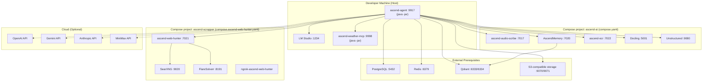

# 4. Deployment View

---

### Local development topology

```mermaid
graph TB
    subgraph "Developer Machine (Host)"
        LMStudio["LM Studio :1234"]
        Agent["ascend-agent :9917<br/>(java -jar)"]
        Weather["ascend-weather-mcp :9998<br/>(java -jar)"]
    end

    subgraph "External Prerequisites"
        Postgres["PostgreSQL :5432"]
        Redis["Redis :6379"]
        Qdrant["Qdrant :6333/6334"]
        S3["S3-compatible storage :9070/9071"]
    end

    subgraph "Compose project: ascend-ai (compose.yaml)"
        AudioScribe["ascend-audio-scribe :7017"]
        Memory["AscendMemory :7020"]
        PaddleOCR["ascend-ocr :7022"]
        Docling["Docling :5001"]
        Unstructured["Unstructured :9080"]
    end

    subgraph "Compose project: ascend-scrapper (compose.ascend-web-hunter.yaml)"
        WebHunter["ascend-web-hunter :7021"]
        SearXNG["SearXNG :9020"]
        Flare["FlareSolverr :8191"]
        Ngrok["ngrok-ascend-web-hunter"]
    end

    subgraph "Cloud (Optional)"
        OpenAI["OpenAI API"]
        Gemini["Gemini API"]
        Anthropic["Anthropic API"]
        MiniMax["MiniMax API"]
    end

    Agent --> LMStudio
    Agent --> Postgres
    Agent --> Redis
    Agent --> Qdrant
    Agent --> S3
    Agent --> AudioScribe
    Agent --> Weather
    Agent --> WebHunter
    Agent --> Memory
    Agent --> PaddleOCR
    Agent --> Docling
    Agent --> Unstructured
    Agent -.-> OpenAI
    Agent -.-> Gemini
    Agent -.-> Anthropic
    Agent -.-> MiniMax
    WebHunter --> SearXNG
    WebHunter --> Flare
    Memory --> Qdrant
```

---

### Service port map

| Service           | Port(s)         | Type                  | Runs in                |
| :---------------- | :-------------- | :-------------------- | :--------------------- |
| ascend-agent       | 9917            | Main API gateway      | Host JVM               |
| ascend-weather-mcp | 9998            | MCP server            | Host JVM               |
| LM Studio         | 1234            | Local LLM             | Host                   |
| ascend-audio-scribe       | 7017            | MCP server            | Docker                 |
| ascend-web-hunter   | 7021            | MCP server            | Docker                 |
| AscendMemory      | 7020            | REST + MCP            | Docker                 |
| ascend-ocr        | 7022            | MCP server            | Docker                 |
| Docling Serve     | 5001            | Document conversion   | Docker                 |
| Unstructured API  | 9080            | Document parsing      | Docker                 |
| SearXNG           | 9020            | Meta search           | Docker                 |
| FlareSolverr      | 8191            | Cloudflare bypass     | Docker                 |
| PostgreSQL        | 5432            | Database              | External prerequisite  |
| Redis             | 6379            | Cache                 | External prerequisite  |
| Qdrant            | 6333 / 6334     | Vector DB             | External prerequisite  |
| S3-compatible storage | 9070 / 9071 | Object storage        | External prerequisite  |

---

### Prerequisites

External services must be running before `docker compose up`. The main file
[compose.yaml](../../../compose.yaml) (project `ascend-ai`) uses `include:` to pull in
[compose.ascend-web-hunter.yaml](../../../compose.ascend-web-hunter.yaml) (project `ascend-scrapper`), so a
single command brings up the full stack.

| Service     | Purpose                                                | Cloud equivalent                |
| :---------- | :----------------------------------------------------- | :------------------------------ |
| PostgreSQL  | Metadata, chat history, ingestion state                | AWS RDS, Cloud SQL              |
| Redis       | Chat history cache, session persistence                | AWS ElastiCache, Redis Cloud    |
| Qdrant      | Vector embeddings for RAG and semantic memory          | Qdrant Cloud                    |
| S3-compatible storage | Document storage, provided locally by a self-hosted emulator | AWS S3, GCS      |
