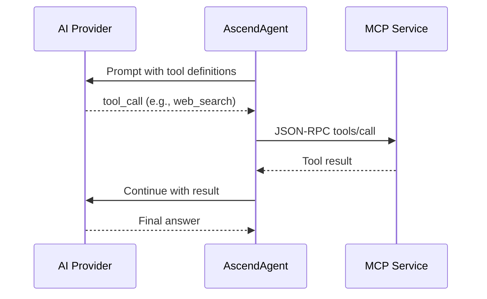

# 5. Crosscutting Concerns

## Multi-Provider AI Routing

The AscendAgent supports 5 AI providers with per-request selection:

| Provider | API Type | Models |
|---|---|---|
| LM Studio (default) | Anthropic-compatible | meta-llama-3.1-8b-instruct |
| OpenAI | OpenAI native | gpt-5.4, gpt-5.1, gpt-5-mini, gpt-4o |
| Anthropic | Anthropic native | claude-opus-4-6, claude-sonnet-4-6, claude-haiku-4-5 |
| Gemini | OpenAI-compatible | gemini-3.1-pro, gemini-2.5-pro, gemini-2.5-flash |
| MiniMax | Anthropic-compatible | MiniMax-M2.5, MiniMax-M2.1 |

Users select providers via the `provider` and `model` form parameters on the prompt endpoint. Each provider also configures a `default-embedding` to route embedding operations to the correct vector dimensions.

## Model Context Protocol (MCP)

MCP services expose tools via Streamable HTTP (JSON-RPC 2.0). The AscendAgent discovers all tools at startup and attaches them to every `ChatClient`. When an LLM decides to use a tool, Spring AI transparently routes the call.



## Dual API Surfaces

Python services (AudioScribe, AscendWebSearch, AscendMemory, PaddleOCR) expose both:
- **REST API** — for direct HTTP integration and testing
- **MCP Server** — for LLM tool discovery and invocation via AscendAgent

Both APIs share the same business logic layer.

## Embedding Provider Routing

Different AI providers use different embedding dimensions:

| Provider | Embedding Model | Dimensions | Qdrant Collection |
|---|---|---|---|
| lmstudio, gemini | nomic-embed-text-v2 | 768 | ascendai-768, ascend_memory_768 |
| openai | text-embedding-3-small | 1536 | ascendai-1536, ascend_memory_1536 |

The `embeddingProvider` parameter propagates through the full chain (AscendAgent → AscendMemory → Qdrant) ensuring search and insert always target the matching collection.

## Chat History (Dual-Store)

- **Redis** — sliding window of last N turns (default 5) for fast LLM context injection
- **PostgreSQL** — persistent archive of all interactions for auditing

## Document Ingestion Pipeline

```
MinIO (S3) → Polling → Docling/Unstructured API → Token Splitter → Qdrant
```

Documents uploaded to MinIO are automatically detected, parsed into text, chunked with token-aware splitting, and stored as vector embeddings in Qdrant for RAG retrieval.

## Semantic Memory

After each prompt, an async `SemanticMemoryExtractor` uses a low-cost model to extract user facts (name, preferences, context) and stores them in AscendMemory. These are injected into future prompts for personalized responses.
