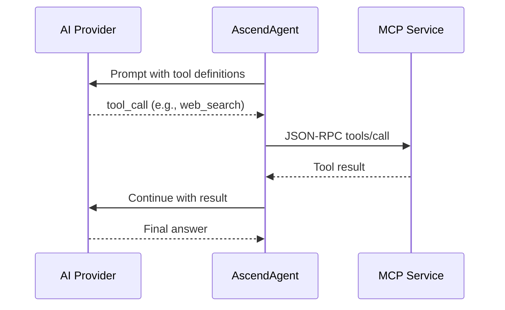

# 5. Crosscutting Concerns

---

### Multi-provider AI routing

The AscendAgent supports 5 AI providers with per-request selection. Model IDs below mirror the values wired in
[AscendAgent/src/main/resources/application.yaml](../../../AscendAgent/src/main/resources/application.yaml) for chat
defaults, memory extraction, and history compaction. Any other model the provider accepts works at request time via
the `model` form field; the values below are what ships out of the box.

| Provider              | API type             | Chat default                  | Memory extraction               | Compaction default              |
| :-------------------- | :------------------- | :---------------------------- | :------------------------------ | :------------------------------ |
| LM Studio (default)   | Anthropic-compatible | `meta-llama-3.1-8b-instruct`  | `meta-llama-3.1-8b-instruct`    | `meta-llama-3.1-8b-instruct`    |
| OpenAI                | OpenAI native        | `gpt-4o`                      | `gpt-4o-mini`                   | `gpt-4o-mini`                   |
| Anthropic             | Anthropic native     | `claude-sonnet-4-5`           | `claude-3-5-haiku-20241022`     | `claude-haiku-4-5`              |
| Gemini                | OpenAI-compatible    | `gemini-flash-latest`         | `gemini-flash-lite-latest`      | `gemini-flash-lite-latest`      |
| MiniMax               | Anthropic-compatible | `MiniMax-M2.7`                | `MiniMax-M2.7`                  | `MiniMax-M2.7`                  |

Users select a provider via the `provider` and `model` form parameters on the prompt endpoint. Each provider also
configures a `default-embedding` to route embedding operations to the correct vector dimensions.

---

### Model Context Protocol (MCP)

MCP services expose tools via Streamable HTTP (JSON-RPC 2.0). The AscendAgent discovers all tools at startup and
attaches them to every `ChatClient`. When an LLM decides to use a tool, Spring AI transparently routes the call.



---

### Dual API surfaces

Python services (AudioScribe, AscendWebSearch, AscendMemory, PaddleOCR) expose both:

- **REST API.** For direct HTTP integration and testing.
- **MCP server.** For LLM tool discovery and invocation via AscendAgent.

Both APIs share the same business logic layer.

---

### Embedding provider routing

Different AI providers use different embedding dimensions.

| Provider          | Embedding model            | Dimensions | Qdrant collection                       |
| :---------------- | :------------------------- | :--------- | :-------------------------------------- |
| lmstudio, gemini  | `nomic-embed-text-v2`      | 768        | `ascendai-768`, `ascend_memory_768`     |
| openai            | `text-embedding-3-small`   | 1536       | `ascendai-1536`, `ascend_memory_1536`   |

The `embeddingProvider` parameter propagates through the full chain (AscendAgent to AscendMemory to Qdrant), ensuring
search and insert always target the matching collection.

---

### Chat history (dual-store)

- **Redis.** Sliding window of the last N turns (default 5) for fast LLM context injection.
- **PostgreSQL.** Persistent archive of all interactions for auditing.

---

### Document ingestion pipeline

```text
MinIO (S3) → Polling → Docling / Unstructured API → Token Splitter → Qdrant
```

Documents uploaded to MinIO are detected, parsed into text, chunked with token-aware splitting, and stored as vector
embeddings in Qdrant for RAG retrieval.

---

### Semantic memory

After each prompt, an async `SemanticMemoryExtractor` uses a low-cost model to extract user facts (name, preferences,
context) and stores them in AscendMemory. These are injected into future prompts for personalised responses.
