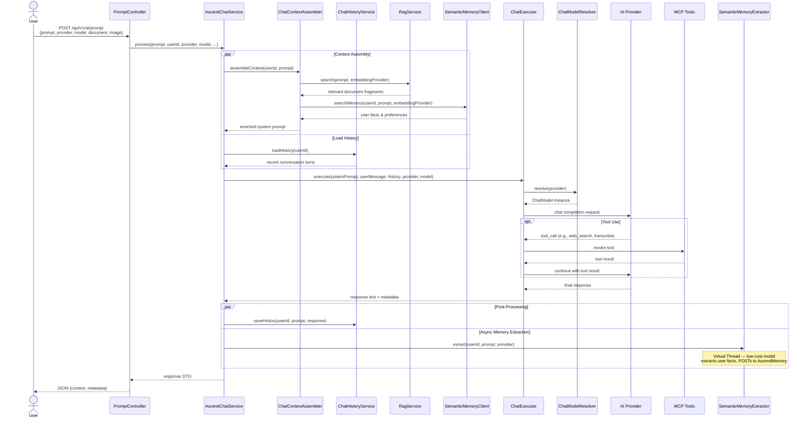

# Prompt Processing Flow

## Sequence Diagram

## Key Design Decisions

- **Parallel context assembly**: RAG search and memory search run concurrently
- **Per-request provider selection**: User chooses AI provider and model at prompt time
- **Transparent tool routing**: LLM decides when to use tools; Spring AI MCP handles dispatch
- **Async memory extraction**: Runs on a Virtual Thread after response, uses a cheap/fast model
- **Dual history store**: Redis for fast reads, PostgreSQL for persistence
