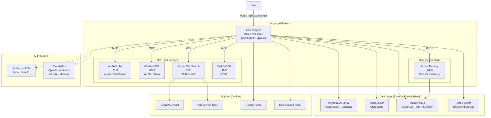

# System Overview Diagram

---

### Data flow summary

| Flow                | Path                                                                | Protocol                            |
| :------------------ | :------------------------------------------------------------------ | :---------------------------------- |
| User prompt         | User to AscendAgent to AI Provider to User                          | REST + LLM API                      |
| Tool call           | AscendAgent to MCP Service to AscendAgent                           | MCP (Streamable HTTP)               |
| RAG retrieval       | AscendAgent to Qdrant                                               | gRPC / HTTP                         |
| Memory              | AscendAgent to AscendMemory to Qdrant                               | REST + Qdrant API                   |
| Chat history        | AscendAgent to Redis (read / write), PostgreSQL (persist)           | TCP                                 |
| Document ingestion  | MinIO to AscendAgent to Docling / Unstructured to Qdrant            | S3 + REST + Qdrant                  |
| Web search          | AscendAgent to AscendWebSearch to SearXNG to FlareSolverr           | MCP + HTTP                          |
