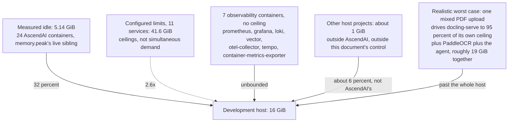

# Memory budget across the AscendAI stack

As of 2026-09-06. Written after the optical character recognition service was OOM-killed on a 16 GiB host running roughly 28 containers, none of them AscendAI's own PaddleOCR container hitting its own limit. The service died from pressure the rest of the host created, and nothing in this repository would have let anyone predict that. This document is the attempt to make that pressure visible and repeatable to check.

The strongest finding in it is this. One person uploading one ordinary mixed-content PDF, a document with both scanned and native-text pages, can already push memory demand to roughly 19 GiB against this 16 GiB host, because the ingestion pipeline fans that single upload across Docling and the OCR service in parallel by design. Docling was measured directly, two days after the incident, at 7.57 GiB, 95 percent of its own 8 GiB ceiling. That is not five unrelated services spiking by coincidence. It is one file, and the mechanism is traced in "Reachable worst case vs. theoretical worst case" below.

Reading paths. New hire sizing a machine for local development: read "Cost at rest" and "Per-service inventory: standalone bundle." Architect reviewing the platform: read the whole document, especially "Reachable worst case vs. theoretical worst case." Operator responding to the next OOM kill: read "Limits that look wrong, and the evidence" and "What to do when the host is smaller than the budget."

---

### Why this document exists

The incident, as reported by the operator: a 16 GiB virtual machine running roughly 28 containers ran the host out of swap, and the kernel killed the PaddleOCR container. PaddleOCR's own cgroup limit (`ascend-paddle-ocr`, [docker-compose.yaml:98](../../docker-compose.yaml)) was never reached. The kill came from the host, not the container. A direct count taken since, once measurement was possible, shows the host running 30 containers. The two counts do not need to agree: two days passed between the incident and the count, and containers get added and removed in that time. Thirty is the number this document uses going forward, because it comes from a direct count rather than recollection.

More than this repository defines, either way. The combined `ascend-ai` plus `ascend-scrapper` stack (`docker-compose.yaml` with its `include:` of `ascend-scrapper.docker-compose.yaml`) is 18 services, and the standalone AscendWebSearch bundle is 4, deployed elsewhere and not part of this host's 30. Six more of the 30 are AscendAI's own external prerequisites, PostgreSQL, Redis, Qdrant, the object store and its own admin UI, and Keycloak, none of them compose services and all of them now measured below. The remaining containers on this host are other projects entirely, a document database, a relational database, two other applications, and a gateway, together holding about 1 GiB, and outside this document's control or concern. What this document can do is state AscendAI's own share of that host, all 24 containers of it, precisely enough that whoever owns the host can subtract it and see what is left for everything else.

---

### Method: what was measured, how, and what was not

Two instruments give a peak that cannot be missed by construction. The kernel's own high water mark, `VmHWM` in `/proc/<pid>/status`, is updated by the kernel every time resident memory grows past its previous maximum, so a sampler reading it afterward sees the true peak regardless of how briefly it was held. The cgroup's own `memory.peak` (cgroup v2) gives the same guarantee at the container level. Both are preferred over sampling from inside the process, because an earlier investigation into PaddleOCR found that an in-process Python sampler understated the true peak by nearly four times: PaddleOCR's inference call holds the GIL almost continuously, so a sampler running on the same interpreter is blocked for exactly the window it needs to measure. `docker stats` is a third instrument, external to the sampled process, but it polls the cgroup's accounting on an interval (roughly one second), so it can still miss a spike shorter than that interval. It is what produced the three figures already on record in `docker-compose.yaml` (see below), and this document keeps them without re-deriving them, per instruction, while noting the instrument for each.

This session had no shell or container-execution tool available to it, so the coordinator ran the measurements directly: `memory.peak` read from inside each container (cgroup v2, the kernel's own high water mark), plus a live read of current usage for the same set, taken afterward. That closes almost every gap this document originally had to leave open. What follows now states, per figure, whether it is one of those two live readings, a figure already supplied as established before this document existed (the PaddleOCR formula, and its confirming OOM-event record), a figure already recorded as a comment inside a compose file by whoever measured it earlier, or static configuration read directly from the files that define it. Where none of those four could answer the question, the figure is still marked unmeasured, with the exact command that would answer it.

One property of `memory.peak` matters for reading every figure below. The counter resets when a container is recreated, so it reports the peak since the container's last recreation, not an all-time peak. Six containers on this host were recreated two days ago during a rebuild, in the same maintenance window as the incident, and PaddleOCR is confirmed among them: it was restarted after its own kill and has read almost nothing since, so its own `memory.peak` this round is small and must not be read as its true ceiling. Where a new reading conflicts with an older one already on record in this document, both are kept, and the difference is attributed to the reset rather than treated as a correction, since a younger counter reporting a lower number does not mean the container's real capability shrank.

One structural fact is confirmed from the running application code rather than from a live measurement: [DocumentRouter.java:40-46](../../AscendAgent/src/main/java/com/lukk/ascend/ai/agent/service/ingestion/DocumentRouter.java) states in its own comment that Docling Serve's two Uvicorn workers, each running a 2-slot conversion queue, give it a real capacity of 4 concurrent conversions, and the default `pdf-parallel-pages` setting is 4 to match. That is a code-level fact, not a measurement, and it is cited as such throughout.

A note on enforcement. `deploy.resources.limits.memory` and `deploy.resources.reservations.memory` are Compose-spec keys that Docker Compose V2 (the `docker compose` CLI this repository uses throughout, never the legacy hyphenated `docker-compose`) applies to a plain `docker compose up` without Swarm mode, translating the limit to the container's cgroup memory ceiling and the reservation to a soft floor. This is standard Compose V2 behavior. It is stated here at moderate-high confidence from prior knowledge, not verified against this host's daemon this session, because no tool to do so was available.

---

### Cost at rest

This is the number the task calls the one that matters for choosing a machine, and it is now the best-answered question in this document. Current usage was read live, inside every container, on 2026-09-06.

| Service | Idle | Source |
| :--- | :--- | :--- |
| ascend-paddle-ocr | 550 MiB | live read, 2026-09-06 (post-restart, see below) |
| unstructured-api | 53 MiB | live read, 2026-09-06 |
| docling-serve | 1657 MiB | live read, 2026-09-06 |
| ascend-agent | 597 MiB | live read, 2026-09-06 |
| ascend-memory | 38 MiB | live read, 2026-09-06 |
| weather-mcp | 127 MiB | live read, 2026-09-06 |
| audio-scribe | 45 MiB | live read, 2026-09-06 |
| searxng (dev) | 18 MiB | live read, 2026-09-06 |
| flaresolverr (dev) | 25 MiB | live read, 2026-09-06 |
| ngrok-ascend-web-search (dev) | 41 MiB | live read, 2026-09-06 |
| ascend-web-search (dev) | 354 MiB | live read, 2026-09-06 |
| container-metrics-exporter | 55 MiB | live read, 2026-09-06 |
| prometheus | 98 MiB | live read, 2026-09-06 |
| grafana | 112 MiB | live read, 2026-09-06 |
| loki | 120 MiB | live read, 2026-09-06 |
| vector | 69 MiB | live read, 2026-09-06 |
| tempo | 363 MiB | live read, 2026-09-06 |
| otel-collector | unmeasured | not in the coordinator's set |

Sum: 4322 MiB, 4.22 GiB, for 17 of the 18 development-stack services, missing only otel-collector. Add the six external prerequisites below (938 MiB, 0.92 GiB) and the whole 24-container AscendAI footprint on this host sits at rest around 5.14 GiB of 16, before the roughly 1 GiB the host's other, unrelated projects hold. That is comfortable headroom, and it says something specific about the incident: the host was not slowly starved by idle creep, it was pushed over by a correlated peak, the kind traced in "Reachable worst case vs. theoretical worst case" below.

The reservations floor from static configuration, kept as a second, independent figure because it answers a different question, a guarantee rather than an observation: 6.8 GiB summed from every service's `deploy.resources.reservations.memory`, docling-serve 2 GiB ([docker-compose.yaml:21](../../docker-compose.yaml)), ascend-paddle-ocr 2 GiB ([docker-compose.yaml:101](../../docker-compose.yaml)), ascend-memory 128 MiB ([docker-compose.yaml:212](../../docker-compose.yaml)), audio-scribe 1 GiB ([docker-compose.yaml:287](../../docker-compose.yaml)), searxng 128 MiB ([ascend-scrapper.docker-compose.yaml:48](../../ascend-scrapper.docker-compose.yaml)), flaresolverr 512 MiB ([ascend-scrapper.docker-compose.yaml:82](../../ascend-scrapper.docker-compose.yaml)), ngrok 64 MiB ([ascend-scrapper.docker-compose.yaml:107](../../ascend-scrapper.docker-compose.yaml)), ascend-web-search 1 GiB ([ascend-scrapper.docker-compose.yaml:172](../../ascend-scrapper.docker-compose.yaml)). It sits above the measured 4.22 GiB, which is exactly what a reservation should do: guarantee more than the stack is currently using, not describe what it is using.

---

### Per-service inventory: development stack

Every service in `docker-compose.yaml` and the `ascend-scrapper.docker-compose.yaml` it includes. "Peak" cites its instrument, and where an older figure is already on record and the new one differs, both are kept, with the reason. "Unmeasured" is now down to one cell in this table: otel-collector was not part of the coordinator's measurement set, and ngrok's peak was not among the figures given even though its idle was.

| Service | Idle | Peak | Instrument | Most expensive operation | Limit | Reservation |
| :--- | :--- | :--- | :--- | :--- | :--- | :--- |
| ascend-paddle-ocr | 550 MiB | 569 MiB since restart, true peak roughly 11 GiB, see below | `memory.peak`, 2026-09-06, reset by the restart, the 11 GiB figure is the container's own out-of-memory event record plus the formula | reading one scanned page | 12 GiB ([docker-compose.yaml:98](../../docker-compose.yaml)) | 2 GiB |
| docling-serve | 1657 MiB | 7755 MiB, 95 percent of its own limit | `memory.peak`, 2026-09-06 | converting a DOCX/PPTX/XLSX/HTML document, up to 4 concurrent conversions ([DocumentRouter.java:40-46](../../AscendAgent/src/main/java/com/lukk/ascend/ai/agent/service/ingestion/DocumentRouter.java)) | 8 GiB ([docker-compose.yaml:23](../../docker-compose.yaml)) | 2 GiB |
| unstructured-api | 53 MiB | 1610 MiB since rebuild, 2.23 GiB all-time on record | `memory.peak`, 2026-09-06 (reset two days ago), older figure is docker stats, 2026-09-04, pre-reset | parsing an eml/epub/rtf/odt document ([DocumentRouter.java:56,81-88](../../AscendAgent/src/main/java/com/lukk/ascend/ai/agent/service/ingestion/DocumentRouter.java)) | 3 GiB ([docker-compose.yaml:44](../../docker-compose.yaml)) | none |
| ascend-agent | 597 MiB | 743 MiB since rebuild, 831 MiB over 14h on record | `memory.peak`, 2026-09-06 (reset two days ago), older figure is docker stats, 2026-09-04, pre-reset | a large multipart document upload, every page held as a separate byte array simultaneously ([docker-compose.yaml:154-157](../../docker-compose.yaml)) | 3 GiB ([docker-compose.yaml:161](../../docker-compose.yaml)), heap capped to 70% by `MaxRAMPercentage` ([Dockerfile:27](../../AscendAgent/Dockerfile)) | none |
| ascend-memory | 38 MiB | 270 MiB | `memory.peak`, 2026-09-06, supersedes the older ~85 MiB idle-only point sample (docker stats, 2026-09-04) | a semantic-memory search or insert, thin REST/MCP proxy to Qdrant plus an embedding API | 512 MiB ([docker-compose.yaml:209](../../docker-compose.yaml)) | 128 MiB |
| weather-mcp | 127 MiB | 289 MiB since rebuild, 374 MiB over 24h on record | `memory.peak`, 2026-09-06 (reset two days ago), older figure is docker stats, 2026-09-04, pre-reset | serving `getCurrentWeather`, no meaningful variance between requests | 512 MiB ([docker-compose.yaml:242](../../docker-compose.yaml)), heap capped to 70% ([Dockerfile:21](../../WeatherMCP/Dockerfile)) | none |
| audio-scribe | 45 MiB | 357 MiB | `memory.peak`, 2026-09-06 | transcribing a large multi-track Audacity project on GPU (host RAM only, VRAM is a separate, unbudgeted resource here), though this peak reflects ordinary use so far, not necessarily that operation | 8 GiB ([docker-compose.yaml:284](../../docker-compose.yaml)) | 1 GiB |
| searxng (dev) | 18 MiB | 186 MiB | `memory.peak`, 2026-09-06 | fanning one query out across every configured upstream search engine | 512 MiB ([ascend-scrapper.docker-compose.yaml:45](../../ascend-scrapper.docker-compose.yaml)) | 128 MiB |
| flaresolverr (dev) | 25 MiB | 925 MiB | `memory.peak`, 2026-09-06 | launching its own headless Chrome to solve a Cloudflare challenge | 2 GiB ([ascend-scrapper.docker-compose.yaml:79](../../ascend-scrapper.docker-compose.yaml)) | 512 MiB |
| ngrok-ascend-web-search (dev) | 41 MiB | unmeasured | idle: live read, 2026-09-06, peak not in the coordinator's set | relaying the NoVNC tunnel, no compute of its own | 128 MiB ([ascend-scrapper.docker-compose.yaml:104](../../ascend-scrapper.docker-compose.yaml)) | 64 MiB |
| ascend-web-search (dev) | 354 MiB | 1610 MiB | `memory.peak`, 2026-09-06 | escalating to a Playwright headless browser against a hard-to-scrape page, `shm_size: 2gb` is charged against this same limit | 4 GiB ([ascend-scrapper.docker-compose.yaml:169](../../ascend-scrapper.docker-compose.yaml)) | 1 GiB |
| container-metrics-exporter | 55 MiB | 71 MiB | `memory.peak`, 2026-09-06 | no configured limit at all, and none needed at this size, but nothing would stop it growing either | none | none |
| prometheus | 98 MiB | 231 MiB | `memory.peak`, 2026-09-06 | no configured limit at all, retention is 72h ([docker-compose.yaml:340](../../docker-compose.yaml)) | none | none |
| grafana | 112 MiB | 263 MiB | `memory.peak`, 2026-09-06 | no configured limit at all | none | none |
| loki | 120 MiB | 225 MiB | `memory.peak`, 2026-09-06 | no configured limit at all, retention is 168h and the query-range cache alone is capped at 100 MiB ([observability/loki/loki-config.yaml:24,37](../../observability/loki/loki-config.yaml)), nothing else about the container is bounded | none | none |
| vector | 69 MiB | 100 MiB | `memory.peak`, 2026-09-06 | no configured limit at all | none | none |
| tempo | 363 MiB | 633 MiB | `memory.peak`, 2026-09-06 | no configured limit at all, and the largest of the seven uncapped containers by a clear margin | none | none |
| otel-collector | unmeasured | unmeasured | not in the coordinator's set | no configured limit at all | none | none |

The PaddleOCR formula, given and not re-derived here: `peak_MiB = 635 + 5302 x megapixels_of_one_page`, r=0.9993, VmHWM/cgroup `memory.peak`. Pages are processed one at a time inside the container (`_WORKER_POOL_SIZE=1`, cited in [openspec/changes/stop-ocr-getting-stuck-on-large-jobs/design.md](../../openspec/changes/stop-ocr-getting-stuck-on-large-jobs/design.md) at the time of writing, that change may be archived to `openspec/specs/` by the time this is read), so page count adds only about 11.5 MiB per additional page rather than multiplying the formula. An A4 page at the library's fixed 144 dpi rendering ([design.md](../../openspec/changes/stop-ocr-getting-stuck-on-large-jobs/design.md), citing `PDF_RENDER_SCALE=2.0` in paddlex) is 2.004 megapixels, giving 11.0 GiB for one page. Each cached language engine in the LRU cache ([ENGINE_CACHE_MAX_SIZE](../../PaddleOCR/AGENTS.md), default 8) costs a further 143 MiB, and a worker that has cycled through all 8 languages carries about 1.6 GiB before reading anything.

The formula is no longer the only evidence for that 11 GiB figure. The container's own out-of-memory event, the one described in "Why this document exists," recorded PaddleOCR's resident memory at the moment the kernel killed it, and that recorded value is close to the formula's own one-page, cold-cache prediction of 11.0 GiB, not the higher end of the range that a fully warmed 8-language cache would add. The two readings in the table above, 550 MiB idle and 569 MiB peak, are neither wrong nor a contradiction of that: they are what the same container reports after being restarted with a fresh `memory.peak` counter and almost no traffic since. Read the 11 GiB as the number that matters for sizing the container, and the two smaller ones as evidence of how little the container has done since it came back up.

---

### Per-service inventory: external prerequisites

PostgreSQL, Redis, Qdrant, and the S3-compatible object store (locally Floci, alongside its own admin UI) are deliberately not compose services, per [ADR-M003](decisions/ADR-M003-external-infrastructure-prerequisites.md), and they still spend the same host's RAM. None has a configured limit anywhere in this repository, because none is defined by this repository, and whatever process manager runs them on this machine owns their sizing. All six below were measured live on 2026-09-06, the same round as the compose services above.

| Service | Idle | Peak | Instrument |
| :--- | :--- | :--- | :--- |
| postgres | 59 MiB | 106 MiB | `memory.peak`, 2026-09-06 |
| redis | 13 MiB | 46 MiB | `memory.peak`, 2026-09-06 |
| qdrant | 97 MiB | 222 MiB | `memory.peak`, 2026-09-06 |
| floci | 90 MiB | 260 MiB | `memory.peak`, 2026-09-06 |
| floci-ui | 99 MiB | unmeasured | idle: `memory.peak`, 2026-09-06, peak not in the coordinator's set |
| keycloak | 580 MiB | 1333 MiB | `memory.peak`, 2026-09-06 |

Keycloak is a real finding on its own, separate from its size. It appears in none of this repository's `AGENTS.md` files, none of the compose files, and none of this document's earlier drafts, yet it is running on this host, and at 1333 MiB peak it is a substantial consumer, behind only docling-serve at 7755 MiB and the pair tied at 1610 MiB, unstructured-api and ascend-web-search. [Permission-aware retrieval](permission-aware-retrieval.md) describes an identity provider in the abstract without naming one, so Keycloak is very likely that provider, staged ahead of the auth and tenant-isolation work it references. Whoever owns that work should confirm it and add it to the prerequisites list this repository actually publishes, since a prerequisite nobody wrote down is a prerequisite nobody budgeted for.

What is known structurally about the four already documented, beyond the live figures above: Postgres's footprint is driven by `shared_buffers` and `work_mem` times active connections, both of which are the operator's own postgresql.conf, not this repo's concern, and the low figures measured here reflect a lightly loaded instance, not a ceiling. Redis is unbounded unless `maxmemory` is set on the instance itself, and nothing in this repository sets it. Qdrant's footprint depends on whether a collection's vectors and payload are held in RAM or spilled to disk, a per-collection setting made at collection-creation time, not visible from compose, and its own 222 MiB measured peak says more about how little data this development instance holds than about its ceiling. Floci is out of scope for the same reason.

LM Studio, when used as the local model provider on port 1234, is also outside compose and outside this budget, and it was not part of the coordinator's measurement set either. A loaded local model occupies host RAM (or VRAM, if GPU-offloaded) for as long as it stays resident, and that is entirely a function of which model the operator has loaded, not of anything this repository configures. It remains unmeasured, out of this repository's scope, and still real cost on the host if it is running.

---

### Per-service inventory: standalone bundle

The [AscendWebSearch standalone bundle](../../AscendWebSearch/deploy-standalone/README.md) targets a separate 8 GiB, 2-core host running only four containers: ascend-web-search, searxng, flaresolverr, and the ngrok tunnel. Its own resource footprint is already measured and documented there, and this document does not re-derive it, only carries the headline numbers forward for comparison.

| Container | Limit | Reservation |
| :--- | :--- | :--- |
| ascend-web-search | 2560 MiB | 512 MiB |
| flaresolverr | 1280 MiB | 256 MiB |
| searxng | 384 MiB | 128 MiB |
| ngrok-ascend-web-search | 96 MiB | 32 MiB |

Limits total 4.2 GiB. Reservations total about 0.9 GiB. The bundle's own README states the arithmetic an operator needs against the 8 GiB host directly: subtract what the host already uses from its total RAM, and the remainder must clear 4.2 GiB with headroom left for page cache. See [Resource footprint in deploy-standalone/README.md](../../AscendWebSearch/deploy-standalone/README.md#resource-footprint) for the full worked example and for why `shm_size` is charged against the same ceiling as the process using it.

This bundle's one external prerequisite is Redis, reachable at the host's own port 6379 per its own README. It carries none of PostgreSQL, Qdrant, or an object store, because it runs none of the services that need them.

---

### Whether the sum of configured limits exceeds the host

Yes, by a wide margin, and this is the specific question the incident exposed as never having been checked.

Summing every `deploy.resources.limits.memory` across the combined `ascend-ai` and `ascend-scrapper` stack, the only services with a configured ceiling at all:

8192 (docling-serve) + 3072 (unstructured-api) + 12288 (ascend-paddle-ocr) + 3072 (ascend-agent) + 512 (ascend-memory) + 512 (weather-mcp) + 8192 (audio-scribe) + 512 (searxng) + 2048 (flaresolverr) + 128 (ngrok) + 4096 (ascend-web-search) = 42624 MiB, which is 41.6 GiB.

Against a 16 GiB host, that is 2.6 times the host's entire RAM, from configured ceilings alone, on the 11 services that have one. The other 7 (container-metrics-exporter, prometheus, grafana, loki, vector, otel-collector, tempo) have no ceiling at all and are not in that sum, so the true worst case a misbehaving container could reach is higher still. External prerequisites and LM Studio are outside compose entirely and add more on top of that.

This is not necessarily a design error by itself. A limit is a safety ceiling against one runaway container, not a promise that every container will hit it at once, and the reservations sum (6.8 GiB, above) is a far more honest floor for planning. But nobody had written down that the ceilings sum to 2.6x the host, and that is the gap this document closes. Whether the ceilings are individually right is a separate question, addressed below.

---

### Reachable worst case vs. theoretical worst case

The theoretical worst case, every configured limit reached at once, is 41.6 GiB against 16 GiB and is not a useful planning number: nothing in this stack drives every container to its ceiling simultaneously, and treating it as the target would mean provisioning for a scenario that has no plausible trigger.

The realistic worst case is smaller, but not by as much as intuition suggests, and it does not require several unrelated services to coincidentally spike at once. A single ordinary event does most of the work: one mixed-content PDF, containing both scanned pages and native-text pages, uploaded through the ingestion pipeline. [DocumentRouter.java:90-105](../../AscendAgent/src/main/java/com/lukk/ascend/ai/agent/service/ingestion/DocumentRouter.java) splits such a PDF into per-page work and dispatches up to 4 pages in parallel ([DocumentRouter.java:132-152](../../AscendAgent/src/main/java/com/lukk/ascend/ai/agent/service/ingestion/DocumentRouter.java)), and [DocumentRouter.java:216-223](../../AscendAgent/src/main/java/com/lukk/ascend/ai/agent/service/ingestion/DocumentRouter.java) routes each page independently, scanned pages to PaddleOCR and text pages to Docling, by the same classification, in the same request. A document with even one large scanned page and several text pages therefore drives PaddleOCR and docling-serve to their own expensive operations at the same wall-clock moment, from one upload, by design, not by coincidence.

Adding up that one scenario, with measured rather than estimated figures wherever one exists: PaddleOCR's single worst page, confirmed by its own out-of-memory event at roughly 11 GiB, plus docling-serve's own measured peak of 7755 MiB, 7.57 GiB, 95 percent of its own 8 GiB ceiling on its own, plus the agent's own per-page byte-array retention while it waits on both, 831 MiB on the higher of its two recorded peaks. That totals roughly 19.4 GiB from one ingestion event alone, comfortably past the entire 16 GiB development host, before counting anything else running on it at the time. This is the finding this document opened with, and it is worth restating why it is stronger than the theoretical sum above it: it does not require any coincidence. One person, one upload, one document with a mix of scanned and native-text pages, and the pipeline does the rest by design.

One genuine mutual exclusion is confirmed at the code level: PaddleOCR's own worker pool is `_WORKER_POOL_SIZE=1`, so however many pages DocumentRouter dispatches to it in parallel, only one is ever actually being inferred at a time inside PaddleOCR's own process, and the rest wait on PaddleOCR's own admission gate with an open HTTP connection back to the agent, not a second copy of the OCR peak. That is the one place in this stack where two expensive operations provably cannot overlap inside the same container. No equivalent guarantee was found for anything else. Nothing in AudioScribe's, AscendWebSearch's, or unstructured-api's own documentation describes a similar single-worker gate, so a transcription job, a Playwright scrape, and the ingestion scenario above are not known to be mutually exclusive, and should be assumed reachable together in a live, multi-user deployment, since nothing in the code serializes across those three subsystems.

---

### Host headroom

A host that hands every byte to containers has nothing left for the kernel's own page cache, and starts swapping instead of caching, which by the operator's own account is what happened. The measured idle total, 5.14 GiB across all 24 of AscendAI's own containers on this host, plus roughly 1 GiB for the other projects sharing it, leaves close to 9.9 GiB against the 16 GiB total before anything peaks at all. That is genuinely comfortable, and it is also why the idle figure was never the risk. The incident was not a slow creep past a tight idle budget, it was the correlated peak in "Reachable worst case vs. theoretical worst case," roughly 19 GiB from one upload, landing on a host that had no reason to expect it and no per-container ceiling on seven of its own containers to contain it if it had gone even further. There is no fixed rule for how much a host needs to reserve for its own kernel and container runtime on top of that. A commonly used starting point is 10 to 15% of total RAM, which on 16 GiB is roughly 1.6 to 2.4 GiB, stated here at moderate confidence as a general operating rule rather than a figure measured on this host.

---

### Limits that look wrong, and the evidence

docling-serve's 8 GiB limit is the strongest evidence in this section, because it is a direct measurement rather than an estimate. Its `memory.peak` reached 7755 MiB, 95 percent of its own ceiling ([docker-compose.yaml:23](../../docker-compose.yaml)), on its own, before any interaction with the OCR service is even counted. Combined with the finding in "Reachable worst case vs. theoretical worst case," a single mixed-content upload routinely drives docling-serve this close to its own ceiling at the same moment PaddleOCR is doing the same, which is the mechanism behind the roughly 19 GiB combined figure this document leads with.

Seven services have no configured memory limit at all: container-metrics-exporter, prometheus, grafana, loki, vector, otel-collector, tempo (all in [docker-compose.yaml](../../docker-compose.yaml), lines 312-427, none carrying a `deploy.resources.limits` block). Measured, none of the seven is large today: tempo is the biggest at 633 MiB peak, the rest sit well under 300 MiB. Loki in particular retains 168 hours of logs and caches query ranges up to 100 MiB ([observability/loki/loki-config.yaml:24,37](../../observability/loki/loki-config.yaml)), but that 100 MiB bounds only the query cache, not ingestion buffers or the index, so nothing stops its resident memory from growing with log volume and label cardinality, and its own measured 225 MiB peak says nothing about what a busier week would cost it. On a host that runs 30 containers and just exhausted its swap, 7 containers with no ceiling at all are exactly the kind of thing that can absorb whatever headroom the rest of the budget assumed exists, whether or not they are currently exercising it. This is reported as evidence, not fixed, per the boundary on this task: the fix is a compose-file change and belongs to whoever owns that file.

PaddleOCR's own 12 GiB limit ([docker-compose.yaml:98](../../docker-compose.yaml)) may itself be tight rather than generous. A worker that has cycled through all 8 cached languages and then reads one large page lands at roughly 11.0 to 12.6 GiB by the formula and the cache figure above, which is at or over the container's own 12 GiB ceiling, independent of anything else on the host. The container's own out-of-memory event is consistent with the lower end of that range. This is worth the owner's attention on its own terms. Whether the arithmetic should be tightened (fewer cached languages) or the ceiling raised is a product decision this document does not make.

audio-scribe's 8 GiB limit is the second-largest in the stack, and its measured peak this round, 357 MiB, is a small fraction of it. That measurement does not settle the question, since nothing confirms a large multi-track transcription actually ran during the window measured, and 357 MiB is consistent with lighter, ordinary requests rather than with its own named worst case. The limit is not confirmed wrong, and it is not confirmed right either. Whoever runs the next large multi-track job through this container should read its `memory.peak` immediately afterward, which will settle it either way.

---

### What to do when the host is smaller than the budget

This is the situation the standalone bundle already documents for its own 8 GiB target, and the same reasoning applies to any host smaller than a stack's configured limits, including the 16 GiB development host once the 7 uncapped services and the external prerequisites are counted.

Do the arithmetic before deploying, the same way [deploy-standalone/README.md](../../AscendWebSearch/deploy-standalone/README.md#resource-footprint) already does for its own bundle: take the host's total RAM, subtract what it uses before AscendAI starts, subtract the headroom the host itself needs (see above), and compare what remains against the measured idle total (5.14 GiB on this host, "Cost at rest" above) first, the reservations floor second, and the limits sum last. If the remainder clears the measured idle but not the limits sum, the stack will start and run comfortably at rest, but a genuine worst case (the ingestion scenario this document leads with, or several MCP tools peaking from different users at once) can still exhaust the host, the same failure mode the incident already produced once.

Where it does not clear even the measured idle total, cut services rather than shrinking every limit uniformly. The seven uncapped observability containers are the first candidates. Their measured idle is small today, but a limit with no ceiling can still absorb the headroom the rest of the budget assumed exists once log or metric volume grows, so removing them, or moving them to a separate host, removes an unbounded unknown rather than a bounded one. Past that, lower `ENGINE_CACHE_MAX_SIZE` on PaddleOCR before lowering its container limit, since the cache is the one lever that trades capability for memory without changing what a single page costs to read. Raising `OCR_WORKER_COUNT` is the one setting PaddleOCR should never touch on a small host, since every additional worker multiplies its own peak by that count.

---

### The budget, in one diagram



---

### Keeping this current

Every figure above states its instrument, so re-measuring means repeating the same command against the same target, not guessing at a fresher number. For a single running container, the two commands that cannot miss a peak:

```bash
docker exec <container> cat /proc/1/status | grep VmHWM
```

```bash
docker exec <container> cat /sys/fs/cgroup/memory.peak
```

The second requires cgroup v2, which is the default on any current Docker Desktop or Docker Engine install. For a quick read across every running container without picking a target, `docker stats --no-stream` gives current usage against each container's configured limit, sampled once, subject to the same aliasing caveat under "Method" above.

Where this document says unmeasured, that is the gap: run the two commands above against that container while it is doing the operation named as its most expensive, and update the row rather than the whole document. Three concrete gaps remain after this round: otel-collector was not part of the coordinator's measurement set at all, ngrok-ascend-web-search's idle is known but its peak is not, and audio-scribe's real worst case still needs a large multi-track job run through it deliberately, since its measured peak so far reflects only ordinary use.

Record the container's own uptime alongside any future `memory.peak` reading, not just the reading itself. The counter resets on recreation, which is why several figures in this document carry two numbers, an older one and a newer, smaller one, with the gap explained by a rebuild rather than by anything shrinking. A reading with no uptime attached cannot be told apart from one of those resets later.

---

### Whether this belongs as a decision record

It does not, and the reasoning is this. An ADR records a choice between alternatives and the trade-off accepted, and this document is a measurement and an inventory, not a choice. The closest candidate is the fact this document surfaces rather than decides: that every memory limit in this repository was set as a per-service safety ceiling against that one container running away, never as a line item in a host-wide capacity plan, and nobody had written that assumption down before. That is worth an ADR, but not this one to write unasked. If the owner wants it recorded, it would fit the existing `docs/architecture/decisions/` series as the next `ADR-M` number, titled around "container memory limits are per-service ceilings, not a host capacity plan," with this document's own findings as its evidence.
