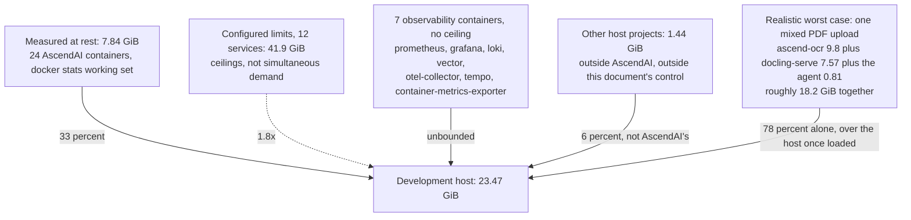

# Memory budget across the AscendAI stack

As of 2026-09-07, revised after the host grew. Written after the optical character recognition service was OOM-killed on a 15.5 GiB host running roughly 28 containers, none of them AscendAI's own ascend-ocr container hitting its own limit. The service died from pressure the rest of the host created, and nothing in this repository would have let anyone predict that. This document is the attempt to make that pressure visible and repeatable to check.

The host is no longer that machine. The Docker virtual machine now reports 23.47 GiB, confirmed this round from `docker info` (MemTotal 25199005696 bytes) and again from the limit column `docker stats` prints against every container that has no ceiling of its own. It grew because the owner set an explicit memory limit in the WSL configuration where none had been set, so the virtual machine had been taking the default half of the physical 31.9 GiB. Every comparison against the host below has been recomputed against 23.47 GiB, and the two findings that mattered most changed character rather than just changing number.

The strongest finding in it has flipped, and that is the first thing to read here. One person uploading one ordinary mixed-content PDF, a document with both scanned and native-text pages, still fans that single upload across Docling and the OCR service in parallel by design, and the mechanism is unchanged. What changed is the arithmetic on both sides of the comparison. That one event now costs roughly 18.2 GiB rather than roughly 19.4, and it lands on 23.47 GiB rather than 15.5. Against the old host it exceeded the machine on its own. Against this one it fits, with about 5.3 GiB spare. Two things moved it: the host grew by 8 GiB, and the owner settled the OCR detector's long-side bound at 1536, which takes one A4 page from roughly 11.0 GiB to roughly 9.8 GiB, measured across five real documents, with the implementation in progress at the time of writing. Docling's own contribution did not improve at all. It was measured directly at 7.57 GiB, 95 percent of its own 8 GiB ceiling, and it is now the largest single term in the sum.

The margin comes with a caveat an operator needs before relying on it. That 5.3 GiB is the spare against an otherwise empty host, and this host is not empty. The rest of AscendAI's containers plus five belonging to other projects hold 5.65 GiB at rest, and adding that back puts the same single upload at roughly 23.8 GiB against 23.47 GiB, still marginally over. Shutting down the five unrelated containers brings it back inside the host by about 1.1 GiB, which is real but still less than the 2.3 to 3.5 GiB a host this size wants for its own page cache. So the honest statement is narrower than the headline. The upload now fits the machine, and it does not yet fit the machine as it is currently loaded. The mechanism is traced in "Reachable worst case vs. theoretical worst case" below.

Reading paths. New hire sizing a machine for local development: read "Cost at rest" and "Per-service inventory: standalone bundle." Architect reviewing the platform: read the whole document, especially "Reachable worst case vs. theoretical worst case." Operator responding to the next OOM kill: read "Limits that look wrong, and the evidence" and "What to do when the host is smaller than the budget."

---

### Why this document exists

The incident, as reported by the operator: a 15.5 GiB virtual machine running roughly 28 containers ran the host out of swap, and the kernel killed the ascend-ocr container. ascend-ocr's own cgroup limit (`ascend-ocr`, [compose.yaml:98](../../compose.yaml)) was never reached. The kill came from the host, not the container. A direct count on 2026-09-06 showed 30 containers running. A second direct count on 2026-09-07 shows 29. None of the three numbers needs to agree with the others, because containers get added and removed between them, and the one that went away between the last two belongs to another project rather than to AscendAI. Twenty nine is the number this document uses going forward, because it is the most recent direct count.

More than this repository defines, either way. The combined `ascend-ai` plus `ascend-scrapper` stack (`compose.yaml` with its `include:` of `compose.ascend-web-hunter.yaml`) is 19 services, one more than when this document was first written, because a stack-local Redis was added to the scrapper file ([compose.ascend-web-hunter.yaml:114](../../compose.ascend-web-hunter.yaml)) with a 256 MiB limit and a 64 MiB reservation. It is not running on this host, where the external prerequisite Redis serves that role, so it appears in the limits sum below and in none of the measurements. The standalone ascend-web-hunter bundle is 4 services, deployed elsewhere and not part of this host's 29. Six more of the 29 are AscendAI's own external prerequisites, PostgreSQL, Redis, Qdrant, the object store and its own admin UI, and Keycloak, none of them compose services and all of them measured below. The remaining 5 containers on this host are other projects entirely, a document database, a relational database, two other applications, and a gateway, together holding 1.44 GiB at rest and 2.58 GiB in summed peaks, and outside this document's control or concern. That is more than the roughly 1 GiB this document first credited them with, and it is the figure the worst case below subtracts. What this document can do is state AscendAI's own share of that host, all 24 running containers of it, precisely enough that whoever owns the host can subtract it and see what is left for everything else.

---

### Method: what was measured, how, and what was not

Two instruments give a peak that cannot be missed by construction. The kernel's own high water mark, `VmHWM` in `/proc/<pid>/status`, is updated by the kernel every time resident memory grows past its previous maximum, so a sampler reading it afterward sees the true peak regardless of how briefly it was held. The cgroup's own `memory.peak` (cgroup v2) gives the same guarantee at the container level. Both are preferred over sampling from inside the process, because an earlier investigation into ascend-ocr found that an in-process Python sampler understated the true peak by nearly four times: ascend-ocr's inference call holds the GIL almost continuously, so a sampler running on the same interpreter is blocked for exactly the window it needs to measure. `docker stats` is a third instrument, external to the sampled process, but it polls the cgroup's accounting on an interval (roughly one second), so it can still miss a spike shorter than that interval. It is what produced the three figures already on record in `compose.yaml` (see below), and this document keeps them without re-deriving them, per instruction, while noting the instrument for each.

The 2026-09-06 round was taken through a coordinator, because that session had no shell or container-execution tool available to it: `memory.peak` read from inside each container (cgroup v2, the kernel's own high water mark), plus a live read of current usage for the same set, taken afterward. That closes almost every gap this document originally had to leave open. What follows now states, per figure, whether it is one of those two live readings, a figure already supplied as established before this document existed (the ascend-ocr formula, and its confirming OOM-event record), a figure already recorded as a comment inside a compose file by whoever measured it earlier, or static configuration read directly from the files that define it. Where none of those four could answer the question, the figure is still marked unmeasured, with the exact command that would answer it.

The 2026-09-07 round was taken with direct read-only container access rather than through a coordinator: `memory.peak` and `memory.current` read from inside each container, plus one `docker stats --no-stream` working-set snapshot across all 29 containers on the host, repeated a few seconds later to confirm the readings were stable and that nothing was mid-job. Two containers cannot be read by either of the documented commands, and the reason is structural rather than an oversight. Neither `otel-collector` nor `ngrok-ascend-web-hunter` ships a shell or a `cat`, so `docker exec` has nothing to run, and `docker cp` refuses to read through the cgroup mount. Their current usage is therefore taken from `docker stats`, which is external to the container and needs nothing inside it, and their peaks stay unmeasured until something in this stack scrapes cgroup peaks from outside.

One property of `memory.peak` matters for reading every figure below, and it now applies to every row rather than to a few. The counter resets when a container's cgroup is created, which happens on every start, not only on recreation. The whole Docker virtual machine restarted at 2026-09-06T23:01:20Z, when the new memory limit took effect, and `docker inspect` confirms all 29 containers report that exact start time, so on 2026-09-07 every `memory.peak` below is roughly three and a half hours old. What was a caveat on three services in the first draft is now a caveat on all of them, and the clearest illustration is docling-serve: 7755 MiB on record, 3937 MiB on a counter that has been running since the restart, with nothing about the container changed in between.

Two rules follow, and both are applied consistently below. Where a 2026-09-07 reading is lower than a figure already on record here, both are kept and the gap is attributed to the reset rather than treated as a correction, because a younger counter reporting a lower number does not mean the container's real capability shrank. Where a 2026-09-07 reading is higher, it replaces the older one, because a higher peak on a younger counter is a genuine correction upward and nothing else can explain it.

One structural fact is confirmed from the running application code rather than from a live measurement: [DocumentRouter.java:40-46](../../apps/ascend-ai-agent/src/main/java/com/lukk/ascend/ai/agent/service/ingestion/DocumentRouter.java) states in its own comment that Docling Serve's two Uvicorn workers, each running a 2-slot conversion queue, give it a real capacity of 4 concurrent conversions, and the default `pdf-parallel-pages` setting is 4 to match. That is a code-level fact, not a measurement, and it is cited as such throughout.

A note on enforcement, no longer an assumption. `deploy.resources.limits.memory` and `deploy.resources.reservations.memory` are Compose-spec keys that Docker Compose V2 (the `docker compose` CLI this repository uses throughout, never the legacy hyphenated `docker-compose`) applies to a plain `docker compose up` without Swarm mode, translating the limit to the container's cgroup memory ceiling and the reservation to a soft floor. That is now confirmed on this host rather than stated from prior knowledge. `docker info` reports Swarm inactive, and every capped service carries its compose limit in both `HostConfig.Memory` and its own `memory.max` inside the container: ascend-memory reads 536870912, exactly the 512 MiB the compose file gives it, ascend-ocr reads 12884901888, exactly 12 GiB, and tempo, which has no limit block, reads `max`. The seven uncapped containers really are uncapped at the kernel, not merely undocumented.

---

### Cost at rest

This is the number the task calls the one that matters for choosing a machine, and it is now measured twice, a day apart, on the same host. The 2026-09-07 column is a `docker stats --no-stream` working-set reading (usage minus reclaimable page cache) taken across all 29 containers with the stack quiet, confirmed stable on a second sample. The 2026-09-06 column is the earlier round, recorded then only as a live read of current usage. The two are two observations rather than a measured trend, and where they diverge widely the 2026-09-07 figure is the one to plan against, because it is the higher of the two for every service that holds a model or a cache.

| Service | At rest, 2026-09-07 | At rest, 2026-09-06 | Instrument for the newer figure |
| :--- | :--- | :--- | :--- |
| ascend-ocr | 646 MiB | 550 MiB | `docker stats`, 2026-09-07 |
| unstructured-api | 457 MiB | 53 MiB | `docker stats`, 2026-09-07 |
| docling-serve | 2379 MiB | 1657 MiB | `docker stats`, 2026-09-07 |
| ascend-ai-agent | 696 MiB | 597 MiB | `docker stats`, 2026-09-07 |
| ascend-memory | 190 MiB | 38 MiB | `docker stats`, 2026-09-07 |
| ascend-weather-mcp | 228 MiB | 127 MiB | `docker stats`, 2026-09-07 |
| ascend-audio-scribe | 131 MiB | 45 MiB | `docker stats`, 2026-09-07 |
| searxng (dev) | 133 MiB | 18 MiB | `docker stats`, 2026-09-07 |
| flaresolverr (dev) | 215 MiB | 25 MiB | `docker stats`, 2026-09-07 |
| ngrok-ascend-web-hunter (dev) | 13 MiB | 41 MiB | `docker stats`, 2026-09-07 |
| ascend-web-hunter (dev) | 596 MiB | 354 MiB | `docker stats`, 2026-09-07 |
| container-metrics-exporter | 44 MiB | 55 MiB | `docker stats`, 2026-09-07 |
| prometheus | 43 MiB | 98 MiB | `docker stats`, 2026-09-07 |
| grafana | 77 MiB | 112 MiB | `docker stats`, 2026-09-07 |
| loki | 63 MiB | 120 MiB | `docker stats`, 2026-09-07 |
| vector | 19 MiB | 69 MiB | `docker stats`, 2026-09-07 |
| tempo | 213 MiB | 363 MiB | `docker stats`, 2026-09-07 |
| otel-collector | 58 MiB | unmeasured | `docker stats`, 2026-09-07, the only instrument that reaches this container |

Sum: 6201 MiB, 6.06 GiB, and this round covers all 18 development-stack services rather than 17, because `docker stats` reaches the two containers `docker exec` cannot. Add the six external prerequisites below (1828 MiB, 1.79 GiB) and the whole 24-container AscendAI footprint on this host sits at rest at 8029 MiB, 7.84 GiB of 23.47, before the 1.44 GiB the host's other, unrelated projects hold. All 29 containers together hold 9.28 GiB, leaving 14.19 GiB free with nothing running.

That total is up from the 5.14 GiB this document first recorded, and the increase is not a measurement error on either side. Most of it is three services that had not finished warming when the first round was taken: docling-serve holds 722 MiB more, unstructured-api 404 MiB more, and Qdrant, in the prerequisites table below, 791 MiB more. The conclusion the first round drew survives the correction unchanged and gets stronger for being drawn against a bigger number. The host was not slowly starved by idle creep, since 9.28 GiB of 23.47 is still comfortable, and it was pushed over by a correlated peak, the kind traced in "Reachable worst case vs. theoretical worst case" below.

The reservations floor from static configuration, kept as a second, independent figure because it answers a different question, a guarantee rather than an observation: 7040 MiB, 6.9 GiB, summed from every service's `deploy.resources.reservations.memory`, docling-serve 2 GiB ([compose.yaml:21](../../compose.yaml)), ascend-ocr 2 GiB ([compose.yaml:101](../../compose.yaml)), ascend-memory 128 MiB ([compose.yaml:212](../../compose.yaml)), ascend-audio-scribe 1 GiB ([compose.yaml:287](../../compose.yaml)), searxng 128 MiB ([compose.ascend-web-hunter.yaml:48](../../compose.ascend-web-hunter.yaml)), flaresolverr 512 MiB ([compose.ascend-web-hunter.yaml:82](../../compose.ascend-web-hunter.yaml)), the scrapper's own Redis 64 MiB ([compose.ascend-web-hunter.yaml:138](../../compose.ascend-web-hunter.yaml)), ngrok 64 MiB ([compose.ascend-web-hunter.yaml:163](../../compose.ascend-web-hunter.yaml)), ascend-web-hunter 1 GiB ([compose.ascend-web-hunter.yaml:230](../../compose.ascend-web-hunter.yaml)). It is 64 MiB larger than the 6.8 GiB first recorded, entirely because of the scrapper's new Redis. It still sits above the measured development-stack total, which is what a reservation should do, but the gap has closed from 2.6 GiB to 839 MiB as the measured figure caught up, and 64 MiB of what is left is reserved for a container that is not running on this host.

---

### Per-service inventory: development stack

Every service in `compose.yaml` and the `compose.ascend-web-hunter.yaml` it includes, except the scrapper's own Redis, which is defined but not running on this host. "Peak" cites its instrument. Every counter in this column was reset by the virtual machine restart described under "Method", so each cell gives the 2026-09-07 reading first and, where an older figure on record is higher, that figure second with the reason.

| Service | At rest | Peak | Instrument | Most expensive operation | Limit | Reservation |
| :--- | :--- | :--- | :--- | :--- | :--- | :--- |
| ascend-ocr | 646 MiB | 1468 MiB since the restart, true cost of one A4 page roughly 9.8 GiB, see below | `memory.peak`, 2026-09-07, 3.5h old, the 9.8 GiB figure is the owner's measurement across five real documents at the settled detector bound | reading one scanned page | 12 GiB ([compose.yaml:98](../../compose.yaml)) | 2 GiB |
| docling-serve | 2379 MiB | 3937 MiB since the restart, 7755 MiB on record, 95 percent of its own limit | `memory.peak`, 2026-09-07, 3.5h old, older figure is `memory.peak`, 2026-09-06, pre-restart | converting a DOCX/PPTX/XLSX/HTML document, up to 4 concurrent conversions ([DocumentRouter.java:40-46](../../apps/ascend-ai-agent/src/main/java/com/lukk/ascend/ai/agent/service/ingestion/DocumentRouter.java)) | 8 GiB ([compose.yaml:23](../../compose.yaml)) | 2 GiB |
| unstructured-api | 457 MiB | 1680 MiB since the restart, 2.23 GiB all-time on record | `memory.peak`, 2026-09-07, 3.5h old and already above the 1610 MiB it reported a day earlier, older figure is docker stats, 2026-09-04 | parsing an eml/epub/rtf/odt document ([DocumentRouter.java:56,81-88](../../apps/ascend-ai-agent/src/main/java/com/lukk/ascend/ai/agent/service/ingestion/DocumentRouter.java)) | 3 GiB ([compose.yaml:44](../../compose.yaml)) | none |
| ascend-ai-agent | 696 MiB | 777 MiB since the restart, 831 MiB over 14h on record | `memory.peak`, 2026-09-07, 3.5h old, older figure is docker stats, 2026-09-04 | a large multipart document upload, every page held as a separate byte array simultaneously ([compose.yaml:154-157](../../compose.yaml)) | 3 GiB ([compose.yaml:161](../../compose.yaml)), heap capped to 70% by `MaxRAMPercentage` ([Dockerfile:27](../../apps/ascend-ai-agent/Dockerfile)) | none |
| ascend-memory | 190 MiB | 299 MiB, 58 percent of its own limit | `memory.peak`, 2026-09-07, 3.5h old, a correction upward from the 270 MiB on record | a semantic-memory search or insert, thin REST/MCP proxy to Qdrant plus an embedding API | 512 MiB ([compose.yaml:209](../../compose.yaml)) | 128 MiB |
| ascend-weather-mcp | 228 MiB | 340 MiB since the restart, 374 MiB over 24h on record, 73 percent of its own limit | `memory.peak`, 2026-09-07, 3.5h old, older figure is docker stats, 2026-09-04 | serving `getCurrentWeather`, no meaningful variance between requests | 512 MiB ([compose.yaml:242](../../compose.yaml)), heap capped to 70% ([Dockerfile:21](../../apps/ascend-weather-mcp/Dockerfile)) | none |
| ascend-audio-scribe | 131 MiB | 212 MiB since the restart, 357 MiB on record | `memory.peak`, 2026-09-07, 3.5h old, older figure is `memory.peak`, 2026-09-06 | transcribing a large multi-track Audacity project on GPU (host RAM only, VRAM is a separate, unbudgeted resource here), though neither peak reflects that operation, only ordinary use | 8 GiB ([compose.yaml:284](../../compose.yaml)) | 1 GiB |
| searxng (dev) | 133 MiB | 217 MiB | `memory.peak`, 2026-09-07, 3.5h old, a correction upward from the 186 MiB on record | fanning one query out across every configured upstream search engine | 512 MiB ([compose.ascend-web-hunter.yaml:45](../../compose.ascend-web-hunter.yaml)) | 128 MiB |
| flaresolverr (dev) | 215 MiB | 654 MiB since the restart, 925 MiB on record | `memory.peak`, 2026-09-07, 3.5h old, older figure is `memory.peak`, 2026-09-06 | launching its own headless Chrome to solve a Cloudflare challenge | 2 GiB ([compose.ascend-web-hunter.yaml:79](../../compose.ascend-web-hunter.yaml)) | 512 MiB |
| ngrok-ascend-web-hunter (dev) | 13 MiB | unmeasurable by the documented commands | at rest: `docker stats`, 2026-09-07, peak: no shell and no `cat` in the image, and `docker cp` will not read through the cgroup mount | relaying the NoVNC tunnel, no compute of its own | 128 MiB ([compose.ascend-web-hunter.yaml:160](../../compose.ascend-web-hunter.yaml)) | 64 MiB |
| ascend-web-hunter (dev) | 596 MiB | 1432 MiB since the restart, 1610 MiB on record | `memory.peak`, 2026-09-07, 3.5h old, older figure is `memory.peak`, 2026-09-06 | escalating to a Playwright headless browser against a hard-to-scrape page, `shm_size: 2gb` is charged against this same limit | 4 GiB ([compose.ascend-web-hunter.yaml:227](../../compose.ascend-web-hunter.yaml)) | 1 GiB |
| container-metrics-exporter | 44 MiB | 62 MiB since the restart, 71 MiB on record | `memory.peak`, 2026-09-07, 3.5h old | no configured limit at all, and none needed at this size, but nothing would stop it growing either | none | none |
| prometheus | 43 MiB | 218 MiB since the restart, 231 MiB on record | `memory.peak`, 2026-09-07, 3.5h old | no configured limit at all, retention is 72h ([compose.yaml:340](../../compose.yaml)) | none | none |
| grafana | 77 MiB | 281 MiB | `memory.peak`, 2026-09-07, 3.5h old, a correction upward from the 263 MiB on record | no configured limit at all | none | none |
| loki | 63 MiB | 184 MiB since the restart, 225 MiB on record | `memory.peak`, 2026-09-07, 3.5h old | no configured limit at all, retention is 168h and the query-range cache alone is capped at 100 MiB ([infra/observability/loki/loki-config.yaml:24,37](../../infra/observability/loki/loki-config.yaml)), nothing else about the container is bounded | none | none |
| vector | 19 MiB | 114 MiB | `memory.peak`, 2026-09-07, 3.5h old, a correction upward from the 100 MiB on record | no configured limit at all | none | none |
| tempo | 213 MiB | 544 MiB since the restart, 633 MiB on record | `memory.peak`, 2026-09-07, 3.5h old | no configured limit at all, and still the largest of the seven uncapped containers by a clear margin | none | none |
| otel-collector | 58 MiB | unmeasurable by the documented commands | at rest: `docker stats`, 2026-09-07, peak: no shell and no `cat` in the image, and `docker cp` will not read through the cgroup mount | no configured limit at all | none | none |

Five services corrected upward on the newer counter despite it being three and a half hours old: unstructured-api, ascend-memory, searxng, grafana and vector. Those are genuine corrections, since nothing but a real allocation can push a young counter past an older, longer-lived one. Everything else reads lower than its own record, and that is the reset, not a shrinking service.

The ascend-ocr formula, given and not re-derived here: `peak_MiB = 635 + 5302 x megapixels_of_one_page`, r=0.9993, VmHWM/cgroup `memory.peak`. Pages are processed one at a time inside the container (`_WORKER_POOL_SIZE=1`, cited in [openspec/changes/stop-ocr-getting-stuck-on-large-jobs/design.md](../../openspec/changes/stop-ocr-getting-stuck-on-large-jobs/design.md) at the time of writing, that change may be archived to `openspec/specs/` by the time this is read), so page count adds only about 11.5 MiB per additional page rather than multiplying the formula. An A4 page at the library's fixed 144 dpi rendering ([design.md](../../openspec/changes/stop-ocr-getting-stuck-on-large-jobs/design.md), citing `PDF_RENDER_SCALE=2.0` in paddlex) is 2.004 megapixels, giving 11.0 GiB for one page with the detector unbounded, which is the configuration the formula was fitted against. Each cached language engine in the LRU cache ([ENGINE_CACHE_MAX_SIZE](../../apps/ascend-ocr/AGENTS.md), default 8) costs a further 143 MiB, and a worker that has cycled through all 8 languages carries about 1.6 GiB before reading anything.

The detector bound changes that headline figure, and it is the second of the two things that moved this document's conclusion. The owner has settled the detector's long-side bound at 1536, the setting built by Decision 11 of the same [design.md](../../openspec/changes/stop-ocr-getting-stuck-on-large-jobs/design.md), and measured across five real documents that takes one A4 page from roughly 11.0 GiB to roughly 9.8 GiB. The mechanism is that A4 at 144 dpi is 1191 by 1684 pixels, and a long side of 1684 is scaled down to 1536 before the detector sees it, so detection works on about 1.67 megapixels instead of 2.004 while recognition still works on the full page. Two limits on that figure are worth carrying with it. It is an A4 number, not a universal one, since the bound fires only on inputs whose long side already exceeds 1536, and the same design document notes that against the worst case over all aspect ratios, a square page, a 1536 bound buys nothing. The implementation was in progress when this revision was written, so 9.8 GiB is the number to plan the host against and 11.0 GiB is what the service still costs until it ships.

The formula is no longer the only evidence for the unbounded 11 GiB figure. The container's own out-of-memory event, the one described in "Why this document exists," recorded ascend-ocr's resident memory at the moment the kernel killed it, and that recorded value is close to the formula's own one-page, cold-cache prediction of 11.0 GiB, not the higher end of the range that a fully warmed 8-language cache would add. The 646 MiB at rest and 1468 MiB peak in the table above are neither wrong nor a contradiction of that. They are what the same container reports on a counter three and a half hours old with almost no OCR traffic through it, and the 1468 MiB is roughly what a loaded engine costs before a page arrives. Read the 9.8 GiB as the number that matters for sizing the container once the bound ships, the 11.0 GiB as what it costs today, and the two smaller ones as evidence of how little the container has done since the host restarted.

---

### Per-service inventory: external prerequisites

PostgreSQL, Redis, Qdrant, and the S3-compatible object store (locally Floci, alongside its own admin UI) are deliberately not compose services, per [ADR-M003](decisions/ADR-M003-external-infrastructure-prerequisites.md), and they still spend the same host's RAM. None has a configured limit anywhere in this repository, because none is defined by this repository, and whatever process manager runs them on this machine owns their sizing. All six below were re-measured on 2026-09-07, the same round as the compose services above, on counters reset by the same virtual machine restart.

| Service | At rest | Peak | Instrument |
| :--- | :--- | :--- | :--- |
| postgres | 80 MiB | 134 MiB | `memory.peak`, 2026-09-07, 3.5h old, a correction upward from the 106 MiB on record |
| redis | 14 MiB | 77 MiB | `memory.peak`, 2026-09-07, 3.5h old, a correction upward from the 46 MiB on record |
| qdrant | 888 MiB | 1954 MiB | `memory.peak`, 2026-09-07, 3.5h old, a correction upward from the 222 MiB on record |
| floci | 86 MiB | 332 MiB | `memory.peak`, 2026-09-07, 3.5h old, a correction upward from the 260 MiB on record |
| floci-ui | 59 MiB | 136 MiB | `memory.peak`, 2026-09-07, 3.5h old, the gap this document previously left open |
| keycloak | 701 MiB | 932 MiB since the restart, 1333 MiB on record | `memory.peak`, 2026-09-07, 3.5h old, older figure is `memory.peak`, 2026-09-06 |

Qdrant is the single largest correction anywhere in this revision, and it is a correction, not a reset artifact. Its peak went from 222 MiB to 1954 MiB on a counter that is younger, not older, so nothing but real allocation explains it, and its at-rest figure moved the same way, from 97 MiB to 888 MiB. On the 2026-09-07 peaks it is now the second-largest consumer on this host, behind docling-serve at 3937 MiB and ahead of unstructured-api at 1680 MiB and ascend-ocr at 1468 MiB, it is an unmanaged external prerequisite with no ceiling of any kind, and the earlier remark that its 222 MiB said more about how little data the instance held than about its ceiling has been proved right within a day. Whoever owns this host should watch it, because a vector database that grew nearly ninefold in a day is the one uncapped consumer here with an obvious growth mechanism behind it.

Keycloak remains a real finding on its own, separate from its size. It appears in none of this repository's `AGENTS.md` files, none of the compose files, and none of this document's earlier drafts, yet it is running on this host, and at 1333 MiB on record it is a substantial consumer. [Permission-aware retrieval](permission-aware-retrieval.md) describes an identity provider in the abstract without naming one, so Keycloak is very likely that provider, staged ahead of the auth and tenant-isolation work it references. Whoever owns that work should confirm it and add it to the prerequisites list this repository actually publishes, since a prerequisite nobody wrote down is a prerequisite nobody budgeted for.

What is known structurally about the four already documented, beyond the live figures above: Postgres's footprint is driven by `shared_buffers` and `work_mem` times active connections, both of which are the operator's own postgresql.conf, not this repo's concern, and the low figures measured here reflect a lightly loaded instance, not a ceiling. Redis is unbounded unless `maxmemory` is set on the instance itself, and nothing in this repository sets it. Qdrant's footprint depends on whether a collection's vectors and payload are held in RAM or spilled to disk, a per-collection setting made at collection-creation time, not visible from compose, which is exactly the lever behind the jump above. Floci is out of scope for the same reason.

LM Studio, when used as the local model provider on port 1234, is also outside compose and outside this budget, and it is not among the 29 containers on this host either, since it runs on the host itself rather than in a container. A loaded local model occupies host RAM (or VRAM, if GPU-offloaded) for as long as it stays resident, and that is entirely a function of which model the operator has loaded, not of anything this repository configures. It remains unmeasured, out of this repository's scope, and still real cost on the machine if it is running.

---

### Per-service inventory: standalone bundle

The [ascend-web-hunter standalone bundle](../../apps/ascend-web-hunter/deploy-standalone/README.md) targets a separate 8 GiB, 2-core host running only four containers: ascend-web-hunter, searxng, flaresolverr, and the ngrok tunnel. Its own resource footprint is already measured and documented there, and this document does not re-derive it, only carries the headline numbers forward for comparison.

| Container | Limit | Reservation |
| :--- | :--- | :--- |
| ascend-web-hunter | 2560 MiB | 512 MiB |
| flaresolverr | 1280 MiB | 256 MiB |
| searxng | 384 MiB | 128 MiB |
| ngrok-ascend-web-hunter | 96 MiB | 32 MiB |

Limits total 4.2 GiB. Reservations total about 0.9 GiB. The bundle's own README states the arithmetic an operator needs against the 8 GiB host directly: subtract what the host already uses from its total RAM, and the remainder must clear 4.2 GiB with headroom left for page cache. See [Resource footprint in deploy-standalone/README.md](../../apps/ascend-web-hunter/deploy-standalone/README.md#resource-footprint) for the full worked example and for why `shm_size` is charged against the same ceiling as the process using it.

This bundle's one external prerequisite is Redis, reachable at the host's own port 6379 per its own README. It carries none of PostgreSQL, Qdrant, or an object store, because it runs none of the services that need them.

Nothing in this revision touches this bundle. It targets its own 8 GiB machine, which did not change, so its limits are sized against 8 GiB and stay correct at that size. Every recomputation below is about the development host only.

---

### Whether the sum of configured limits exceeds the host

Yes, and it always will, but the ratio is no longer the interesting part of the answer and this revision retires it as the headline.

Summing every `deploy.resources.limits.memory` across the combined `ascend-ai` and `ascend-scrapper` stack, the only services with a configured ceiling at all:

8192 (docling-serve) + 3072 (unstructured-api) + 12288 (ascend-ocr) + 3072 (ascend-ai-agent) + 512 (ascend-memory) + 512 (ascend-weather-mcp) + 8192 (ascend-audio-scribe) + 512 (searxng) + 2048 (flaresolverr) + 256 (the scrapper's Redis) + 128 (ngrok) + 4096 (ascend-web-hunter) = 42880 MiB, which is 41.9 GiB across 12 services.

Against the 23.47 GiB host that is 1.8 times its entire RAM, down from 2.6 times against the 15.5 GiB machine. The sum itself barely moved, gaining only the 256 MiB of the scrapper's new Redis. The whole change is on the other side of the division.

The useful conclusion is that the ratio was never the right question, and this document said as much when it first computed it. A limit is a safety ceiling against one runaway container, not a promise that every container will hit it at once, and a stack of 12 capped services on one host is oversubscribed by construction unless every ceiling is sized as though it were the only service running. Oversubscription at 1.8 times is normal and fine. Oversubscription at 2.6 times was also normal, and it was not what killed the OCR service. What matters is whether the reachable peak fits, and that question now has a different answer than it did, which is why it has been promoted above this section in importance and is worked through next.

Two things the ratio still hides, and both survive the host change unchanged. The other 7 services (container-metrics-exporter, prometheus, grafana, loki, vector, otel-collector, tempo) have no ceiling at all and are in no sum, so the true worst case a misbehaving container could reach is higher than 41.9 GiB by an unknown amount. External prerequisites are outside compose entirely and add more on top of that, and one of them, Qdrant, grew ninefold in a day with nothing to stop it.

---

### Reachable worst case vs. theoretical worst case

The theoretical worst case, every configured limit reached at once, is 41.9 GiB against 23.47 GiB and is not a useful planning number: nothing in this stack drives every container to its ceiling simultaneously, and treating it as the target would mean provisioning for a scenario that has no plausible trigger.

The realistic worst case is smaller, and it does not require several unrelated services to coincidentally spike at once. A single ordinary event does most of the work: one mixed-content PDF, containing both scanned pages and native-text pages, uploaded through the ingestion pipeline. [DocumentRouter.java:90-105](../../apps/ascend-ai-agent/src/main/java/com/lukk/ascend/ai/agent/service/ingestion/DocumentRouter.java) splits such a PDF into per-page work and dispatches up to 4 pages in parallel ([DocumentRouter.java:132-152](../../apps/ascend-ai-agent/src/main/java/com/lukk/ascend/ai/agent/service/ingestion/DocumentRouter.java)), and [DocumentRouter.java:216-223](../../apps/ascend-ai-agent/src/main/java/com/lukk/ascend/ai/agent/service/ingestion/DocumentRouter.java) routes each page independently, scanned pages to ascend-ocr and text pages to Docling, by the same classification, in the same request. A document with even one large scanned page and several text pages therefore drives ascend-ocr and docling-serve to their own expensive operations at the same wall-clock moment, from one upload, by design, not by coincidence. None of that changed, and none of it can be fixed by giving the host more memory.

What changed is what the event costs and what it lands on. Adding up that one scenario, with measured rather than estimated figures for every term:

| Term | Cost | Where it comes from |
| :--- | :--- | :--- |
| ascend-ocr, one A4 scanned page, detector bounded to 1536 | 9.8 GiB | owner's measurement across five real documents, implementation in progress |
| docling-serve, its own measured peak | 7.57 GiB | `memory.peak`, 2026-09-06, 95 percent of its own 8 GiB ceiling |
| ascend-ai-agent, per-page byte-array retention while it waits on both | 0.81 GiB | the higher of its two recorded peaks |
| Total for one upload | 18.2 GiB | against a 23.47 GiB host |

So the headline flips. That is 18.2 GiB against 23.47 GiB, which fits, with 5.3 GiB spare. Against the old 15.5 GiB host the same event, costed at the unbounded 11.0 GiB for the OCR page, came to 19.4 GiB and exceeded the machine on its own. Both changes push the same way, and the host change alone is enough: even at the unbounded 11.0 GiB, 19.4 GiB fits inside 23.47 GiB with 4.1 GiB spare. The detector bound widens the margin from 4.1 GiB to 5.3 GiB rather than being what rescues it.

The margin an operator can actually spend is smaller than 5.3 GiB, and this is the number to carry away. That 5.3 GiB is spare against an empty host. On this host the event lands on top of everything else already resident: the 24 AscendAI containers hold 7.84 GiB at rest and the five foreign ones hold 1.44 GiB, and subtracting the three services that are themselves in the scenario, since their peaks already include their baselines, leaves 5.65 GiB of resting load underneath. That puts the total at roughly 23.8 GiB against 23.47 GiB, which is marginally over. Stopping the five unrelated containers brings it to roughly 22.4 GiB, inside the host by about 1.1 GiB, and still short of the 2.3 to 3.5 GiB the host wants for its own page cache.

Read that as an improvement rather than as a failure, because the change in kind is the point. Before, one upload exceeded the host by roughly 4 GiB and no amount of housekeeping could close that. Now it exceeds the loaded host by roughly 0.3 GiB, and ordinary housekeeping, stopping unrelated projects, or capping the seven uncapped containers, or letting the detector bound ship, closes it. The scenario has moved from impossible to tight.

One genuine mutual exclusion is confirmed at the code level: ascend-ocr's own worker pool is `_WORKER_POOL_SIZE=1`, so however many pages DocumentRouter dispatches to it in parallel, only one is ever actually being inferred at a time inside ascend-ocr's own process, and the rest wait on ascend-ocr's own admission gate with an open HTTP connection back to the agent, not a second copy of the OCR peak. That is the one place in this stack where two expensive operations provably cannot overlap inside the same container. No equivalent guarantee was found for anything else. Nothing in ascend-audio-scribe's, ascend-web-hunter's, or unstructured-api's own documentation describes a similar single-worker gate, so a transcription job, a Playwright scrape, and the ingestion scenario above are not known to be mutually exclusive, and should be assumed reachable together in a live, multi-user deployment, since nothing in the code serializes across those three subsystems. On a host with 5.3 GiB of spare against a single upload, that matters more than it used to, not less: the spare is now large enough to look like room for a second workload and small enough that it is not.

---

### Host headroom

A host that hands every byte to containers has nothing left for the kernel's own page cache, and starts swapping instead of caching, which by the operator's own account is what happened. The measured resting total, 7.84 GiB across all 24 of AscendAI's own containers on this host plus 1.44 GiB for the other projects sharing it, leaves 14.19 GiB against the 23.47 GiB total before anything peaks at all. On the old 15.5 GiB machine the same arithmetic left close to 9.9 GiB against a lower measured total, so the free space roughly grew by half. That is genuinely comfortable, and it is also why the idle figure was never the risk. The incident was not a slow creep past a tight idle budget, it was the correlated peak in "Reachable worst case vs. theoretical worst case," landing on a host that had no reason to expect it and no per-container ceiling on seven of its own containers to contain it if it had gone further.

There is no fixed rule for how much a host needs to reserve for its own kernel and container runtime on top of that. A commonly used starting point is 10 to 15 percent of total RAM, which on 23.47 GiB is roughly 2.3 to 3.5 GiB, stated here at moderate confidence as a general operating rule rather than a figure measured on this host. That band is the reason the worst case above is described as tight rather than as comfortably inside: 18.2 GiB of upload plus 5.65 GiB of resting load leaves nothing for it, and the band is what a fully loaded host would have to give up first.

---

### Limits that look wrong, and the evidence

docling-serve's 8 GiB limit is the strongest evidence in this section, and the host change promoted it rather than settling it. Its `memory.peak` reached 7755 MiB, 95 percent of its own ceiling ([compose.yaml:23](../../compose.yaml)), on its own, before any interaction with the OCR service is even counted. Now that the detector bound takes ascend-ocr's A4 page down to 9.8 GiB, docling-serve is the term in the single-upload worst case that has not improved at all, and at 7.57 GiB it is 42 percent of the total. It is also the one service in this stack measured within 5 percent of its own ceiling, which means it is the one most likely to be killed by its own limit rather than by the host. Nothing here says whether the right answer is a higher ceiling or a lower concurrency (the 4 concurrent conversions of [DocumentRouter.java:40-46](../../apps/ascend-ai-agent/src/main/java/com/lukk/ascend/ai/agent/service/ingestion/DocumentRouter.java)), and the host having grown makes raising it affordable in a way it was not before.

Seven services have no configured memory limit at all: container-metrics-exporter, prometheus, grafana, loki, vector, otel-collector, tempo (all in [compose.yaml](../../compose.yaml), lines 312-427, none carrying a `deploy.resources.limits` block). Measured again on 2026-09-07, none of the seven is large today: tempo is the biggest at 544 MiB on a young counter and 633 MiB on record, the rest sit well under 300 MiB, and two of them, grafana and vector, corrected upward within three and a half hours of the counter resetting. Loki in particular retains 168 hours of logs and caches query ranges up to 100 MiB ([infra/observability/loki/loki-config.yaml:24,37](../../infra/observability/loki/loki-config.yaml)), but that 100 MiB bounds only the query cache, not ingestion buffers or the index, so nothing stops its resident memory from growing with log volume and label cardinality. Capping these seven is the cheapest single thing that would turn the tight worst case above into a comfortable one, because it converts an unbounded unknown into a bounded one without changing what any real workload costs. This is reported as evidence, not fixed, per the boundary on this task: the fix is a compose-file change and belongs to whoever owns that file.

ascend-ocr's own 12 GiB limit ([compose.yaml:98](../../compose.yaml)) is the cap the host change most obviously reframes, and the answer is that it should stay where it is. On the old 15.5 GiB machine, 12 GiB was 77 percent of the whole host, so the OCR container alone was permitted to take three quarters of the machine, and a single container permitted to do that is not a safety ceiling in any useful sense. On 23.47 GiB it is 51 percent, which the host can absorb alongside the rest of the stack. The measured picture moved the same way. Unbounded, a worker with all 8 languages cached reading one A4 page lands at roughly 11.0 to 12.6 GiB, at or over the ceiling, which is why this document previously called the cap tight rather than generous. With the detector bounded to 1536 the same worker lands at roughly 9.8 GiB cold, about 10.8 GiB with the full 8-language cache, and about 11.1 GiB with the cache and a twenty five page document's per-page retention. That is inside 12 GiB with roughly 0.9 GiB to spare. So the cap that was at or over its own measured worst case is now under it, the reason to raise it has gone, and the reason to lower it never existed, since the container needs most of that headroom for exactly one page. Keep 12 GiB, and revisit it only if the detector bound does not ship.

Two small limits are closer to their measured peaks than anything else in the stack, and neither was flagged before because neither counter had run long enough to show it. ascend-weather-mcp is capped at 512 MiB ([compose.yaml:242](../../compose.yaml)) with 340 MiB measured in three and a half hours and 374 MiB on record, which is 73 percent of its ceiling for a service whose most expensive operation is serving one weather lookup. ascend-memory is capped at 512 MiB ([compose.yaml:209](../../compose.yaml)) with 299 MiB in the same window, a correction upward from 270 MiB, which is 58 percent. Neither is wrong today and neither is anywhere near large enough to matter to the host, but both are JVM or proxy services whose peak is drifting up on every fresh counter, and both would be killed by their own limit long before the host noticed. They are the two most likely candidates for the next OOM kill in this stack, and unlike the last one it would be a container-limit kill rather than a host kill.

ascend-audio-scribe's 8 GiB limit is tied with docling-serve for second-largest in the stack, behind ascend-ocr's 12 GiB, and its measured peaks, 212 MiB this round and 357 MiB on record, are a small fraction of it. That still does not settle the question, since nothing confirms a large multi-track transcription actually ran during either window, and both figures are consistent with lighter, ordinary requests rather than with its own named worst case. The limit is not confirmed wrong, and it is not confirmed right either. Whoever runs the next large multi-track job through this container should read its `memory.peak` immediately afterward, which will settle it either way.

One consumer outside compose deserves the same attention as anything inside it. Qdrant has no limit, is not defined by this repository, and went from a 222 MiB peak to a 1954 MiB peak in one day. It is not a limit that looks wrong, because it has no limit at all, and that is the point.

---

### What to do when the host is smaller than the budget

This is the situation the standalone bundle already documents for its own 8 GiB target, and the same reasoning applies to any host smaller than a stack's configured limits, including this 23.47 GiB development host once the 7 uncapped services and the external prerequisites are counted.

Do the arithmetic before deploying, the same way [deploy-standalone/README.md](../../apps/ascend-web-hunter/deploy-standalone/README.md#resource-footprint) already does for its own bundle: take the host's total RAM, subtract what it uses before AscendAI starts, subtract the headroom the host itself needs (see above), and compare what remains against the measured resting total (7.84 GiB for AscendAI's 24 containers on this host, "Cost at rest" above) first, the reservations floor second, and the limits sum last. If the remainder clears the measured resting total but not the limits sum, the stack will start and run comfortably at rest, but a genuine worst case can still exhaust the host.

On this host that arithmetic now comes out one step better than it did, and the step is worth stating precisely because it is the practical form of this revision's headline. The remainder clears the measured resting total with 14.19 GiB to spare, it does not clear the 41.9 GiB limits sum and never will, and the single-upload worst case sits between the two at 18.2 GiB, which the host clears on its own and does not clear while the rest of the stack and five foreign containers are also resident. That is a host to run one heavy ingestion at a time on, not a host to run one alongside a transcription job and a Playwright scrape.

Where a host does not clear even the measured resting total, cut services rather than shrinking every limit uniformly. The seven uncapped observability containers are the first candidates. Their measured resting cost is small today, but a container with no ceiling can still absorb the headroom the rest of the budget assumed exists once log or metric volume grows, so removing them, or moving them to a separate host, removes an unbounded unknown rather than a bounded one. Past that, lower `ENGINE_CACHE_MAX_SIZE` on ascend-ocr before lowering its container limit, since the cache is the one lever that trades capability for memory without changing what a single page costs to read. Raising `OCR_WORKER_COUNT` is the one setting ascend-ocr should never touch on a small host, since every additional worker multiplies its own peak by that count.

---

### The budget, in one diagram



---

### Keeping this current

Every figure above states its instrument, so re-measuring means repeating the same command against the same target, not guessing at a fresher number. For a single running container, the two commands that cannot miss a peak:

```bash
docker exec <container> cat /proc/1/status | grep VmHWM
```

```bash
docker exec <container> cat /sys/fs/cgroup/memory.peak
```

The second requires cgroup v2, which is the default on any current Docker Desktop or Docker Engine install. Both need a shell and a `cat` inside the image, which two containers here do not have, so for a quick read across every running container without picking a target, and for those two in particular, `docker stats --no-stream` gives current usage against each container's configured limit, sampled once, subject to the same aliasing caveat under "Method" above. Its limit column also states the host's own total against every container that has no ceiling of its own, which is the second way this revision confirmed 23.47 GiB.

Confirm the host figure itself before trusting any comparison in this document, because it changed once already:

```bash
docker info --format '{{.MemTotal}}'
```

Where this document says unmeasured or unmeasurable, that is the gap: run the commands above against that container while it is doing the operation named as its most expensive, and update the row rather than the whole document. Three concrete gaps remain after this round, and one of them is now understood rather than merely open. `otel-collector` and `ngrok-ascend-web-hunter` cannot be read by either `docker exec` command at all, because neither image ships a shell or a `cat` and `docker cp` will not read through the cgroup mount, so their peaks need a cgroup scraper running outside the container rather than a better command. ascend-audio-scribe's real worst case still needs a large multi-track job run through it deliberately, since both of its measured peaks reflect only ordinary use. ascend-ocr's 9.8 GiB is the owner's measurement at a detector bound that had not shipped when this was written, so re-read its `memory.peak` after one real A4 scanned page once it has.

Record the container's own uptime alongside any future `memory.peak` reading, not just the reading itself, and this round is the reason why. The counter resets whenever the cgroup is created, which is every container start and not only a recreation, so a single restart of the Docker virtual machine reset all 29 counters at once and made every peak in this document three and a half hours old on the same morning. `docker inspect --format '{{.State.StartedAt}}'` gives that timestamp. A reading with no uptime attached cannot be told apart from one of those resets later, and several figures here carry two numbers precisely because it could.

---

### Whether this belongs as a decision record

It does not, and the reasoning is this. An ADR records a choice between alternatives and the trade-off accepted, and this document is a measurement and an inventory, not a choice. The closest candidate is the fact this document surfaces rather than decides: that every memory limit in this repository was set as a per-service safety ceiling against that one container running away, never as a line item in a host-wide capacity plan, and nobody had written that assumption down before. That is worth an ADR, but not this one to write unasked. If the owner wants it recorded, it would fit the existing `docs/architecture/decisions/` series as the next `ADR-M` number, titled around "container memory limits are per-service ceilings, not a host capacity plan," with this document's own findings as its evidence.
