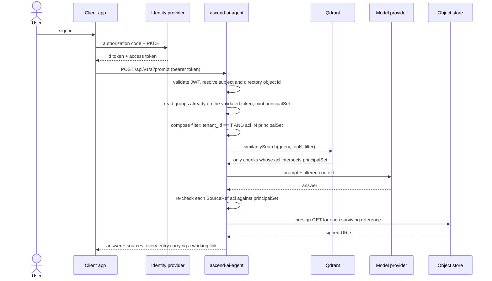
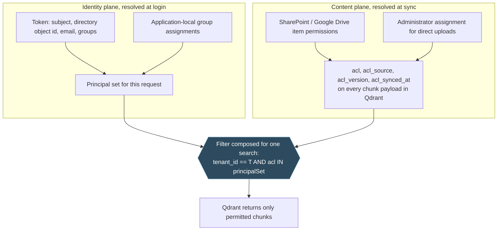
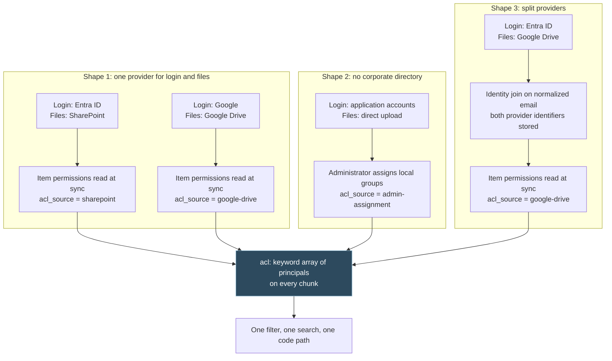
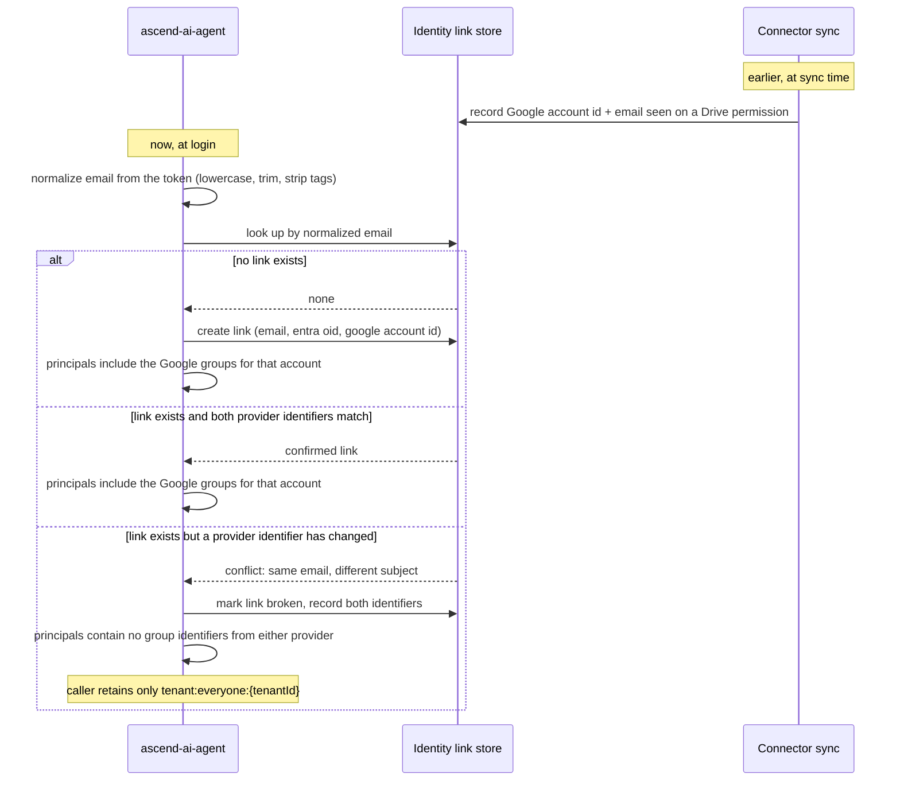
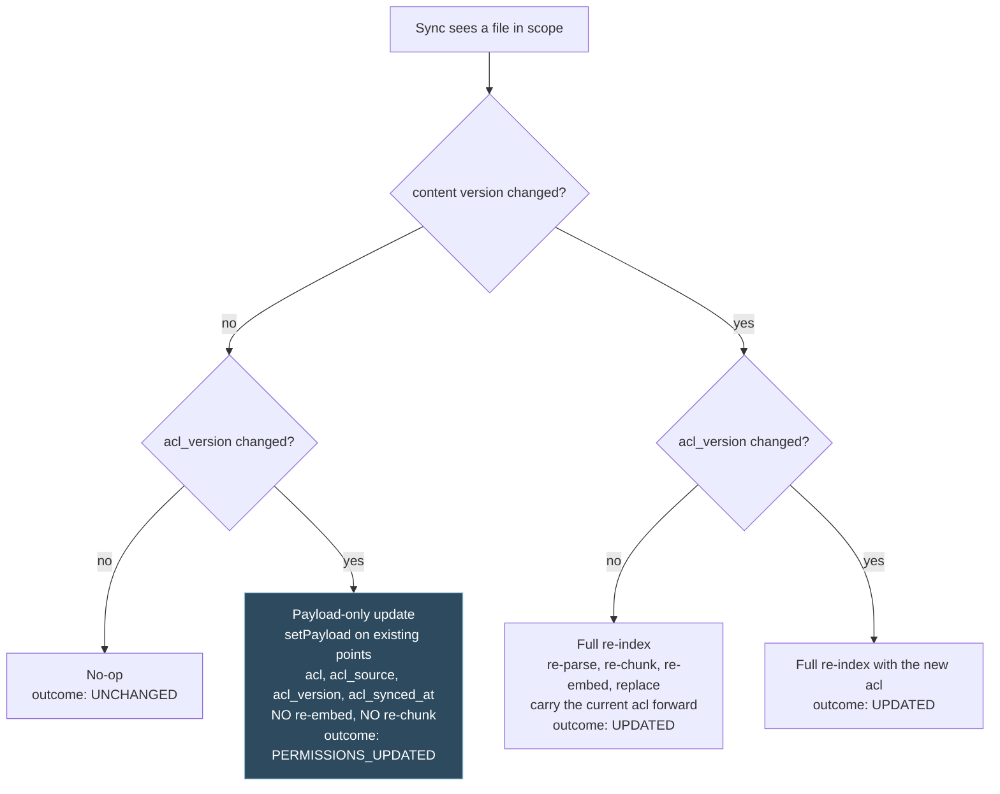
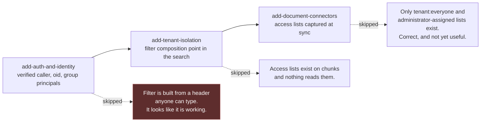

# Permission-aware retrieval

How AscendAI decides which chunks a person is allowed to see, and why every part of that decision sits where it does.

This document is the design. The decisions it depends on are recorded separately as [ADR-M004](decisions/ADR-M004-acl-mirroring-onto-chunks.md) through [ADR-M009](decisions/ADR-M009-enforcement-in-the-agent.md), and the implementation work is split across three OpenSpec changes: [add-auth-and-identity](../../openspec/changes/add-auth-and-identity/), [add-tenant-isolation](../../openspec/changes/add-tenant-isolation/), and [add-document-connectors](../../openspec/changes/add-document-connectors/).

---

### The problem

A company's documents are not uniformly readable by the company. The board deck is not for everyone, the salary bands are not for everyone, and the incident postmortem naming a customer is not for everyone. SharePoint and Google Drive already know this and enforce it on every file open. The moment those files are pulled into a vector store and answered over by a language model, that enforcement is gone unless something rebuilds it.

Today nothing rebuilds it. [RagRetrievalService](../../apps/ascend-agent/src/main/java/com/lukk/ascend/ai/agent/service/rag/RagRetrievalService.java) builds a `SearchRequest` from query, `topK`, and a similarity threshold of zero, with no filter of any kind, and every chunk in the collection is a candidate for every prompt. [SecurityConfig](../../apps/ascend-agent/src/main/java/com/lukk/ascend/ai/agent/config/SecurityConfig.java) ships with `app.security.enabled=false` and a `permitAll` chain, so there is not even a verified caller to filter against. [IngestionMetadataKeys](../../apps/ascend-agent/src/main/java/com/lukk/ascend/ai/agent/service/ingestion/IngestionMetadataKeys.java) records three keys, `source`, `type`, and `title`, and none of them says anything about who may read the chunk.

The failure this produces is not a subtle one. Any person who can reach the agent can ask a question whose answer is drawn from any document in the corpus, and the model will answer it fluently, with a working download link to the source file attached.

---

### The model in five rules

1. Every chunk carries the list of identifiers permitted to read it.
2. That list names groups, never individual people, and membership is never copied into the vector store.
3. The filter runs inside the vector search, never after it.
4. A chunk with no access list is invisible, not visible.
5. Membership resolves at login from the identity provider. Sharing resolves at sync from the source. These are two separate staleness windows and they must not be conflated.

Everything below is either a consequence of one of those rules or a place where getting them wrong is easy.

---

### One question, end to end



The re-check before presigning is not redundant. It is covered in its own section below, because the reason it exists is the reason permission-aware retrieval systems leak in practice.

---

### The two planes

Identity and content are captured by different systems, at different times, from different sources, and they are wrong in different ways. They should meet in exactly one place.



Nothing in the identity plane is ever written into Qdrant. Nothing in the content plane is ever expanded into a list of people. That separation is what keeps a membership change from requiring a re-index and a sharing change from requiring a re-login.

---

### Payload contract

Four fields go onto every chunk. They are added to [IngestionMetadataKeys](../../apps/ascend-agent/src/main/java/com/lukk/ascend/ai/agent/service/ingestion/IngestionMetadataKeys.java) alongside `source`, `type`, `title`, and the `tenant_id` key that [add-tenant-isolation](../../openspec/changes/add-tenant-isolation/) introduces.

| Field | Type | Meaning |
| :--- | :--- | :--- |
| `acl` | keyword array, indexed | The principals permitted to read this chunk. Empty means nobody. |
| `acl_source` | keyword | Which producer wrote the list: `sharepoint`, `google-drive`, `admin-assignment`, `tenant-default`. Tells an operator who to go and fix when a list is wrong. |
| `acl_version` | keyword | A stable hash of the sorted `acl` list. This is the change-detection key, and it is the reason a permission-only change can be noticed at all. |
| `acl_synced_at` | integer, epoch seconds | When the list was last confirmed against its source, not when it last changed. A list that has not been confirmed recently is a list you cannot trust. |

A keyword payload index on `acl` is mandatory. Without it Qdrant evaluates the filter by walking the collection, and the pre-filter that makes this design correct becomes the thing that makes it unusably slow. The index is created in the same migration step as the `tenant_id` payload index that [add-tenant-isolation](../../openspec/changes/add-tenant-isolation/) already requires, which keeps one migration owning all payload indexes rather than two.

`acl_version` hashes the sorted list, so two chunks sharing a permission set share a version, and a list that is reordered by the source without changing membership does not read as a change.

---

### Principal identifiers

One format everywhere: `namespace:type:id`.

| Example | What it names |
| :--- | :--- |
| `entra:group:8f4a1b2c-3d5e-4f60-9a1b-2c3d4e5f6071` | A Microsoft Entra ID security group, named by its directory object id |
| `google:group:engineering@acme.example` | A Google Workspace group, named by its group address |
| `local:group:policy-readers` | An application-local group, created and assigned inside AscendAI |
| `tenant:everyone:acme` | The pseudo-group every member of tenant `acme` belongs to |

Rules on the format:

- Total length capped at 128 characters. A principal is a keyword payload value in Qdrant, and that gets worse as values grow.
- Character set restricted to lowercase letters, digits, and the characters `.`, `-`, `_`, `@`, so a principal is safe as a keyword value with no escaping layer, exactly the reasoning [add-tenant-isolation](../../openspec/changes/add-tenant-isolation/) applies to its tenant slug.
- The namespace and type segments come from a closed set. An unrecognised namespace is a capture bug, and it fails rather than being stored.
- Principals are produced by one typed factory and never by string concatenation at the point of use. Filters are built through Spring AI's `FilterExpressionBuilder`, which is the same rule [add-tenant-isolation](../../openspec/changes/add-tenant-isolation/) already states for the tenant predicate, applied here for the same reason: the moment anybody can hand-assemble a filter string, the format constraints above stop being enforceable.

The `tenant:everyone:{tenantId}` pseudo-group is what makes the deny-by-default rule survivable. It is a real principal in every member's set, it can be written onto a chunk deliberately, and it is the floor a person falls back to when every other source of principals has failed them.

---

### Storage cost

An access list of a realistic size is around 400 bytes. A chunk with its embedding vector is 4 to 7.5 kilobytes: a 768-dimension vector is roughly 3 kilobytes and a 1536-dimension vector roughly 6, plus around a kilobyte of text and existing metadata. The access list is therefore 5 to 10 percent of the stored chunk.

The cap is 64 principals per list. A list that would exceed it is a capture failure, and the ingest of that chunk fails loudly. It is not truncated. Truncating an allow list silently denies people access they actually have, the symptom is a person who cannot find a document they can open in SharePoint, and that symptom is indistinguishable from a bug in retrieval, in embedding, in chunking, or in the model. A capture failure is a line in the sync history with a file name attached. There is no version of "quietly drop the last few principals" that is cheaper to operate than that.

---

### Why filtering after the search fails

This is the part that is easy to get wrong, because the wrong version passes a casual test. Post-filtering does not leak. It suppresses. So the first thing anyone checks, whether a caller can see a document they should not, comes back clean, and the design looks correct.

Take a corpus where the caller may read only three chunks, and those three happen to rank sixth, seventh, and eighth for their question. `topK` is 5, which is the current default shape of the search in [RagRetrievalService](../../apps/ascend-agent/src/main/java/com/lukk/ascend/ai/agent/service/rag/RagRetrievalService.java).

| Rank | Score | Chunk | Caller permitted | Returned by post-filter | Returned by pre-filter |
| :--- | :--- | :--- | :--- | :--- | :--- |
| 1 | 0.87 | Board pack Q3 | no | fetched, then discarded | never a candidate |
| 2 | 0.85 | Salary bands 2026 | no | fetched, then discarded | never a candidate |
| 3 | 0.83 | Legal hold memo | no | fetched, then discarded | never a candidate |
| 4 | 0.81 | Acquisition diligence | no | fetched, then discarded | never a candidate |
| 5 | 0.79 | Exec offsite notes | no | fetched, then discarded | never a candidate |
| 6 | 0.77 | Team handbook | yes | below the cut, never fetched | returned |
| 7 | 0.74 | Onboarding checklist | yes | below the cut, never fetched | returned |
| 8 | 0.71 | Expense policy | yes | below the cut, never fetched | returned |

Post-filtering returns nothing. The model is handed an empty context block and answers from its own weights, or says it does not know. Pre-filtering returns the three chunks the caller is entitled to, and the answer is grounded in their own documents.

The visible symptom is not a leak. It is a product that appears to know nothing, and it appears to know nothing precisely for the narrow-access users, which is to say for the new joiner, the contractor, the auditor, and the person the customer's security team asked to go and check whether permissions actually work. The people most likely to be testing the guarantee get the worst possible demonstration of it.

Over-fetching does not fix this. Raising `topK` to 50 fixes the table above and does nothing for a caller whose entitled chunks rank below a hundred others, which is the normal situation in a corpus where most content is broadly shared and one team's material is not. Worse, whether over-fetching works depends on what else is in the collection at the moment the question is asked, so the same question can succeed today and fail next week after an unrelated ingest. A non-deterministic correctness property is not a weaker guarantee than a deterministic one. It is a different and much worse thing, because it cannot be tested.

The filter therefore goes into the `SearchRequest`, composed with the tenant predicate into a single expression:

```text
tenant_id == '<currentTenant>' AND acl IN <principalSet>
```

Spring AI's `IN` operator against a keyword-array payload field maps to Qdrant's match-any semantics, which is exactly the set-intersection test this design needs: the chunk is a candidate when its `acl` contains at least one principal the caller holds. That translation is the one part of this design that depends on library behaviour rather than on our own code, so it is pinned by an integration test against a real Qdrant rather than assumed from the API shape.

The existing Java-side threshold filtering and score logging in [RagRetrievalService](../../apps/ascend-agent/src/main/java/com/lukk/ascend/ai/agent/service/rag/RagRetrievalService.java) stay exactly as they are. They operate on what Qdrant returned, and after this change what Qdrant returns is already permitted.

---

### Three deployment shapes, one mechanism

The three ways a customer arrives all converge on the same payload field. Nothing downstream of the `acl` field knows which one it is dealing with.



Shape 1 is the easy one and it is also the common one. The customer's login provider and their file store belong to the same vendor, the group identifiers in the token and the group identifiers on the file permissions are the same identifiers, and mirroring is a direct copy.

Shape 2 has no directory to mirror. Documents arrive by upload, an administrator assigns application-local groups, and `local:group:*` principals do the work that `entra:group:*` principals do elsewhere. This shape needs a management surface, and who owns that surface is an open question below.

Shape 3 is where the design earns its keep, and it needs its own section.

---

### The cross-provider identity join

A company that logs in through Microsoft and stores files in Google Drive has one person represented twice, with two identifiers that share nothing. The token says `entra:user:<oid>`. The Drive permission says `user@acme.example` and a Google account id. There is no directory anywhere that maps one to the other.

The only value both systems hold is the email address, so that is the join key, and it is a weak one. Email addresses get reassigned. A person leaves, their address is reissued to somebody new six months later, and a naive join hands the new person the old person's group memberships.

The defence is to store each provider's own stable identifier alongside the address rather than instead of it. The link record holds the normalized email, the Entra directory object id, and the Google account id. A reused address then shows up as the same email presenting a different provider identifier than the one on file, which is a detectable condition rather than a silent inheritance.



A link in the broken state contributes no group identifiers at all. The person can still sign in, still chat, and still see whatever `tenant:everyone:{tenantId}` grants, which for most customers is the general-purpose material. They do not silently acquire somebody else's access, and they do not silently lose the ability to use the product.

Because a broken link is a state a person can be stuck in without knowing why, an administrator API to inspect and correct the mappings is part of this design and not an operational nicety. Without it the failure mode is a support ticket that says "search finds nothing for one person" and nothing in the system that explains it.

---

### Microsoft Entra ID: `sub` is not the user

This is the detail that will be got wrong if it is not written down, because it produces a system that authenticates perfectly and authorizes nothing.

In Entra ID, the `sub` claim is pairwise. It is unique per user per application, and two applications receive two different `sub` values for the same person. The immutable directory object id is the `oid` claim, and it is the same everywhere. Group membership and item permissions in Microsoft Graph are expressed against `oid`. Nothing in Graph knows what a `sub` is.

So a system that keys identity on `sub`, calls Graph for the user's groups using `sub`, and filters on the result gets an empty group list, a principal set containing only `tenant:everyone`, and a product that finds nothing for everyone. Every token validates. Every request returns 200. Nobody can retrieve anything beyond the general material, and the cause is one claim name.

The current [add-auth-and-identity](../../openspec/changes/add-auth-and-identity/) design does key on `sub`, and for its own purposes that is correct: `sub` is the right partition key for chat history and semantic memory, where the only requirement is stability inside one application. What it needs alongside is `oid`, carried on the resolved identity object and used for every directory call and every permission comparison. Two claims, two jobs, and never one standing in for the other.

The same shape exists at Google, where the `sub` claim is the Google account id and is directory-wide rather than pairwise. The rule generalises to: the claim used for storage partitioning and the claim used for directory lookups are separate fields on the identity object, and which token claim fills each is a per-provider mapping.

---

### Resolving group membership

For this version, membership resolves from Keycloak's own groups, and nowhere else. An administrator creates a group inside the realm and assigns people to it. Every token issued to a member of that group carries it, and each entry mints into a `local:group:<slug>` principal through the typed factory. There is no per-customer directory lookup, no claim-versus-lookup fallback, and no distinction between Microsoft Entra ID and Google Workspace, because neither provider's own group data is consulted at all.

Per token: read the group claim already on the validated JWT and mint each entry into a principal. There is no cache in front of this step. A cache exists to save the cost of something expensive, and reading a claim the framework has already decoded and minting a bounded set of principals from it is neither an external call nor slow enough to be worth a Redis round trip to avoid. Nothing here calls out to Keycloak, or to anywhere else, once the token has been validated.

The principal set is capped. A caller whose resolved set exceeds the cap fails the request rather than proceeding on a truncated set, for the same reason a chunk's access list fails rather than truncating: a truncated principal set produces silent under-retrieval that looks exactly like a retrieval bug.

This is a deliberate scope cut for this version, and it has a consequence that has to be written down rather than discovered later. A document synced from SharePoint or Google Drive arrives with an access list naming that source's own group identifiers, `entra:group:*` or `google:group:*`. Nothing mints a Keycloak group into either of those namespaces, and nothing maps a Keycloak group onto them. So permission filtering is correct and complete for a document uploaded directly into the product, where an administrator assigns Keycloak groups by hand, and it silently matches nobody for a document synced from a customer's own storage, until something maps that source's groups onto Keycloak groups. What that mapping mechanism is, and who builds it, is not decided here.

---

### Deferred: resolving membership from a customer's own directory

The reasoning below predates the scope cut above. It described how membership would resolve once a customer's own Microsoft Entra ID or Google Workspace directory has to be consulted directly, whether brokered through Keycloak or not. It is not implemented against for this version. It is kept here, clearly marked, because it is the reasoning a later change will need the moment that consultation happens, and re-deriving it from scratch would mean re-checking the same primary sources a second time.

Microsoft caps the groups claim at 200 group identifiers for the token protocols and 150 for SAML, counting nested groups. A user over that cap does not get a truncated list, Microsoft emits no groups claim at all and substitutes a pointer to a Graph endpoint instead. That lands on precisely the people who belong to the most groups, in a company of any size.

Google Workspace never emits a groups claim, in any token, at any tenant size. For Google a directory call would not be a fallback, it would be the only path there is.

So, per token, a future resolver would need this order:

1. If a directory adapter is configured for the caller's provider, call it. Microsoft Graph's transitive member-of call against `oid` for Entra ID, the Google Workspace Directory API group listing for Google. This would be the primary path, correct at every tenant size.
2. Only when no directory adapter is configured for that provider, read the configured group claim. This would be a fast path, valid only for a tenant comfortably under Microsoft's emission cap, with no equivalent for Google.
3. Cache the resolved principal set in Redis under the subject, with a time to live of the shorter of the remaining token lifetime and five minutes.

Nested groups are flattened by the provider. Both Microsoft and Google expose a transitive endpoint that returns the full closure, and walking the hierarchy ourselves would mean reimplementing their nesting semantics, their cycle handling, and their limits, in order to arrive at the same answer more slowly and more wrongly. The Microsoft cap counts nested groups too, which is a second reason a claim path would not be a size-of-company-independent option.

Where a claim path would be used, a completeness test would still be needed. Entra ID has a specific trap. When a user belongs to more group objects than the token can carry, Entra omits the `groups` claim and substitutes `_claim_names` and `_claim_sources` pointing at a Graph endpoint. A resolver that reads `groups` and treats absence as "no groups" gives exactly the heavily-permissioned users the smallest access. Absence of the claim would have to mean fall through to the directory call, never fall through to an empty set.

None of this is built or tested against for this version. It is recorded so the next person who picks it up does not have to start from nothing.

---

### Failure mode one: the permission-only change

Somebody revokes a group's access to a document. The bytes do not change. This is the most common permission event in any real company, and the current pipeline is structurally incapable of noticing it.

[ManualIngestionService](../../apps/ascend-agent/src/main/java/com/lukk/ascend/ai/agent/service/ingestion/ManualIngestionService.java) builds its deduplication marker as `manual-ingestion:<key>:<etag>` and skips the object when the marker already exists. The ETag is a hash of the content. Unchanged bytes produce an unchanged ETag, which produces a marker hit, which produces a skip. The revocation is never seen, and the chunks keep their old access list until something unrelated changes the file.

This is not only current behaviour. [add-document-connectors](../../openspec/changes/add-document-connectors/) writes it into a requirement. Its `document-connectors` capability contains a scenario titled "Unchanged file re-landed is a no-op", asserting that identical bytes mean the ETag dedup skips re-indexing and the Qdrant chunk count is unchanged. As a statement about re-embedding that is correct and desirable. As written it is a statement about the whole sync outcome, and in that reading it prescribes the bug: a file whose sharing changed and whose bytes did not is exactly a file that must not be a no-op.

Three things fix it.

The deduplication key becomes the pair of content version and access-list version. `manual-ingestion:<key>:<contentVersion>:<aclVersion>`, where `contentVersion` is the ETag as today and `aclVersion` is the `acl_version` hash. A permission-only change produces a new marker, so the object is processed. A genuine no-op still produces a marker hit and is still skipped.

The sync reads permissions rather than inferring them from the content feed. Microsoft Graph's delta query reports item changes, and a permission change on an unchanged item is not reliably one of them. The sync asks for the item's permissions explicitly for items in scope, on a schedule, and compares the resulting `acl_version` against what is stored.

There is a payload-only update path that does not re-embed. When `acl_version` differs and `contentVersion` does not, the run rewrites four payload fields on the existing points and stops. Re-embedding a 200-chunk document to change one keyword array is the difference between a revocation taking seconds and a revocation taking an hour, and during that hour the revoked group can still retrieve the document.

Spring AI's `VectorStore` abstraction has no payload update operation. It offers `add` and `delete`, and `add` means embed. The payload-only path therefore uses the native Qdrant client's `setPayload` call. That client is already a declared dependency in [apps/ascend-agent/build.gradle.kts](../../apps/ascend-agent/build.gradle.kts) as `libs.qdrant.client`, so this introduces no new dependency, only a second and narrower use of one that is already there.



That branch needs a sync outcome the current model does not have. [add-document-connectors](../../openspec/changes/add-document-connectors/) defines per-file actions as `ADDED`, `UPDATED`, `DELETED`, `SKIPPED`, and `FAILED`, all of which describe indexing. A run that touched a file, changed something that matters, and indexed nothing is none of them. `PERMISSIONS_UPDATED` is added, and it matters operationally: it is how an administrator distinguishes "the sync is working and permissions moved" from "the sync did nothing".

---

### Failure mode two: the presigned download link

Filtered retrieval is worthless if the link beside the answer was issued without the same check.

[S3PresignedUrlService](../../apps/ascend-agent/src/main/java/com/lukk/ascend/ai/agent/service/rag/S3PresignedUrlService.java) presigns whatever `SourceRef` list it is handed. Under this design that list comes from filtered retrieval, so in the ordinary case every reference is already permitted. Relying on that is the mistake. The reference list is assembled by `buildSourceRefs` in [RagRetrievalService](../../apps/ascend-agent/src/main/java/com/lukk/ascend/ai/agent/service/rag/RagRetrievalService.java), passed across a service boundary, and will one day be reachable from a code path that did not filter, because that is what happens to every check that lives in only one place. The presigner therefore re-checks each reference against the caller's principal set itself, rather than trusting that retrieval filtered them.

A reference that fails the re-check is dropped from the response entirely. It is not returned as a source entry with the link omitted. That preserves the decision already taken in [add-tenant-isolation](../../openspec/changes/add-tenant-isolation/) design section 9 and [add-document-management-api](../../openspec/changes/add-document-management-api/) decision D8: every source entry that is returned always carries a non-blank `downloadUrl` and `expiresAt`, so a caller never has to implement two ways of fetching the same source. The existing implementation already has the right shape for this. `presign` returns an `Optional<SourceFile>` and empties are filtered out of the result list, so a refused reference disappears rather than degrading.

A link that has already been issued stays valid for its remaining lifetime. Presigned URLs are self-contained: the signature encodes the object and the expiry, and nothing consults the application when the URL is fetched. Revoking somebody's access does not reach back and invalidate a link they were handed two minutes ago.

That window is real and it is bounded by the presign time to live, which today defaults to 15 minutes and is clamped by [S3PresignedUrlService](../../apps/ascend-agent/src/main/java/com/lukk/ascend/ai/agent/service/rag/S3PresignedUrlService.java) to between one minute and one hour. The correct response is a short default and an honest disclosure, not an engineering effort to close it. Closing it means proxying every download through the agent so each fetch can be authorized, which collides directly with the settled decision that the presigned link is mandatory on every source entry. Trading a documented 15-minute window for a re-litigation of a closed decision is a bad trade.

---

### Sequencing, and why it is not negotiable



Authentication first. A filter built from a client-supplied header is not a filter, it is a suggestion, and the header is exactly what the agent trusts today: [add-auth-and-identity](../../openspec/changes/add-auth-and-identity/) documents `X-User-Id` on `PromptController` falling back to `app.user.default-id=user1`. Building permission filtering on top of that produces a system where every test passes, every audit trace shows a principal set, every search carries a filter, and any caller can become any group by editing a request. That is worse than no filtering, because no filtering is at least legible as a gap. This one looks like a control.

Then the filter composition point. [add-tenant-isolation](../../openspec/changes/add-tenant-isolation/) is already putting a mandatory `FilterExpression` into the `SearchRequest` and making retrieval fail closed without context. That is the same seam, the same builder, and the same fail-closed rule. Adding the access-list predicate there is a second conjunct in one expression. Adding it separately means two places that both believe they own the filter.

Then connectors. Access lists captured from a real source are the point of the exercise, and they are also the only part that can wait: until they exist, `tenant:everyone` and administrator-assigned local groups produce a system that is correct and merely coarse.

---

### Staleness

Every permission decision in this design is made against a copy, and every copy is stale by some bounded amount. The bounds are these, and they are a product disclosure rather than a hidden default.

| Event | Visible after | Bounded by |
| :--- | :--- | :--- |
| Group membership changes, edited directly in Keycloak | the person signs in again and is issued a token carrying the new groups | the realm's SSO session and access token lifetime, since membership is read fresh from the token on every request and nothing refreshes it between logins |
| Sharing changes at the source | the next connector sync reads the item's permissions | the connector's sync interval |
| Administrator revokes access inside AscendAI | the next request | immediate, the list is emptied in place |
| A presigned link already handed out | never, it remains valid | the presign time to live, 15 minutes by default, one hour maximum |

Three things make that window operable rather than merely documented.

An administrator-triggered immediate resync. When somebody revokes access to a document and needs it to take effect now, they must not have to wait for a cron tick. [add-document-connectors](../../openspec/changes/add-document-connectors/) already specifies a trigger-sync-now endpoint, and this design gives it a second reason to exist.

An in-application revocation that empties the list without waiting for the source. Emptying a chunk's `acl` makes it invisible immediately under the deny-by-default rule, and it does not require the source to agree, or the connector to run, or the credentials to still work. It is the break-glass control, and it is available even when the connector is broken, which is when it is most likely to be needed.

A staleness sweep that empties access lists older than a maximum. If permission capture silently stops, whether by a revoked client secret, a delta token stuck in a resync loop, or a scheduler that never fires, the alternative to a sweep is a corpus that keeps serving permissions frozen at the moment capture died, with no signal that anything is wrong. The sweep converts that into visible degradation: documents stop being retrievable, people notice within a day, and `acl_synced_at` says exactly when capture stopped. A product that goes quiet is a support ticket. A product that keeps answering from permissions that stopped being true is an incident.

---

### Who owns what

| Element of the model | Owned by |
| :--- | :--- |
| Verified caller, JWT validation, resource-server posture | [add-auth-and-identity](../../openspec/changes/add-auth-and-identity/) |
| `oid` alongside `sub` on the resolved identity object | [add-auth-and-identity](../../openspec/changes/add-auth-and-identity/) |
| Group membership resolution, from Keycloak's own groups at login | [add-auth-and-identity](../../openspec/changes/add-auth-and-identity/) |
| Redis principal-set cache and its time to live, deferred alongside directory resolution | [add-auth-and-identity](../../openspec/changes/add-auth-and-identity/) |
| Principal identifier format and the typed factory | [add-auth-and-identity](../../openspec/changes/add-auth-and-identity/) |
| Cross-provider identity link, reused-address detection, administrator API | [add-auth-and-identity](../../openspec/changes/add-auth-and-identity/) |
| `tenant:everyone:{tenantId}` pseudo-group | [add-tenant-isolation](../../openspec/changes/add-tenant-isolation/) |
| `acl`, `acl_source`, `acl_version`, `acl_synced_at` metadata keys | [add-tenant-isolation](../../openspec/changes/add-tenant-isolation/) |
| Keyword payload index on `acl` | [add-tenant-isolation](../../openspec/changes/add-tenant-isolation/) |
| Filter composition in the `SearchRequest`, fail-closed on empty context | [add-tenant-isolation](../../openspec/changes/add-tenant-isolation/) |
| Presign re-check against the principal set, refused reference dropped | [add-tenant-isolation](../../openspec/changes/add-tenant-isolation/) |
| Deny-by-default on a chunk with no list | [add-tenant-isolation](../../openspec/changes/add-tenant-isolation/) |
| Reading item permissions from SharePoint at sync | [add-document-connectors](../../openspec/changes/add-document-connectors/) |
| Deduplication key of content version paired with access-list version | [add-document-connectors](../../openspec/changes/add-document-connectors/) |
| Payload-only update path using the native Qdrant client | [add-document-connectors](../../openspec/changes/add-document-connectors/) |
| `PERMISSIONS_UPDATED` sync outcome | [add-document-connectors](../../openspec/changes/add-document-connectors/) |
| Staleness sweep and administrator-triggered resync | [add-document-connectors](../../openspec/changes/add-document-connectors/) |
| Administrator assignment surface for direct uploads | undecided, see open questions |

---

### Tests that tell this apart from a plausible imitation

Every one of these asserts observable behaviour. None of them asserts a log line, in keeping with the contract in [apps/ascend-agent/e2e/README.md](../../apps/ascend-agent/e2e/README.md).

| Test | Passes only if |
| :--- | :--- |
| Pre-filter, not post-filter | With `topK` of 5, a caller permitted only the chunks ranked sixth through eighth receives those three chunks in the retrieved context and a grounded answer. A post-filter implementation returns an empty context here, which is what makes this the single test that distinguishes the two designs. |
| Deny by default | A chunk written with no `acl` field is retrieved by nobody, including a caller holding every group in the tenant. |
| Deny by default applies to administrators | The same chunk is not retrieved by a caller holding `ADMIN` or `PLATFORM_ADMIN`. Role is not a principal, and an administrative role does not widen the filter. |
| Membership revocation without a sync | Remove a caller from a group in Keycloak, have them sign in again so a token carrying the new groups is issued, present it: the chunks granted by that group only are gone from retrieval, and nothing was re-indexed. |
| Sharing revocation with unchanged bytes | Revoke a group's access to a source file without editing it, run a sync: the chunk payloads carry a new `acl_version`, the file's outcome is `PERMISSIONS_UPDATED`, the point ids are unchanged, and a member of the revoked group no longer retrieves it. Point ids being unchanged is what proves no re-embed happened. |
| Presign refusal | Hand the presigner a `SourceRef` whose chunk `acl` does not intersect the caller's principal set: no signed URL is produced and the entry is absent from `response.sources` entirely, rather than present with a blank link. |
| Reused address detection | Present a token whose normalized email matches an existing link but whose provider identifier does not: the link is marked broken, the resolved principal set contains only `tenant:everyone:{tenantId}`, and no group from either provider appears. |
| Access-list cap | Ingest a source whose permission list exceeds 64 principals: the file's outcome is `FAILED` with a cap reason, no chunk is written with a truncated list, and no chunk for that source becomes retrievable. |
| Principal set cap | A caller whose resolved principal set exceeds the cap gets an error response, and no search is executed on a truncated set. |

---

### Observability, honestly

There is no hidden-documents metric and there will not be one.

Suppression happens inside the search. Qdrant applies the filter while traversing the index, so the chunks the caller may not read are never scored and never counted. Reporting how many documents the filter removed would require running a second, unfiltered search alongside every real one, which means paying twice for every query in order to compute a number whose only use is reassurance. Worse, it means the system routinely executes exactly the unfiltered query the design exists to prevent, on the production path, in production code. That is the wrong trade in both directions.

Correctness here is proved by the test table above, not by a dashboard.

What is measured instead, all of it actionable:

| Metric | Why it earns its place |
| :--- | :--- |
| Principal set size, distribution | A set that collapses toward one is the Entra `_claim_names` trap or a broken identity link showing up as a population-level signal before it arrives as a support ticket. |
| Access list age, from `acl_synced_at` | A rising maximum is capture failing silently. This is the metric the staleness sweep exists to backstop. |
| Payload-only update count per sync run | Permission-only changes are being detected. A flat zero across a customer with active sharing changes means the permission read is not happening. |
| Capture failures, counted by reason | Cap exceeded, permission read failed, unrecognised principal namespace. Each one is a document that is now invisible, and each is somebody's ticket in waiting. |

---

### Open questions

These are undecided, not overlooked.

1. Who owns the administrator assignment surface for direct uploads. Shape 2 needs a screen and an API for assigning application-local groups to uploaded documents. It falls between [add-tenant-administration](../../openspec/changes/add-tenant-administration/), which owns groups and membership, and [add-document-management-api](../../openspec/changes/add-document-management-api/), which owns documents and their metadata. The first of those is outside this set of three changes, so assigning it needs a decision about scope rather than a decision about design.

2. The default sync interval. Whatever it is, it is the upper bound on how long a revocation at the source takes to reach retrieval, so it is a number that gets stated to a customer rather than picked to look reasonable in a configuration file. It is also a straight trade against Graph throttling on large tenants, which [add-document-connectors](../../openspec/changes/add-document-connectors/) already treats as a real constraint.

3. How anonymous and anyone-with-the-link sharing maps to an access list. Both plausible mappings are wrong for somebody. Mapping it to `tenant:everyone` makes a document the customer shared publicly retrievable by their whole company, which may be exactly what they did not mean. Mapping it to nobody makes a document that is genuinely open invisible, which reads as the product being broken. This probably needs to be a per-connector setting with a deliberate default, and the default is the part that is undecided.

4. Whether a revoked presigned link must be actively invalidated. Doing it means proxying downloads through the agent so each fetch can be authorized, which collides with the settled decision in [add-tenant-isolation](../../openspec/changes/add-tenant-isolation/) and [add-document-management-api](../../openspec/changes/add-document-management-api/) that every source entry carries a presigned link. Reopening that is a bigger decision than this design should make on its own.

5. Whether synchronous membership resolution is acceptable latency against a large directory. This question belongs to the deferred customer-directory design in [Deferred: resolving membership from a customer's own directory](#deferred-resolving-membership-from-a-customers-own-directory), not to the current Keycloak-only version, which reads groups already on the validated token and makes no external call at all. A Graph transitive membership call would sit in the request path before the search. Nobody has measured it against a directory of the relevant size, and the measurement does not exist yet.

---

### Related documents

| Document | What it covers |
| :--- | :--- |
| [ADR-M004](decisions/ADR-M004-acl-mirroring-onto-chunks.md) | Mirror access lists onto chunks rather than querying the source per request |
| [ADR-M005](decisions/ADR-M005-pre-filter-in-vector-search.md) | Filter inside the vector search rather than after it |
| [ADR-M006](decisions/ADR-M006-deny-by-default-on-missing-acl.md) | A chunk with no recorded access list is invisible |
| [ADR-M007](decisions/ADR-M007-group-principals-membership-at-login.md) | Access lists name groups, membership resolves at login |
| [ADR-M008](decisions/ADR-M008-email-join-with-provider-identifiers.md) | Email joins two provider identities with each provider's stable identifier alongside |
| [ADR-M009](decisions/ADR-M009-enforcement-in-the-agent.md) | Enforcement lives in the agent's retrieval path, not behind a network hop |
| [decisions/README.md](decisions/README.md) | Full ADR index |
