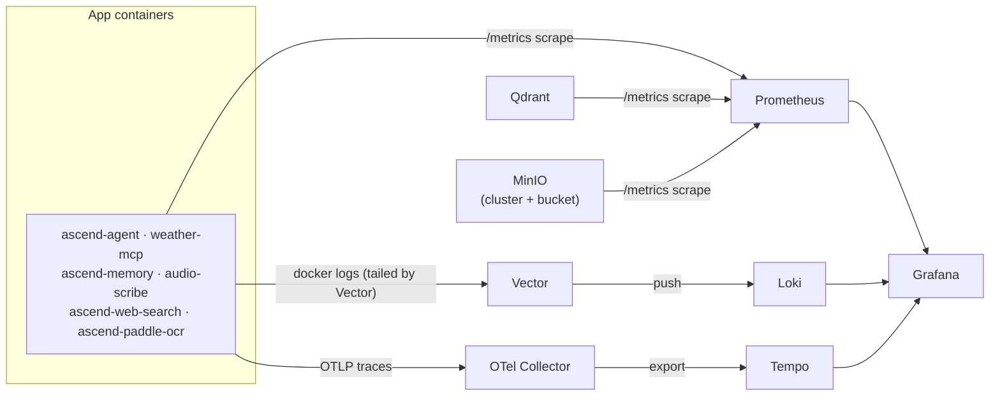

# Observability

This directory holds the full local observability stack for AscendAI: metrics, logs, and traces. Every service here is
defined in the main [`docker-compose.yaml`](../docker-compose.yaml) under the "Observability stack" block and comes up
with the rest of the platform on a single `docker compose up`.

The three signal types are kept separate end to end:

- **Metrics** — Prometheus scrapes each service and Grafana visualises them in six provisioned dashboards.
- **Logs** — Vector tails the application containers' Docker logs and ships them to Loki; you read them in Grafana's
  Explore view.
- **Traces** — the services export OTLP traces to the OpenTelemetry Collector, which forwards them to Tempo.

## How the pipeline fits together



## Services

| Service | Host port → container | Exposed | Role |
| :--- | :--- | :--- | :--- |
| **Grafana** | `7078` → `3000` | Browser UI | Dashboards and Explore. Anonymous viewing is enabled with the `Viewer` role; sign in as `admin` / `admin` to edit or save. |
| **Prometheus** | `7077` → `9090` | Browser UI / API | Scrapes metrics from the 6 application services, plus Qdrant and MinIO. 72h retention. |
| **Loki** | `3100` | Internal only | Log store. Receives logs pushed by Vector; queried through Grafana. |
| **Tempo** | — | Internal only | Trace store. Receives traces forwarded by the OTel Collector; queried through Grafana. |
| **Vector** | — | Internal only | Tails the 6 application containers' Docker logs and ships them to Loki. |
| **OTel Collector** | — | Internal only | Receives OTLP traces (gRPC `:4317`) from the services and exports them to Tempo. |

"Internal only" means the service is reachable on the Compose network by hostname but is **not** published to the host;
you interact with it through Grafana rather than directly.

### Prometheus scrape targets

Prometheus ([`prometheus/prometheus.yaml`](prometheus/prometheus.yaml)) scrapes:

- The two **Java** services (`ascend-agent`, `weather-mcp`) at `/actuator/prometheus` (Spring Boot Actuator +
  Micrometer).
- The four **Python** services (`ascend-memory`, `audio-scribe`, `ascend-web-search`, `ascend-paddle-ocr`) at
  `/metrics` (prometheus-fastapi-instrumentator).
- **Qdrant** at `/metrics` (native, unprefixed metric names such as `collection_vectors` and `collections_total`).
- **MinIO** at both `/minio/v2/metrics/cluster` and `/minio/v2/metrics/bucket` (the bucket endpoint provides the
  per-bucket `minio_bucket_usage_object_total` and `minio_bucket_usage_total_bytes` gauges).

Every scrape job sets a `service` label (e.g. `service="ascend-agent"`), which is what the dashboards filter on.

### Vector log shipping

Vector ([`vector/vector.toml`](vector/vector.toml)) reads the Docker log streams of exactly the six application
containers and pushes each line to Loki, labelled `service="<container_name>"`.

The Vector container **must** be started with the config flag, otherwise it boots with no pipeline:

```text
--config /etc/vector/vector.toml
```

The main compose file already wires this (`command: ["--config", "/etc/vector/vector.toml"]`); keep that flag if you
edit the service definition.

## Viewing logs

1. Open Grafana at [http://localhost:7078](http://localhost:7078).
2. Go to the **Explore** view (left navigation → Explore).
3. Pick the **Loki** datasource in the datasource selector at the top.
4. Run a label query for the service you want, for example:

   ```text
   {service="ascend-agent"}
   ```

Each of the six application containers is shipped under its own `service` label value: `ascend-agent`, `ascend-memory`,
`audio-scribe`, `ascend-web-search`, and `ascend-paddle-ocr`.

**`weather-mcp` is intentionally console-silent** — its `application.yml` suppresses console logging to keep the SSE
stream clean — so it will not appear in Loki even though Vector is configured to watch it. That is expected, not a
gap in the pipeline.

## Provisioned dashboards

Grafana auto-loads six dashboards from [`grafana/dashboards/`](grafana/dashboards/):

| File | Title | What it shows |
| :--- | :--- | :--- |
| [`platform-overview.json`](grafana/dashboards/platform-overview.json) | Platform Overview | Request rate, 5xx error rate, p95 latency, and memory (JVM heap / Python RSS) per service. |
| [`infrastructure.json`](grafana/dashboards/infrastructure.json) | Infrastructure | Qdrant per-collection vector and point counts; MinIO objects and bytes per bucket. |
| [`token-cost.json`](grafana/dashboards/token-cost.json) | L1 — Token Cost | LLM token usage and derived cost per provider. |
| [`ai-pipeline.json`](grafana/dashboards/ai-pipeline.json) | AI Pipeline | MCP tool call latency and pipeline-stage timing. |
| [`cache-hit-rate.json`](grafana/dashboards/cache-hit-rate.json) | L3 — Cache Hit Rate | Prompt-cache read / creation token rates per provider. |
| [`rag-quality.json`](grafana/dashboards/rag-quality.json) | L2 — RAG Quality | RAG retrieval top-score distribution and related quality signals. |
```
