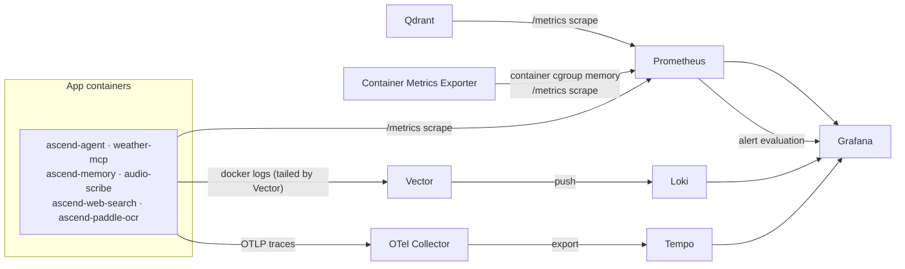

# Observability

This directory holds the full local observability stack for AscendAI: metrics, logs, and traces. Every service here is defined in the main [docker-compose.yaml](../docker-compose.yaml) under the "Observability stack" block and comes up with the rest of the platform on a single `docker compose up`.

The three signal types are kept separate end to end:

- Metrics: Prometheus scrapes each service and Grafana visualises them in six provisioned dashboards.
- Logs: Vector tails the application containers' Docker logs and ships them to Loki. You read them in Grafana's Explore view.
- Traces: the services export OTLP traces to the OpenTelemetry Collector, which forwards them to Tempo.

---

### How the pipeline fits together



---

### Services

| Service | Host port → container | Exposed | Role |
| :--- | :--- | :--- | :--- |
| Grafana | `7078` → `3000` | Browser UI | Dashboards and Explore. Anonymous viewing is enabled with the `Viewer` role. Sign in as `admin` / `admin` to edit or save. |
| Prometheus | `7077` → `9090` | Browser UI / API | Scrapes metrics from the 6 application services, plus Qdrant and the container metrics exporter. 72h retention. |
| Container Metrics Exporter | `8080` | Internal only | First-party exporter (source in [container-metrics-exporter/](container-metrics-exporter/)) that reads only the Docker Engine API stats endpoint over the Docker socket, no privileged mode or host filesystem mounts. |
| Loki | `3100` | Internal only | Log store. Receives logs pushed by Vector, queried through Grafana. |
| Tempo | n/a | Internal only | Trace store. Receives traces forwarded by the OTel Collector, queried through Grafana. |
| Vector | n/a | Internal only | Tails the 6 application containers' Docker logs and ships them to Loki. |
| OTel Collector | n/a | Internal only | Receives OTLP traces (gRPC `:4317`) from the services and exports them to Tempo. |

"Internal only" means the service is reachable on the Compose network by hostname but is not published to the host. You interact with it through Grafana rather than directly.

#### Prometheus scrape targets

Prometheus ([prometheus/prometheus.yaml](prometheus/prometheus.yaml)) scrapes:

- The two Java services (`ascend-agent`, `weather-mcp`) at `/actuator/prometheus` (Spring Boot Actuator + Micrometer).
- The four Python services (`ascend-memory`, `audio-scribe`, `ascend-web-search`, `ascend-paddle-ocr`) at `/metrics` (prometheus-fastapi-instrumentator).
- Qdrant at `/metrics` (native, unprefixed metric names such as `collection_vectors` and `collections_total`).
- Container Metrics Exporter at `/metrics` (`container_memory_used_bytes`, `container_memory_limit_bytes`, `container_start_time_seconds`, labelled per container by `name`). This is the only source in the stack for a container's total memory footprint against its `deploy.resources.limits.memory` ceiling. JVM heap metrics and Python RSS metrics each see only part of the process, not the cgroup limit itself.

The object store, on host port `9070`, publishes no Prometheus metrics on any path, so Prometheus does not scrape it. Its liveness signal is `GET http://localhost:9070/_floci/health`, checked directly rather than through this stack.

Every scrape job sets a `service` label (e.g. `service="ascend-agent"`), which is what the dashboards filter on.

#### Vector log shipping

Vector ([vector/vector.toml](vector/vector.toml)) reads the Docker log streams of exactly the six application containers and pushes each line to Loki, labelled `service="<container_name>"`.

The Vector container must be started with the config flag, otherwise it boots with no pipeline:

```text
--config /etc/vector/vector.toml
```

The main compose file already wires this (`command: ["--config", "/etc/vector/vector.toml"]`). Keep that flag if you edit the service definition.

---

### Viewing logs

1. Open Grafana at [http://localhost:7078](http://localhost:7078).
2. Go to the Explore view (left navigation → Explore).
3. Pick the Loki datasource in the datasource selector at the top.
4. Run a label query for the service you want, for example:

   ```text
   {service="ascend-agent"}
   ```

Five of the six application containers are shipped under their own `service` label value: `ascend-agent`, `ascend-memory`, `audio-scribe`, `ascend-web-search`, and `ascend-paddle-ocr`.

`weather-mcp` is intentionally console-silent: its `application.yml` suppresses console logging to keep the SSE stream clean, so it will not appear in Loki even though Vector is configured to watch it. That is expected, not a gap in the pipeline.

---

### Provisioned dashboards

Grafana auto-loads six dashboards from [grafana/dashboards/](grafana/dashboards/):

| File | Title | What it shows |
| :--- | :--- | :--- |
| [platform-overview.json](grafana/dashboards/platform-overview.json) | Platform Overview | Request rate, 5xx error rate, p95 latency, memory (JVM heap / Python RSS) per service, container memory used vs. its configured limit (container metrics exporter), and container restart count. |
| [infrastructure.json](grafana/dashboards/infrastructure.json) | Infrastructure | Qdrant per-collection vector and point counts. |
| [token-cost.json](grafana/dashboards/token-cost.json) | L1 — Token Cost | LLM token usage and derived cost per provider. |
| [ai-pipeline.json](grafana/dashboards/ai-pipeline.json) | AI Pipeline | MCP tool call latency and pipeline-stage timing. |
| [cache-hit-rate.json](grafana/dashboards/cache-hit-rate.json) | L3 — Cache Hit Rate | Prompt-cache read / creation token rates per provider. |
| [rag-quality.json](grafana/dashboards/rag-quality.json) | L2 — RAG Quality | RAG retrieval top-score distribution and related quality signals. |

---

### Memory limit alerting

A container that hits its `deploy.resources.limits.memory` ceiling gets killed by the runtime (exit code 137, `OOMKilled=true` in `docker inspect`). The intent is to catch a container approaching that ceiling before the kill happens, not to find out from a user report afterward.

Two signals cover this, both driven by the container metrics exporter scrape above:

- Dashboard panel: "Container Memory Used vs Limit" on the Platform Overview dashboard, colour-thresholded yellow at 70% and red at 90% of the limit. Always visible with no extra configuration, so this is the reliable baseline signal.
- Grafana alert rule: [grafana/provisioning/alerting/memory-limit-alerts.yaml](grafana/provisioning/alerting/memory-limit-alerts.yaml) fires a `warning`-severity alert when any container stays above 85% of its limit for 5 minutes, visible under Grafana's Alerting page and as an annotation on the panel above. It routes through Grafana's built-in default notification policy. No SMTP or webhook contact point is configured in this stack, so the alert is visible inside Grafana but does not page anyone externally. Add a contact point if that's needed later.

A restart alone does not prove a memory kill. The "Container Restarts (15m)" panel (built on the container metrics exporter's `container_start_time_seconds`) flags that something restarted, nothing more. Confirm the cause with:

```bash
docker inspect <container> --format "{{.State.ExitCode}} {{.State.OOMKilled}}"
```

Exit `137` with `OOMKilled=true` means the container runtime killed it for exceeding its memory limit. A JVM service (`ascend-agent`, `weather-mcp`) exiting with code `3` and `OOMKilled=false` means the JVM itself terminated via `-XX:+ExitOnOutOfMemoryError` before the cgroup limit was reached, a cleaner failure that still restarts under the existing `restart: unless-stopped` policy, but is a distinct condition from a runtime kill. Neither exit code is currently exported as a Prometheus metric. That would need a Docker-events exporter, which this stack does not have.
