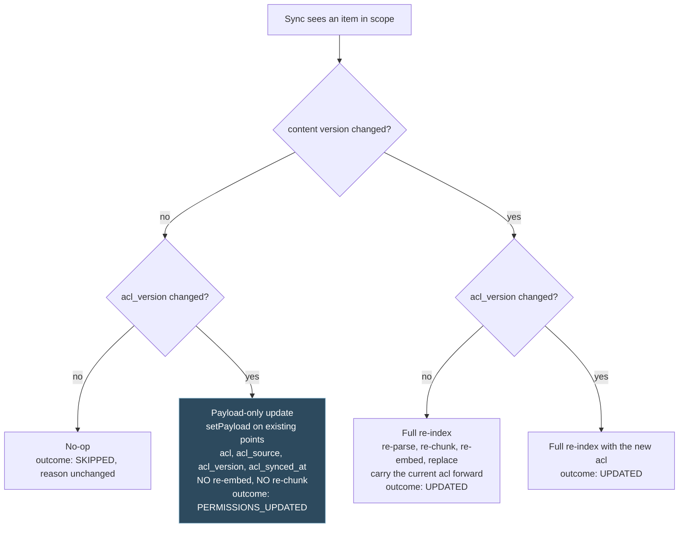

## Context

Documents enter the RAG knowledge base through exactly two hand-driven paths today:

1. `POST /api/v1/ingestion/upload` (`controller/IngestionController.java`): multipart upload, filename sanitization (`util/IngestionSecurity`), Tika MIME sniffing against `app.ingestion.upload.allowed-mime-types`, then a `StorageService` write into MinIO under `markdown/` or `documents/`.
2. Out-of-band drops into the MinIO bucket followed by `POST /api/v1/ingestion/run`. `service/ingestion/ManualIngestionService.java` scans the bucket, dedupes on ETag via a `ConcurrentMetadataStore` (`manual-ingestion:<key>:<etag>` markers), and pushes content through `IngestionService` / `DocumentRouter` into Qdrant.

A Spring Integration S3 poller exists (`config/IngestionPipelineConfig.java`) but is disabled by default (`app.ingestion.auto.enabled=false`). Downstream parsing is already rich: `DocumentRouter` routes to the markdown parser, Docling, ascend-ocr, or Unstructured, with per-page PDF classification. There is no connector or sync concept anywhere in the codebase.

This change layers automated source sync on top, without touching the parse path.

Permission-aware retrieval is settled design, recorded in `docs/architecture/permission-aware-retrieval.md` and in ADR-M004 through ADR-M009 under `docs/architecture/decisions/`. That design splits into three halves: a verified caller with resolved group principals (`add-auth-and-identity`), a filter composed into the vector search over an `acl` payload field (`add-tenant-isolation`), and the capture of that `acl` field from a real source at sync time. The third half was this change's, and it is the half this version does not deliver.

The scope of this change has been cut to match the authentication scope the owner settled. Groups live in Keycloak and nowhere else. Nothing is read from a customer's Microsoft or Google directory, and `add-auth-and-identity` mints principals only in the `local` and `tenant` namespaces. A SharePoint permission entry names an Entra ID directory object id, which is a principal in a namespace this version cannot mint and which the typed factory rejects. So capturing per-document permissions from the source is not merely unimplemented here, it is unrepresentable, and a connector that tried would fail capture on every item and land nothing.

For this version, therefore, a document a connector syncs is visible to everyone in the company. It carries `tenant:everyone:{tenantId}` and nothing else, which is what this change described before it was amended to capture source access lists, and it is what `add-auth-and-identity` states as a named limitation on its side. D18 is that decision and the Named limitation section below states it in customer terms. The capture design is not deleted. It is preserved whole in the Deferred section, because the moment a customer with a real directory arrives it returns as written.

Dependencies on sibling changes (their scope is not re-specified here):

- `add-auth-and-identity`: provides the `ADMIN` role that guards the connector API and the authenticated principal recorded on connector mutations. It does not provide a directory identifier, a directory-namespaced principal, or a cross-provider identity link in this version, and nothing in this change depends on one.
- `add-tenant-isolation`: provides the tenant prefix under which connector-fetched objects land in MinIO, the tenant metadata carried into Qdrant chunks, the `acl` / `acl_source` / `acl_version` / `acl_synced_at` metadata keys, the mandatory keyword payload index on `acl`, the `tenant:everyone:{tenantId}` pseudo-group, the ingestion producer default that stamps it, and the filter composition that reads all of it. Connector configuration rows are tenant-scoped using the same tenant key.
- `add-document-management-api`: owns the document metadata/status model and the single-document deletion machinery (MinIO object + Qdrant chunks + metadata row). Deletion propagation in this change calls that path; it does not build its own.
- `add-usage-metering-and-quotas`: owns the encryption-at-rest mechanism (BYOK key handling). Connector client secrets are stored with the same mechanism family; this change consumes it, it does not re-specify encryption.

## Goals / Non-Goals

Goals:

- A provider-agnostic connector framework: per-tenant persisted configuration, scheduled and on-demand incremental sync, sync-run history with per-file outcomes, deletion propagation, ADMIN CRUD API.
- First concrete connector: SharePoint/OneDrive via Microsoft Graph with client-credentials auth, delta-query incremental sync, site/drive/folder scoping, allowlist-aligned file filtering, and Graph-compliant throttling behaviour.
- Connectors land bytes and trigger the existing pipeline. Nothing else.
- Every connector-landed document is retrievable by the company that owns it, through the tenant-everyone grant the ingestion producer already stamps, so a sync that reports success produces documents that answer.
- A connector that has quietly stopped syncing is visible as a stale connector rather than as a knowledge base that keeps answering from content that stopped being current.
- An explicit administrator authorization rule on the connector endpoints, owned here because no sibling change carries one for this prefix any more.

Non-Goals:

- Per-document access-list capture from the source. Deferred whole, with its analysis, in the Deferred section. The consequence is stated in the Named limitation section rather than softened.
- Google Drive, Confluence, and network-share connectors. Named follow-ons, explicitly out of scope. The framework interfaces (`DocumentConnector`, per-connector `ConnectorType`, credential-reference indirection, per-connector cursor storage) are designed so each of these is an additive implementation plus a Liquibase enum value, no framework rework. See D17 for the ordering argument and what changed about it under this scope.
- Any new parsing capability. `DocumentRouter` and its parsers are untouched.
- Real-time (webhook/subscription-based) change notification. First iteration is polling via scheduled delta sync; Graph change notifications are a later optimisation.
- The retrieval side of permission-aware retrieval. Composing `acl` into the `SearchRequest`, the deny-by-default rule for a chunk with no list, the payload index, the metadata key definitions, and the presign re-check all belong to `add-tenant-isolation`.
- Composing an access list at all. `add-tenant-isolation` owns the one place that mints `tenant:everyone:{tenantId}` and stamps the four access-list keys, and this change consumes that rather than writing a second producer of the same value (D18).
- Group membership resolution, the principal identifier format and its factory, and the cross-provider identity link. All `add-auth-and-identity`.
- The administrator assignment surface for access lists on direct uploads. That is the Shape 2 deployment in `docs/architecture/permission-aware-retrieval.md`, and it is an open question there rather than something a connector change can settle.
- User-delegated (on-behalf-of) Graph auth. Client credentials only.
- Encryption mechanism design, consumed from `add-usage-metering-and-quotas`.
- Single-document delete mechanics, consumed from `add-document-management-api`.

## Decisions

Decision numbers are stable. A decision that has been deferred keeps its number and moves to the Deferred section, so a cross-reference from a sibling change or a decision record still lands on the right text.

### D1: Connector to MinIO to existing pipeline; no parallel parse path

A connector's contract is bytes. The source file's bytes are written to MinIO under the tenant prefix (markdown to the markdown folder, everything else to the documents folder, same routing rule as `IngestionController.determineFolder`) and the existing ingestion scan is triggered for the affected prefix. Parsing, chunking, and embedding stay the existing pipeline's job, and so does composing the access list those chunks carry (D18).

*Why:* one parse path means one set of parser bugs, one dedup semantics, one metrics surface. The alternative, connectors calling `IngestionService` directly with in-memory streams, would bypass the dedup and the MinIO source-of-truth, and would make the `add-document-management-api` metadata model inconsistent (documents in Qdrant with no MinIO object).

*Consequence:* connector-fetched files pass the same hygiene as uploads, filename sanitization from `util/IngestionSecurity` and MIME sniffing against `app.ingestion.upload.allowed-mime-types`, applied by the framework before the MinIO write, so a compromised or misconfigured source cannot smuggle disallowed content types past the controller-level checks.

*Consequence:* a connector never writes to the vector store. Not through the ingestion pipeline's own path, and not around it. The carve-out that a payload-only access-list update would have needed is deferred with the capture work (Deferred D11), so in this version the rule holds without exception and the framework interfaces expose no vector-store handle at all.

The second half this contract carried before the scope cut, a per-item access list produced by the same capture in the same run, is Deferred D7. It returns as the second half of this same contract when capture does.

### D2: Framework shape: `DocumentConnector` interface + sync orchestrator

- `DocumentConnector` (interface, `service/connector/`): `ConnectorType type()`, `ChangeSet fetchChanges(ConnectorConfig, SyncCursor)` returning added/modified/deleted entries plus the next cursor. Each entry carries the source item id, path, and content version. Implementations are stateless; all state lives in the database.
- `ConnectorSyncOrchestrator` (framework): loads due connectors, resolves credentials, calls `fetchChanges`, applies hygiene, MinIO writes, and deletion propagation, records the sync run and per-file outcomes, persists the new cursor only after the run completes; a failed run keeps the previous cursor so the next run retries the same window.
- Scheduling via Spring's `@Scheduled` tick (every minute) that scans for connectors whose `next_run_at` has passed, guarded by `ShedLock`-style DB row locking (`SELECT ... FOR UPDATE SKIP LOCKED` on the connector row) so multiple agent instances never double-sync one connector. Per-connector schedule stored as a cron expression.

The `AccessListSource` interface this design carried is deferred with the capture work it exists for (Deferred D7). The reason it was a separate interface from `DocumentConnector` rather than a method on it, that capture has its own throttling profile, its own failure modes, and its own schedule, is preserved there and is the reason the split returns rather than being reconsidered.

*Why not Quartz:* a full scheduler dependency for "run N connectors on a cron" is overkill (KISS); the DB-row claim gives multi-instance safety without extra infrastructure. *Why not Spring Integration poller reuse:* `IngestionPipelineConfig` polls one bucket with one filter; connectors need per-source cursors, credentials, and run history, which is a different problem.

### D3: Data model (Liquibase, new changelog in `db/changelog/`)

Four tables, all tenant-scoped:

- `connector`: id (UUID), tenant id, type (enum string, first value `SHAREPOINT`), display name, credentials reference (FK/opaque handle into the encrypted credential store from `add-usage-metering-and-quotas`), source scope (JSONB: site/drive/folder identifiers, provider-specific shape validated by the connector implementation), cron schedule, maximum sync age, enabled flag, `last_successful_sync_at`, `stale` flag, created/updated audit columns, `next_run_at`.
- `connector_sync_run`: id, connector FK, trigger (`SCHEDULED` | `MANUAL` | `FRESHNESS_CHECK`), status (`RUNNING` | `SUCCEEDED` | `PARTIAL` | `FAILED`), started/finished timestamps, counters (added / updated / deleted / skipped / failed), error summary.
- `connector_sync_file_outcome`: id, sync-run FK, source item id, source path, action (`ADDED` | `UPDATED` | `DELETED` | `SKIPPED` | `FAILED`), MinIO key, failure reason (nullable).
- `connector_sync_cursor`: connector FK (+ per-drive discriminator for SharePoint, since Graph issues one delta token per drive), opaque content cursor value, updated timestamp.

*Why JSONB scope instead of typed columns:* each provider scopes differently (SharePoint: site/drive/folder; Google Drive: shared-drive/folder; Confluence: space). A typed-per-provider table set would multiply migrations per connector; a JSONB blob validated by the owning connector keeps additions additive (OCP).

The fifth table, `connector_item_acl`, is deferred with capture (Deferred D3a). It held the connector-side record of the access list last written onto each item's chunks, and it existed to serve the four-way branch, the inheritance fan-out, and the age-based sweep, all three of which are deferred. Nothing in this version has a per-item permission state to keep, and the freshness check in D19 measures a connector rather than an item, so it needs no row per document.

The permission columns on the cursor, `permissions_confirmed_through` and `permissions_cursor`, are deferred with Deferred D12 for the same reason. `last_successful_sync_at` and `stale` on the connector row are new here and belong to D19.

### D4: SharePoint sync via Graph delta queries

- Auth: MSAL-style client-credentials flow per tenant (Entra ID app registration; tenant id + client id + encrypted client secret in the credential store). Token cached in memory until expiry; never persisted, never logged.
- Change detection: `GET /drives/{drive-id}/root/delta` (scoped to configured folders by filtering returned paths). First run is a full enumeration (delta with no token); subsequent runs pass the stored `deltaLink` token and receive only created/modified/deleted items. Deleted items arrive as entries with a `deleted` facet.
- Scoping: configured sites are resolved to drives via `GET /sites/{site-id}/drives`; folder scoping filters delta results by path prefix. Items outside scope are ignored (not recorded as skipped, they are not part of the connector's universe).
- Filtering: file MIME (from Graph item metadata, re-verified by Tika sniff before the MinIO write per D1) must be in `app.ingestion.upload.allowed-mime-types`; file size must not exceed the connector's size limit (default aligned with the multipart limits from `ingestion-security`). Filtered files are recorded as `SKIPPED` with reason.
- Throttling: on HTTP 429 or 503 with `Retry-After`, sleep the advised interval; without the header, exponential backoff with jitter, bounded retries per request and a bounded total-throttle budget per run. Exceeding the budget ends the run as `PARTIAL` with the cursor unadvanced past the completed window. This follows Microsoft's published throttling guidance for Graph.

One throttling budget, not two. The separate permission budget is deferred with the permission reads it protected (Deferred D8, Deferred D9), and it returns with them, because the argument for splitting the budget was that a permission storm must not starve document landing and there are no permission requests to storm.

*Why delta queries over full listing + diff:* delta is the Graph-native incremental mechanism, server-side change tracking, one round trip per page of changes, deletions included. Full listing per sync would hammer both Graph (throttling) and our comparison logic, and cannot see deletions without keeping a full remote-inventory shadow ourselves.

*What delta does not do:* it does not reliably report a permission change on an item whose content did not change, and it does not report a permission change made higher in a folder tree as a change on each descendant. That was Deferred D8's problem and it is not a problem this version has, because this version reads no permissions. It becomes one again the day capture returns, which is why Deferred D8 is kept rather than dropped.

### D5: Deletion propagation reuses `add-document-management-api`

When a delta entry carries the deleted facet, the orchestrator maps source item to MinIO key (recorded in the file-outcome history and in the document metadata model owned by `add-document-management-api`) and invokes that change's single-document deletion path, which removes the MinIO object, the Qdrant chunks for that source, and the metadata row. This change adds only the mapping and the trigger; if `add-document-management-api` has not shipped, this change is blocked on it (declared dependency, not an inline re-implementation).

### D6: Credentials: reference, not value

The `connector` row stores an opaque credentials reference; the secret material lives in the encrypted credential store from `add-usage-metering-and-quotas` (same mechanism family as BYOK provider keys). API responses never echo secrets (write-only field); logs and sync-run records carry the reference only. Rotating a secret is an update through the credential store with no connector-table change.

### D15: Application permissions wide enough to read content, and no wider

The Azure app registration a customer administrator creates needs content grants and nothing else in this version.

Microsoft's reference for reading a `driveItem` gives, for application permission type, `Files.Read.All` as a least-privileged permission and `Sites.Read.All` among the higher-privileged alternatives. `Sites.Read.All` is what this change asks for, because that one grant covers site enumeration, drive enumeration, and item content. `Sites.Selected` is the genuinely least-privileged alternative and is noted in the setup guide, with the caveat that it is granted per site by an administrator and that a site added to a connector's scope without that grant fails to sync rather than syncing empty.

The directory group read grant, `GroupMember.Read.All`, is not requested and is not needed. It existed to resolve a permission entry's group identity into a principal, and there is no principal mapping in this version. Removing it from the onboarding is a real reduction in what a customer is asked to consent to: an application identity that can read a company's documents is a smaller ask than one that can also enumerate their directory groups, and this change should not ask for the second while it cannot use it. The analysis of why the content grants do not cover directory reads, and of the short-list failure mode that made the distinction load-bearing, is preserved in Deferred D15a.

### D17: SharePoint stays the first connector

SharePoint is the first connector. Google Drive, Confluence, and network shares remain named non-goals.

The reasoning that put SharePoint first is that the customers this is being built for are on Microsoft, and it is unaffected by the scope cut.

The counter-argument this decision used to weigh against, that Google Drive is cheaper to make permission-correct because its change feed returns permissions inline while Graph needs a separate request per item, is dormant rather than resolved. Under this scope neither connector reads permissions, so the two are equally cheap and the ordering question has one input rather than two. The argument returns intact the day capture returns, and it is recorded in ADR-015 and in Deferred D9 rather than in this decision, so that a future reader re-opening the ordering finds the analysis rather than rediscovering it.

### D18: A connector-synced document is visible company-wide, and the connector composes no list itself

Every chunk produced from a connector-landed document carries `acl` of exactly `["tenant:everyone:{tenantId}"]`, `acl_source` of `tenant-default`, the matching `acl_version`, and `acl_synced_at` set at ingestion. That is the same stamp `add-tenant-isolation` already applies to a document with no source-captured list, applied by the same ingestion producer, and the connector supplies no list of its own.

Three things follow from the connector composing nothing, and each is the reason rather than a consequence.

There is one producer of `tenant:everyone:{tenantId}` in the system. `add-tenant-isolation` owns the helper that builds it, validates it against the principal format, and computes its version. A connector that assembled the same value would be a second implementation of one piece of knowledge, and the failure mode of a divergence is not a compile error, it is a chunk whose list is syntactically valid and matches nobody.

`acl_source` says `tenant-default` and not `sharepoint`, because the list did not come from SharePoint. An `acl_source` of `sharepoint` on a list nothing at SharePoint decided would be a lie told in a payload field an operator uses to answer "where did this grant come from", and the day capture lands it would be indistinguishable from a genuinely captured list. Whether a document arrived through a connector is answerable from its MinIO key and its document metadata, which is where that question belongs.

The connector framework therefore has no access-list code path at all in this version, rather than a stubbed one. There is no capture interface with a company-wide implementation, no cap check that can never fire, and no version comparison whose two sides are always equal. Machinery that cannot fail is machinery whose tests prove nothing, and it is worse than absent, because the next reader takes its presence as evidence that capture works.

What this costs is stated plainly in the Named limitation section rather than buried here: a customer whose SharePoint has genuinely restricted material gets coarser access in AscendAI than they have at the source.

### D19: The freshness control measures the connector, and changes no document

The sweep this design carried emptied the access list of any item whose list had not been confirmed within a maximum age, which under deny-by-default made the document invisible. Its instinct is right and it survives: a control that keeps answering after it stopped being correct is the worst failure shape available, and a silent outage has to become a visible one. Its mechanism does not survive, because the mechanism was enforcement and there is nothing left to enforce.

Emptying a list under this scope would take a document away from people who were never restricted from it, in order to contain a stale authorization decision that cannot exist, since the only grant on the document is one every member of the company holds. The blunt version was correct when the list was the only thing standing between a revoked person and a document they had lost access to. It is pure availability cost when the list says "the company", and the company is exactly who it was always going to be.

So the control changes target. What can still fail silently in this version is the sync itself: a client secret revoked in Entra ID, a delta token stuck in a resync loop, a scheduler that never fires after a deployment, a connector left disabled after a migration. When that happens nothing errors, the corpus keeps answering, and it answers from content that is weeks out of date, including from documents that have since been deleted at the source. That is the failure the proposal's own opening names as the worst one a RAG product has.

The freshness check, then:

- A scheduled job compares each enabled connector's `last_successful_sync_at` against its configured maximum sync age, claimed with the same row lock as a scheduled sync so two instances cannot both act on one connector.
- A connector past its maximum sync age is marked stale on its configuration row. The flag is returned by the connector read and list endpoints, and it is exposed as a gauge: seconds since the last successful sync, per connector, plus a count of stale connectors.
- A connector that syncs successfully clears the flag on that run.
- The check records a run with trigger `FRESHNESS_CHECK` only when a connector's stale state changes, so a long outage produces one row rather than one per tick.
- It writes nothing to MinIO and nothing to Qdrant, and it does not read the source. That independence is the property the sweep had that is worth keeping: the thing that failed is the sync, so the control that notices must not depend on the sync working.
- Its own run never moves `last_successful_sync_at`. Only a `SCHEDULED` or `MANUAL` run does. Without that, a check completing successfully would look like a successful sync and clear the very condition it was recording, which is a two-line bug with a symptom of a connector that is never stale.

The configuration invariant survives with a new pair of values. A connector's maximum sync age has to be greater than the interval its cron schedule fires on, or a healthy connector marks itself stale on its first check. The framework rejects that configuration at write time rather than discovering it at check time, because that particular misconfiguration is silent until every connector reads stale at once.

What this is not: it is not the alert ADR-014 rejects. An alert was rejected there because a notification is not an enforcement while the system is actively serving stale authorization decisions. Nothing here is serving an authorization decision, so a signal is the proportionate control and enforcement is not available to be traded away. The destructive form returns with capture, and ADR-014 says so on its own status line.

ADR-016 records this decision, including why it does not contradict ADR-014's rejection of alerting and what it inherits from it. ADR-014 is deferred rather than withdrawn, and the two detect different outages once both exist.

## Named limitation: connector-synced documents are company-visible in this version

This is the one place where the scope cut changes what a customer gets, rather than only what we build, and it is written out here rather than softened into a caveat. It is the same statement `add-auth-and-identity` makes from the identity side, and the two say the same thing on purpose.

A document synced from a customer's own storage is readable in AscendAI by everyone in that company, regardless of who could open it in SharePoint. A connector reads no permissions and captures no access list.

The reason is not that capture is hard. It is that capture has nothing to produce. SharePoint names an Entra ID security group by its directory object id, and this version mints principals only from Keycloak realm groups in the `local` namespace. A Keycloak group name will never equal an Entra directory object id, so a captured list would match nobody, for everybody, always, and under deny-by-default every synced document would be invisible to the entire company. That is the worse of the two honest options: the sync reports success, the storage bill arrives, and nothing can be retrieved.

Per-document permissions are reachable in this version only for documents uploaded directly into the product, where the groups on a document and the groups in a caller's principal set are both Keycloak realm groups and can therefore match. The identity and retrieval halves of that are complete: the factory mints `local:group:*`, the filter matches on it. The surface an administrator would use to assign those groups to an uploaded document is an open question outside these three changes, noted as such in `add-auth-and-identity`, so today even a direct upload lands on the tenant-everyone grant. What is settled is that the mechanism can work there and cannot work for a connector-synced document, whatever assignment surface arrives.

What would have to be built to lift it, which is analysis already done and preserved in the Deferred section below rather than deleted:

- Directory group identifiers have to reach the agent, which is deferred on the identity side.
- The principal namespaces `entra` and `google` have to be added to the closed set the typed factory validates against.
- A person's Keycloak identity has to be connected to their identity at the directory whose groups the access lists name, which is the cross-provider identity link, deferred on the identity side.
- And the owner's open decision has to be taken: how a customer's directory groups relate to Keycloak's, whether they are imported, mirrored, mapped by an administrator, or bypassed by resolving membership at the directory.

Until then, the honest statement to a customer is that every document a connector syncs is readable by their whole company, and that group-level restriction is available only on the direct-upload path, once the assignment surface for it ships.

## Deferred

Everything in this section was designed, checked against primary sources, and then taken out of scope by the decision that groups live in Keycloak only. None of it is wrong. It is not needed until a connector can produce a principal a caller might actually hold, and it is kept here because re-deriving it would cost more than reading it.

Every deferred decision keeps its number. A sibling change or a decision record that cross-references D9 or D11 still lands on the right text.

### Deferred D3a: The `connector_item_acl` table

`connector_item_acl`: connector FK, source item id, MinIO key, `acl_version`, `acl_synced_at`, the container id the list was inherited from (nullable, D9), and the captured principal list. This is the connector-side record of what was last written onto that item's chunks. It exists so the four-way branch in D11 can compare against a stored value without reading Qdrant per item, and so the staleness sweep in D14 has something cheaper than the vector store to scan.

*Why a connector-side access-list record at all:* the authoritative copy of an access list is the chunk payload in Qdrant, and it stays that way. Reading it back per item per run would mean a Qdrant round trip for every file in a large drive on every sync, on the sync path, to answer a question a local row answers for free. The row is a cache of what was written, reconciled by the sweep, and the sweep is what catches it drifting.

### Deferred D7: Access-list capture is per in-scope item, and it is not optional

Every item a connector lands carries a captured `AccessList`. The list is the set of principals permitted to read it, expressed in the `namespace:type:id` format from `add-auth-and-identity` and produced through that change's typed factory, never by string concatenation here.

The captured list is written by the framework onto the chunk metadata for that item, populating the four keys `add-tenant-isolation` defines: `acl` (the sorted principal set), `acl_source` (which connector produced it, for example `sharepoint`), `acl_version` (the hash defined in D10), and `acl_synced_at` (the epoch second at which the source was asked, not the second at which the list last changed).

Two rules make the field trustworthy rather than merely present.

Capture failure fails the item. If the source refuses the permission read, returns a permission collection the connector cannot interpret, or returns a partial collection because the granted application permission is too narrow to see all of it, the item's outcome is `FAILED` with the capture reason. No chunk is indexed for it, and bytes already landed for it in this run do not trigger ingestion. An item that is invisible because capture failed is a line in the run history with a file name on it. An item that is invisible because an empty list was written silently is a support ticket about search finding nothing.

An empty list and a failed capture are different things and must never be conflated. A source can legitimately report that no group may read an item, and that is an empty list, deliberately written, making the item invisible to group-based retrieval by design. A source that refused to answer produced no list at all. The first is `ADDED` with an empty `acl`, the second is `FAILED`. The outcome row is what tells an operator which happened.

The interface this hangs off, deferred with it: `AccessListSource` (`service/connector/acl/`): `AccessList capture(ConnectorConfig, SourceItemRef)` and `Map<SourceItemRef, AccessList> captureForContainer(ConnectorConfig, SourceContainerRef)`. Kept separate from `DocumentConnector` because capture has its own throttling profile, its own failure modes, and its own schedule (D8), and because a source can be readable for content and unreadable for sharing. A connector without a working `AccessListSource` is a connector whose documents are invisible, which needs to be a legible failure rather than a silent one.

What has to happen for this to become active: a principal namespace a source identifier can mint into, which is the identity-side deferral, and the owner's decision about how a customer's directory groups relate to Keycloak's.

### Deferred D8: Effective permissions are read from the source, never inferred from the content feed

The connector asks the source what an item's effective permissions are. It does not derive them from the change feed, and it does not treat an item's absence from the change feed as evidence that its permissions are unchanged.

Sources are inconsistent about this in two specific ways, and both break inference.

They are inconsistent about reporting permission edits at all. A sharing change on an item whose bytes did not change may or may not appear in a delta response, depending on the source, the kind of change, and the API version. A pipeline that reads "not in the delta" as "permissions unchanged" is correct exactly as often as the source happens to be generous, and there is no way to know which case a given customer is in without asking the source directly.

They are inconsistent about inherited changes. Revoking a group's access to a folder changes the effective permissions of every item beneath it, and sources generally report that as one change on the folder rather than as a change on each descendant. A pipeline reading only the item-level feed sees a folder event, has no item to act on, and leaves every document in the tree carrying an access list that stopped being true.

So capture runs on its own trigger, not on the content feed's. Every sync run confirms permissions for the items whose confirmation is due, whether or not those items appeared in the content delta, and records the confirmation time in `permissions_confirmed_through` on the cursor. Content progress and permission progress are two separate things and the run advances them separately.

This is the decision that makes `acl_synced_at` mean what ADR-M004 says it means: when the list was last confirmed against its source, not when it last changed.

### Deferred D9: Folder-level inheritance, so capture is not one call per document

Asking the source for the permissions of every item individually is correct and unusable. A first full enumeration of a large drive is tens of thousands of items, one throttled call each, against a per-tenant throttling budget that already constrains the content sync. The first sync would either take days or spend its whole budget on permission reads and land no documents.

Capture is therefore container-first.

The connector reads permissions for the container, meaning the drive root and each folder in scope, and records the resulting list against that container. An item that inherits its container's permissions, which is the overwhelming majority of items in a normal corpus, takes the container's captured list with no call of its own, and its `connector_item_acl` row records the container it inherited from. A per-item call is made only for an item the source marks as having permissions of its own, which sources do expose: Graph marks an inherited permission entry with `inheritedFrom`, so an item whose permission collection contains an entry without that marker has something unique and is read individually.

This turns a first full enumeration from one call per document into one call per folder plus one call per genuinely uniquely-shared document. On a corpus where sharing is set at team-folder level, which is how companies actually work, that is orders of magnitude fewer calls.

Two consequences follow and both are load-bearing.

A container's permission change invalidates every item that inherited from it. That is the point: one folder read detects a revocation affecting a thousand documents, and the run then performs a thousand payload-only updates, which are cheap, rather than a thousand permission reads, which are not. The container reference on the `connector_item_acl` row is what makes that fan-out a local query.

An item that stops inheriting, meaning somebody set a unique permission on it between runs, has to be detected. A container read alone cannot see it. Detection is the per-item confirmation schedule from D8: an item whose confirmation is due is read individually regardless of what its container said, so an item that quietly acquired unique permissions is corrected within one confirmation interval rather than never.

This is also the decision that made the permission throttling budget separate from the content budget, so that a permission storm could not starve document landing and document landing could not starve permission reads. That split returns with these reads.

### Deferred D10: Deduplication key is content version paired with access-list version

`ManualIngestionService` builds its marker as `manual-ingestion:<key>:<etag>` and skips the object when the marker exists. The ETag hashes content. Unchanged bytes produce an unchanged ETag, produce a marker hit, produce a skip. A permission-only change is by definition an unchanged file, so under a content-only key the most common permission event in any company is structurally invisible.

The key becomes the pair: `manual-ingestion:<key>:<contentVersion>:<aclVersion>`.

`contentVersion` is the ETag exactly as today. `aclVersion` is a stable hash of the sorted principal list, and the sorting is what makes it stable: a source that returns the same permitted set in a different order produces the same hash and is correctly read as no change. Two items sharing a permitted set share a version, which is what makes the container-level comparison in D9 a single equality rather than a set diff.

A permission-only change produces a new key, so the object is processed. A genuine no-op produces a key hit and is still skipped. Nothing about the content path changes.

The hash is taken over a canonical form: principals sorted lexicographically and joined with a separator that cannot occur inside a principal, which the format constraints in `add-auth-and-identity` already guarantee.

Under the current scope the access-list version of a connector-landed document is a constant, one principal derived from the tenant, so pairing it into the key would add a segment that never varies and a second marker format that never earns it. The content-only marker is therefore unchanged in this version, and the pairing returns the moment a captured list can differ between two runs of the same connector.

### Deferred D11: The four-way branch, and the payload-only update path

A run compares two versions for every item it touches, and there are four outcomes, not two.

The path that matters is the one where content is unchanged and the access list is not. Re-embedding a 200-chunk document to change one keyword array is the difference between a revocation taking seconds and a revocation taking an hour, and during that hour the revoked group can still retrieve the document. It also spends an embedding API call per chunk on a change that touched no text.

Spring AI's `VectorStore` abstraction cannot express this. It offers `add` and `delete`, and `add` means embed. The payload-only path therefore uses the native Qdrant client's `setPayload` against the points whose payload already identifies that source, updating exactly the four access-list keys and touching nothing else. The Qdrant client is already a declared dependency in `AscendAgent/build.gradle.kts` as `libs.qdrant.client`, so this is a second and narrower use of a dependency that is already present, not a new one.

The update carries the same tenant predicate every other Qdrant operation carries, so it can never reach across tenants, and it names the four access-list keys explicitly rather than replacing the payload, so it cannot drop `source`, `type`, `title`, or `tenant_id` by omission.

Under the current scope only two of these four branches are reachable, because the access-list version of a connector-landed document never changes, and the two that remain are the ones the existing content-only dedup already implements. The carve-out to the no-direct-vector-store-writes rule is therefore not taken in this version, and D1 states the rule without an exception. The carve-out returns with the branch, and ADR-013 records it as deferred rather than as withdrawn, so a future reader finds a reviewed exception rather than an invitation to invent one.

### Deferred D12: The `PERMISSIONS_UPDATED` outcome, and permission confirmation state on the cursor

The existing per-file actions, `ADDED`, `UPDATED`, `DELETED`, `SKIPPED`, `FAILED`, all describe indexing. A run that touched an item, changed something that matters, and indexed nothing is none of them. Recording it as `UPDATED` claims a re-index that did not happen; recording it as `SKIPPED` claims nothing happened while a revocation was taking effect.

`PERMISSIONS_UPDATED` is added, carrying the `acl_version` that was written. It is not bookkeeping. It is how an operator tells "the sync is working and permissions moved" from "the sync did nothing", and a flat zero on that counter across a customer with active sharing changes is the signal that permission capture has stopped while the content sync still looks healthy.

The cursor gains permission confirmation state for the same reason. A cursor holding only a content delta token records how far the content feed has been consumed and says nothing about whether permissions were ever confirmed, so a connector whose permission reads have failed for a week looks identical to one fully up to date. `permissions_confirmed_through` is the timestamp through which items in this connector's scope have had their permissions confirmed, and it advances only when confirmation actually happened. It is what the staleness sweep in D14 measures and what the access-list-age metric reports.

Neither is minted in this version. No run changes a permission, so the outcome value would never be written, and no run confirms one, so the timestamp would never advance off its initial value. An enum value nothing produces and a timestamp nothing moves are both worse than absent, because a reader takes them as evidence the mechanism exists.

### Deferred D13: An over-long access list is a capture failure, never a truncation

The cap is 64 principals per list, matching ADR-M004 and ADR-M007. An item whose permitted set exceeds it fails capture: outcome `FAILED` with a cap reason, no chunk written with a shortened list, and no chunk for that item retrievable.

Truncating an allow list silently denies people access they actually have. The symptom is a person who cannot find a document they can open in SharePoint, and that symptom is indistinguishable from a bug in retrieval, in embedding, in chunking, or in the model. It costs a debugging session across four subsystems. A capture failure costs a line in a sync history with a file name attached. There is no version of quietly dropping the last few principals that is cheaper to operate than that.

This is also why the cap check runs before the MinIO write and before the dedup key is recorded, so a capped item leaves no half-state a later run reads as complete.

A connector-landed list in this version holds exactly one principal, so a cap of 64 cannot be reached by any input the connector can produce. The check is deferred here rather than kept as a guard that cannot fire. The read-side cap that `add-tenant-isolation` enforces on any list it composes is unaffected and stays where it is, which is the right place for a guard that a direct upload's administrator-assigned list can genuinely breach.

### Deferred D14: Staleness sweep, and administrator-triggered immediate resync

Two controls make the staleness window in ADR-M004 operable rather than merely disclosed.

The sweep. A scheduled job scans `connector_item_acl` for rows whose `acl_synced_at` is older than a configured maximum age, and for each one empties the `acl` on that item's chunks through the same payload-only path as D11, recording the outcome. Under deny-by-default an emptied list makes the document invisible immediately.

That is a deliberately blunt control, and the bluntness is the design. If permission capture stops silently, whether by a revoked client secret, a delta token stuck in a resync loop, a scheduler that never fires, or an administrator removing a Graph permission, the alternative to the sweep is a corpus that keeps answering from permissions frozen at the moment capture died, with nothing anywhere indicating a problem. A product that goes quiet is a support ticket on the first day. A product that keeps answering from permissions that stopped being true is an incident discovered by whoever it harmed. The sweep chooses the first.

The maximum age is configured per connector with a platform default, and it has to be comfortably larger than that connector's confirmation interval or a healthy connector sweeps its own documents. The framework rejects a configuration where the maximum age is not at least a stated multiple of the confirmation interval, because that particular misconfiguration is silent right up until it empties a corpus.

The immediate resync. The trigger-sync-now endpoint already exists in this change for content. It gains a permissions-only mode: confirm permissions across the connector's scope now, apply payload-only updates, and do not touch content. When somebody revokes access to a document and needs it to take effect now, they must not have to wait for a cron tick, and they must not pay a full content re-enumeration to get a permission refresh.

D19 is what this becomes in the meantime. The instinct, that a silent outage has to become a visible one and that the control must not depend on the thing that failed, is kept and re-aimed at the sync rather than at the access list. The enforcement half is what is deferred, because there is no stale authorization decision to contain when the only grant on the document is the company itself. The permissions-only trigger mode is deferred with it, since a permissions-only run has nothing to confirm and nothing to write.

### Deferred D15a: The directory grant, and the insufficient-grant detection

Turning a permission entry into a principal is not covered by the content grants. A permission entry names an identity, and mapping that identity onto an `entra:group:<object id>` principal means reading directory group objects. Microsoft's reference for a group's transitive members gives, for application permission type, a least-privileged permission of `GroupMember.ReadBasic.All`, with `Directory.Read.All`, `Group.Read.All`, and `GroupMember.Read.All` among the higher-privileged alternatives. None of `Files.Read.All`, `Sites.Read.All`, or `Sites.ReadWrite.All` grants any of that. An app registration holding only the content grants can read a permission collection and cannot confirm that the group it names exists, is a security group, or carries the object id it appears to carry.

The grant this change documented was therefore `Sites.Read.All` plus `GroupMember.Read.All`, both application permissions, both admin-consented.

The failure this exists to prevent is specific and quiet. Microsoft's own note on listing item permissions says the collection may not be available to every caller and that a non-owner caller receives only the permissions that apply to it. An app registration with an insufficient grant therefore does not necessarily get a clean authorization error. It can get a short list. A capture that accepts a short list writes a narrower access list than the truth and silently denies people, which is D13's failure mode arriving through a different door. Capture therefore treats an unexpectedly empty or unattributable permission collection on an item it can otherwise read as a capture failure, not as an empty list.

Both the grant and the detection return with capture. Until then the onboarding asks a customer for content grants only, which is a smaller consent and one this change can honestly justify.

### Deferred D16: Source identifiers are principals only when one directory backs both the login and the files

The existing scoping design assumes an identifier the source hands back is directly meaningful to the rest of the system. That holds in exactly one case: the customer's login provider and their file store are the same vendor's directory, so the group object id on a SharePoint permission entry is the same object id that appears in the token's group claim. That is Shape 1 in `docs/architecture/permission-aware-retrieval.md`, and it is the common case.

It does not hold otherwise, and a connector that assumes it produces principals nobody holds. A group identifier from a Google Drive permission means nothing to a caller whose principals came from Entra ID, and the resulting access list is syntactically valid, semantically empty, and looks entirely normal in the payload.

So capture states its assumption rather than relying on it. A connector declares the directory namespace it emits principals in. Where that namespace matches the tenant's login directory, the identifiers are used directly. Where it does not, the principals are still captured and still written, and they become meaningful to a caller only through the cross-provider identity link owned by `add-auth-and-identity`, which is what resolves a person's principals across both providers. Nothing here reimplements that join. Capture's job is to emit correctly-namespaced principals and to be honest about which namespace they are in.

A permission entry naming an identity the connector cannot map into a known namespace is a capture failure for that item, per D7. It is not silently dropped, because a dropped entry is a narrowed allow list, which is D13's failure again.

The escape route in the second half of this decision, that an out-of-namespace principal becomes meaningful through the cross-provider identity link, is not available under the current scope: that link is itself deferred on the identity side, so there is nothing to make such a principal mean anything. Under this scope every identifier a source hands back is out of namespace, including the Shape 1 case, because the login directory is Keycloak and no file store's permission entry names a Keycloak group. That is the whole reason capture is deferred rather than shipped in a degraded form.

### Deferred open questions

Three of this change's open questions exist only under capture and are parked with it rather than answered under a scope where they cannot arise.

The default permission confirmation interval, and therefore the default upper bound on how long a revocation at the source takes to reach retrieval. This is a number stated to a customer rather than picked to look reasonable in a configuration file, and it trades directly against Graph throttling on large tenants. Open question 2 in `docs/architecture/permission-aware-retrieval.md` is the same question, and this change should not answer it unilaterally.

How anonymous and anyone-with-the-link sharing maps to an access list. Both plausible mappings are wrong for somebody: mapping it to `tenant:everyone:{tenantId}` makes a document the customer shared publicly retrievable by their whole company, and mapping it to nobody makes a genuinely open document invisible. This is open question 3 in `docs/architecture/permission-aware-retrieval.md`. The shape proposed is a per-connector setting with a deliberate default, and the default is what is undecided. Until it is settled, a link-type permission entry is unmappable, which under D16 fails capture for that item, so the behaviour is loud rather than arbitrary.

Whether an item granted directly to individual people, with no group entry at all, should fail capture or produce an empty list. ADR-M007 rules out expanding it into the list, and both remaining options are defensible: failing is honest and noisy on a corpus with many personally-shared files, empty is quiet and correct under deny-by-default. Proposed default is an empty list with a distinct capture reason recorded on the outcome, so the count is visible without every such file failing a run.

## Risks / Trade-offs

- Connector-synced documents are company-visible in this version, so a customer whose SharePoint has genuinely restricted material gets coarser access in AscendAI than they have at the source. This is the Named limitation section above rather than a bullet with a mitigation, it is a product disclosure, and it is stated to a customer in `docs/CONNECTORS.md` rather than left for them to discover. The alternative under deny-by-default was not finer access, it was a corpus visible to nobody.
- [Graph throttling on large tenants, initial full sync of a big site can hit 429 storms]: delta paging with `Retry-After` compliance, bounded per-run throttle budget, `PARTIAL` status with resumable cursor. `docs/CONNECTORS.md` records that the first sync of a large site can take multiple runs.
- [A connector stops syncing silently and the corpus answers from content that is weeks stale, including documents deleted at the source]: the freshness check in D19 marks the connector stale, surfaces the flag on the read and list endpoints, and reports seconds since last successful sync as a gauge. It changes no document, so the cost of a false positive is a flag rather than an outage.
- [Freshness check marks a healthy connector stale because the maximum sync age was configured below the connector's cron interval]: the framework refuses that configuration at write time rather than discovering it at check time, and the message names both values.
- [Delta token invalidation (Graph returns `410 Gone` / `resyncRequired`)]: the orchestrator resets the content cursor and performs a full re-enumeration, and the content dedup marker makes re-landing unchanged bytes a no-op.
- [Deletion propagation ordering, file deleted and re-added between syncs]: process delta entries in Graph-returned order per item id, since Graph collapses per-item history in a delta page, so the last state wins.
- [Filename collisions, two source files sanitize to the same MinIO key]: connector keys include a source-scoped path segment (sanitized relative path, not just the leaf name) under the tenant prefix. Collisions within one connector then require identical relative paths, which the source itself forbids.
- [Scheduler drift with multiple agent instances]: the DB-row claim (`FOR UPDATE SKIP LOCKED`) makes each due connector run exactly once per due tick, and the same claim covers the freshness check so two instances cannot both flip one connector's flag.
- [Secret leakage via logs or API echoes]: write-only credential fields, reference-only persistence, explicit test asserting no credential material appears in logs at any level during a sync (including failure paths).
- [The connector endpoints are reachable by any authenticated caller, because `add-auth-and-identity`'s filter-chain matrix leaves every path it does not name at merely authenticated and the administrative prefix rule it used to carry was removed with the identity-link endpoints]: this change adds its own filter-chain rule for `/api/v1/connectors/**` requiring `ADMIN`, in `SecurityConfig` where the sibling keeps the single visible source of truth, with a test asserting 401 unauthenticated and 403 for `USER` on every endpoint including the sync trigger. A connector row holds a customer's Graph credentials reference and its scope, so an authenticated non-administrator reaching that surface is a credential-adjacent exposure and not only a tidiness question.
- [Sibling-change coupling, this change cannot ship before its four dependencies]: declared up front, and the framework compiles against interfaces those changes define, and `tasks.md` states which tasks are blocked and by what.
- [A future reader takes the absence of capture code for a decision that per-document permissions do not matter]: the Named limitation section, the Deferred section, and the deferral notes on ADR-010 through ADR-014 all say the opposite, in the change and in the records that outlive it.

## Migration Plan

1. Liquibase changelog adds the four tables; purely additive, no existing-table changes, rollback = drop tables.
2. Framework + SharePoint connector ship dark: no connector rows exist until an ADMIN creates one, so default behaviour is byte-identical to today.
3. Connector-landed documents carry the tenant-everyone grant from their first sync, stamped by the ingestion producer default that `add-tenant-isolation` owns. There is no phase in which a connector-landed document exists with no access list, and no backfill pass, because the stamp happens at ingestion for every document the pipeline sees. Documents ingested before this change through the manual upload paths are handled by the one-shot stamp that `add-tenant-isolation` already performs.
4. Disabling a connector stops scheduling immediately. Its already-landed documents keep their access lists and stay retrievable, because nothing about a disabled connector makes its documents less readable by the company that owns them. The connector itself is marked stale once it passes its maximum sync age, which is the intended signal: a disabled connector is a connector whose content is no longer being refreshed.
5. Deleting a connector removes its configuration, cursors, and run history but leaves already-ingested documents in place (removal is an explicit document-management operation, not a side effect of connector deletion). Those documents keep their access lists and stay retrievable, and they are no longer refreshed.
6. Rollback: disable connectors (or feature-flag the scheduler off via a property), then revert code. Tables can stay (inert) or be dropped with the changelog rollback. Documents already landed keep the access lists the ingestion producer stamped, which are `add-tenant-isolation`'s to interpret and unaffected by a rollback of this change.

## Open Questions

1. Should sync-run history have a retention policy (row count or age cap per connector), or is unbounded history acceptable for the first iteration? Default proposal: cap at the last 50 runs per connector, prune on write.
2. Does `add-tenant-isolation` expose the tenant MinIO prefix as an injectable component this change can call, or is the prefix convention-only? To confirm when that change's design lands; the orchestrator assumes an injectable prefix resolver.
3. The default maximum sync age, which is the number that decides how long a connector may be silently broken before an operator sees a stale flag. It should be a small multiple of the default cron interval rather than a round number picked in isolation, and it is stated in `docs/CONNECTORS.md`.
4. Whether the Google Drive change feed's inline permissions hold under the partial-response field selection a connector would actually use. The Drive change resource carries the File resource and the File resource carries a permissions array, which is the basis for ADR-015, but that was not confirmed against the `changes.list` reference itself. It needs verifying before a Google Drive connector is planned, and it is dormant rather than urgent under the current scope, since neither connector reads permissions here.

Three further open questions belong to capture and are parked in the Deferred section rather than left here, since none of them can arise in this version.

## Decision Records

Decisions this change makes that go beyond the monorepo records ADR-M004 through ADR-M009 are written up under `decisions/`. See `decisions/README.md` for the index, for which records are deferred under the current scope, and for where those files land when the change is archived.
