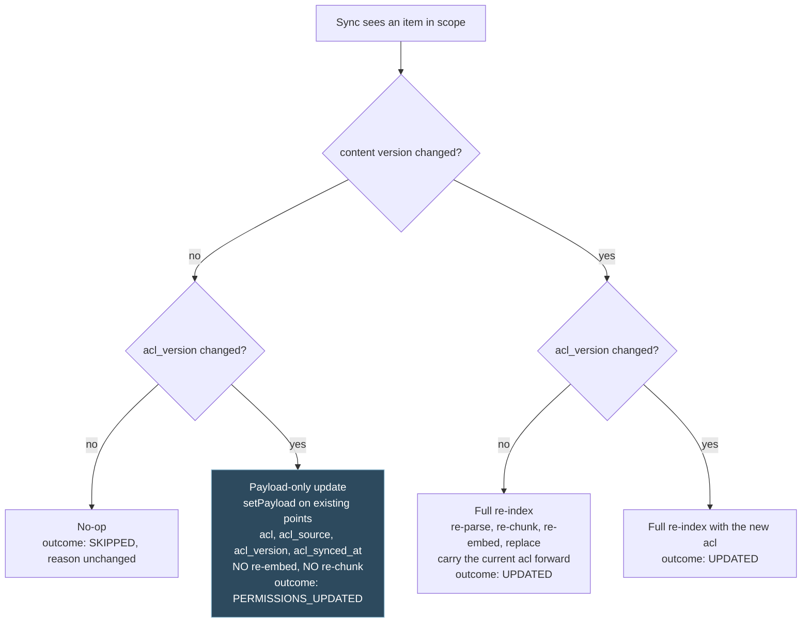

## Context

Documents enter the RAG knowledge base through exactly two hand-driven paths today:

1. `POST /api/v1/ingestion/upload` (`controller/IngestionController.java`): multipart upload, filename sanitization (`util/IngestionSecurity`), Tika MIME sniffing against `app.ingestion.upload.allowed-mime-types`, then a `StorageService` write into MinIO under `markdown/` or `documents/`.
2. Out-of-band drops into the MinIO bucket followed by `POST /api/v1/ingestion/run`. `service/ingestion/ManualIngestionService.java` scans the bucket, dedupes on ETag via a `ConcurrentMetadataStore` (`manual-ingestion:<key>:<etag>` markers), and pushes content through `IngestionService` / `DocumentRouter` into Qdrant.

A Spring Integration S3 poller exists (`config/IngestionPipelineConfig.java`) but is disabled by default (`app.ingestion.auto.enabled=false`). Downstream parsing is already rich: `DocumentRouter` routes to the markdown parser, Docling, PaddleOCR, or Unstructured, with per-page PDF classification. There is no connector or sync concept anywhere in the codebase.

This change layers automated source sync on top, without touching the parse path.

Permission-aware retrieval is settled design, recorded in `docs/architecture/permission-aware-retrieval.md` and in ADR-M004 through ADR-M009 under `docs/architecture/decisions/`. That design splits into three halves: a verified caller with resolved group principals (`add-auth-and-identity`), a filter composed into the vector search over an `acl` payload field (`add-tenant-isolation`), and the capture of that `acl` field from a real source at sync time. The third half is this change, and it is the half without which the other two are correct and empty. Capture is therefore in scope from the first sync a connector ever performs, not bolted on afterwards: adding an access list later means reprocessing every document already ingested, and the reason this is being settled now is that nothing is built yet.

**Dependencies on sibling changes** (their scope is not re-specified here):

- `add-auth-and-identity`: provides the ADMIN role that guards the connector API, the authenticated principal recorded on connector mutations, the `namespace:type:id` principal format and its typed factory, and the `oid` directory identifier that Graph permission entries are compared against.
- `add-tenant-isolation`: provides the tenant prefix under which connector-fetched objects land in MinIO, the tenant metadata carried into Qdrant chunks, the `acl` / `acl_source` / `acl_version` / `acl_synced_at` metadata keys, the mandatory keyword payload index on `acl`, the `tenant:everyone:{tenantId}` pseudo-group, and the filter composition that reads all of it. Connector configuration rows are tenant-scoped using the same tenant key.
- `add-document-management-api`: owns the document metadata/status model and the single-document deletion machinery (MinIO object + Qdrant chunks + metadata row). Deletion propagation in this change calls that path; it does not build its own.
- `add-usage-metering-and-quotas`: owns the encryption-at-rest mechanism (BYOK key handling). Connector client secrets are stored with the same mechanism family; this change consumes it, it does not re-specify encryption.

## Goals / Non-Goals

**Goals:**

- A provider-agnostic connector framework: per-tenant persisted configuration, scheduled + on-demand incremental sync, sync-run history with per-file outcomes, deletion propagation, ADMIN CRUD API.
- Per-item access-list capture from the first sync onwards: the effective permitted principals for every in-scope item, carried through the landing contract onto every chunk that item produces, so retrieval has something to filter on.
- Detection of a permission-only change, meaning sharing moved while the bytes did not, and a payload-only update path that applies it without re-parsing or re-embedding.
- First concrete connector: SharePoint/OneDrive via Microsoft Graph with client-credentials auth, delta-query incremental sync, item-permission reads, site/drive/folder scoping, allowlist-aligned file filtering, and Graph-compliant throttling behaviour.
- Connectors land bytes plus an access list, and trigger the existing pipeline. Nothing else.

**Non-Goals:**

- **Google Drive, Confluence, and network-share connectors.** Named follow-ons, explicitly out of scope. The framework interfaces (`DocumentConnector`, `AccessListSource`, per-connector `ConnectorType`, credential-reference indirection, per-connector cursor storage) are designed so each of these is an additive implementation plus a Liquibase enum value, no framework rework. See D17 for why Google Drive would in fact be the cheaper connector to make permission-correct, and why SharePoint still goes first.
- Any new parsing capability. `DocumentRouter` and its parsers are untouched.
- Real-time (webhook/subscription-based) change notification. First iteration is polling via scheduled delta sync; Graph change notifications are a later optimisation.
- The retrieval side of permission-aware retrieval. Composing `acl` into the `SearchRequest`, the deny-by-default rule for a chunk with no list, the payload index, the metadata key definitions, and the presign re-check all belong to `add-tenant-isolation`. This change produces the field; it does not read it at query time.
- Group membership resolution, the principal identifier format and its factory, the Redis principal cache, and the cross-provider identity link. All `add-auth-and-identity`. This change consumes the factory and never assembles a principal string itself.
- Per-user access lists. Access lists name groups only, decided in ADR-M007. A connector that finds a permission granted to an individual person records that fact as a capture outcome and does not expand it into the list.
- The administrator assignment surface for access lists on direct uploads. That is the Shape 2 deployment in `docs/architecture/permission-aware-retrieval.md`, and it is an open question there rather than something a connector change can settle.
- User-delegated (on-behalf-of) Graph auth. Client credentials only.
- Encryption mechanism design, consumed from `add-usage-metering-and-quotas`.
- Single-document delete mechanics, consumed from `add-document-management-api`.

## Decisions

### D1: Connector → MinIO plus access list → existing pipeline; no parallel parse path

A connector's contract has two halves and it is not satisfied by either one alone.

The first half is bytes. The source file's bytes are written to MinIO under the tenant prefix (markdown to the markdown folder, everything else to the documents folder, same routing rule as `IngestionController.determineFolder`) and the existing ingestion scan is triggered for the affected prefix. Parsing, chunking, and embedding stay the existing pipeline's job.

The second half is the access list. For every in-scope item the connector also produces an `AccessList`: the set of principals permitted to read it, the `acl_source` naming which producer decided it, the `acl_version` hash of the sorted set, and the capture timestamp that becomes `acl_synced_at`. That list travels alongside the bytes to the point where chunk metadata is assembled, and every chunk the item produces carries it.

Bytes in a bucket cannot express who may read them. An object key and an ETag say nothing about sharing, so a landing contract that ends at the MinIO write has no way to deliver the one field retrieval needs, and any later attempt to attach it is a second pass over content that has already been embedded. The two halves are produced by the same capture, in the same run, against the same source item, or they are not consistent with each other.

*Why:* one parse path means one set of parser bugs, one dedup semantics, one metrics surface. The alternative, connectors calling `IngestionService` directly with in-memory streams, would bypass the dedup and the MinIO source-of-truth, and would make the `add-document-management-api` metadata model inconsistent (documents in Qdrant with no MinIO object).

*Consequence:* connector-fetched files pass the same hygiene as uploads, filename sanitization from `util/IngestionSecurity` and MIME sniffing against `app.ingestion.upload.allowed-mime-types`, applied by the framework before the MinIO write, so a compromised or misconfigured source cannot smuggle disallowed content types past the controller-level checks.

*Consequence:* an item whose bytes land and whose access list does not is a failed item, not a partially successful one. Under the deny-by-default rule in ADR-M006 a chunk with no list is invisible, so landing bytes without a list buys storage cost and no retrievability. The framework fails the item, records the reason, and does not trigger ingestion for it.

### D2: Framework shape: `DocumentConnector` interface + sync orchestrator

- `DocumentConnector` (interface, `service/connector/`): `ConnectorType type()`, `ChangeSet fetchChanges(ConnectorConfig, SyncCursor)` returning added/modified/deleted entries plus the next cursor. Each entry carries the source item id, path, content version, and the captured `AccessList` for that item. Implementations are stateless; all state lives in the database.
- `AccessListSource` (interface, `service/connector/acl/`): `AccessList capture(ConnectorConfig, SourceItemRef)` and `Map<SourceItemRef, AccessList> captureForContainer(ConnectorConfig, SourceContainerRef)`. Kept separate from `DocumentConnector` because capture has its own throttling profile, its own failure modes, and its own schedule (D8), and because a source can be readable for content and unreadable for sharing. A connector without a working `AccessListSource` is a connector whose documents are invisible, which needs to be a legible failure rather than a silent one.
- `ConnectorSyncOrchestrator` (framework): loads due connectors, resolves credentials, calls `fetchChanges`, evaluates the four-way branch in D11, applies hygiene, MinIO writes, access-list attachment, payload-only updates, and deletion propagation, records the sync run and per-file outcomes, persists the new cursor **only after** the run completes; a failed run keeps the previous cursor so the next run retries the same window.
- Scheduling via Spring's `@Scheduled` tick (every minute) that scans for connectors whose `next_run_at` has passed, guarded by `ShedLock`-style DB row locking (`SELECT ... FOR UPDATE SKIP LOCKED` on the connector row) so multiple agent instances never double-sync one connector. Per-connector schedule stored as a cron expression.

*Why not Quartz:* a full scheduler dependency for "run N connectors on a cron" is overkill (KISS); the DB-row claim gives multi-instance safety without extra infrastructure. *Why not Spring Integration poller reuse:* `IngestionPipelineConfig` polls one bucket with one filter; connectors need per-source cursors, credentials, permission capture, and run history, which is a different problem.

### D3: Data model (Liquibase, new changelog in `db/changelog/`)

Five tables, all tenant-scoped:

- `connector`: id (UUID), tenant id, type (enum string, first value `SHAREPOINT`), display name, credentials reference (FK/opaque handle into the encrypted credential store from `add-usage-metering-and-quotas`), source scope (JSONB: site/drive/folder identifiers, provider-specific shape validated by the connector implementation), cron schedule, permission confirmation interval, access-list maximum age, enabled flag, created/updated audit columns, `next_run_at`.
- `connector_sync_run`: id, connector FK, trigger (`SCHEDULED` | `MANUAL` | `PERMISSION_SWEEP`), status (`RUNNING` | `SUCCEEDED` | `PARTIAL` | `FAILED`), started/finished timestamps, counters (added / updated / permissions-updated / deleted / skipped / failed), error summary.
- `connector_sync_file_outcome`: id, sync-run FK, source item id, source path, action (`ADDED` | `UPDATED` | `PERMISSIONS_UPDATED` | `DELETED` | `SKIPPED` | `FAILED`), MinIO key, the `acl_version` this outcome wrote, failure reason (nullable).
- `connector_sync_cursor`: connector FK (+ per-drive discriminator for SharePoint, since Graph issues one delta token per drive), opaque content cursor value, `permissions_confirmed_through` timestamp, `permissions_cursor` (nullable opaque value for sources that offer a permission-side delta), updated timestamp. The content cursor and the permission confirmation state advance independently, because a content feed with nothing to report says nothing about whether sharing moved.
- `connector_item_acl`: connector FK, source item id, MinIO key, `acl_version`, `acl_synced_at`, the container id the list was inherited from (nullable, D9), and the captured principal list. This is the connector-side record of what was last written onto that item's chunks. It exists so the four-way branch in D11 can compare against a stored value without reading Qdrant per item, and so the staleness sweep in D14 has something cheaper than the vector store to scan.

*Why JSONB scope instead of typed columns:* each provider scopes differently (SharePoint: site/drive/folder; Google Drive: shared-drive/folder; Confluence: space). A typed-per-provider table set would multiply migrations per connector; a JSONB blob validated by the owning connector keeps additions additive (OCP).

*Why a connector-side access-list record at all:* the authoritative copy of an access list is the chunk payload in Qdrant, and it stays that way. Reading it back per item per run would mean a Qdrant round trip for every file in a large drive on every sync, on the sync path, to answer a question a local row answers for free. The row is a cache of what was written, reconciled by the sweep, and the sweep is what catches it drifting.

### D4: SharePoint sync via Graph delta queries

- Auth: MSAL-style client-credentials flow per tenant (Entra ID app registration; tenant id + client id + encrypted client secret in the credential store). Token cached in memory until expiry; never persisted, never logged.
- Change detection: `GET /drives/{drive-id}/root/delta` (scoped to configured folders by filtering returned paths). First run is a full enumeration (delta with no token); subsequent runs pass the stored `deltaLink` token and receive only created/modified/deleted items. Deleted items arrive as entries with a `deleted` facet.
- Scoping: configured sites are resolved to drives via `GET /sites/{site-id}/drives`; folder scoping filters delta results by path prefix. Items outside scope are ignored (not recorded as skipped, they are not part of the connector's universe).
- Filtering: file MIME (from Graph item metadata, re-verified by Tika sniff before the MinIO write per D1) must be in `app.ingestion.upload.allowed-mime-types`; file size must not exceed the connector's size limit (default aligned with the multipart limits from `ingestion-security`). Filtered files are recorded as `SKIPPED` with reason.
- Throttling: on HTTP 429 or 503 with `Retry-After`, sleep the advised interval; without the header, exponential backoff with jitter, bounded retries per request and a bounded total-throttle budget per run. Exceeding the budget ends the run as `PARTIAL` with the cursor unadvanced past the completed window. This follows Microsoft's published throttling guidance for Graph.

*Why delta queries over full listing + diff:* delta is the Graph-native incremental mechanism, server-side change tracking, one round trip per page of changes, deletions included. Full listing per sync would hammer both Graph (throttling) and our comparison logic, and cannot see deletions without keeping a full remote-inventory shadow ourselves.

*What delta does not do:* it does not reliably report a permission change on an item whose content did not change, and it does not report a permission change made higher in a folder tree as a change on each descendant. That is D8's problem, and delta is not its solution.

### D5: Deletion propagation reuses `add-document-management-api`

When a delta entry carries the deleted facet, the orchestrator maps source item to MinIO key (recorded in the file-outcome history, in `connector_item_acl`, and in the document metadata model owned by `add-document-management-api`) and invokes that change's single-document deletion path, which removes the MinIO object, the Qdrant chunks for that source, and the metadata row. The `connector_item_acl` row for the item is removed in the same step, so the staleness sweep does not later find a record with no document behind it. This change adds only the mapping and the trigger; if `add-document-management-api` has not shipped, this change is blocked on it (declared dependency, not an inline re-implementation).

### D6: Credentials: reference, not value

The `connector` row stores an opaque credentials reference; the secret material lives in the encrypted credential store from `add-usage-metering-and-quotas` (same mechanism family as BYOK provider keys). API responses never echo secrets (write-only field); logs and sync-run records carry the reference only. Rotating a secret is an update through the credential store with no connector-table change.

### D7: Access-list capture is per in-scope item, and it is not optional

Every item a connector lands carries a captured `AccessList`. The list is the set of principals permitted to read that item, expressed in the `namespace:type:id` format from `add-auth-and-identity` and produced through that change's typed factory, never by string concatenation here.

The captured list is written by the framework onto the chunk metadata for that item, populating the four keys `add-tenant-isolation` defines: `acl` (the sorted principal set), `acl_source` (which connector produced it, for example `sharepoint`), `acl_version` (the hash defined in D10), and `acl_synced_at` (the epoch second at which the source was asked, not the second at which the list last changed).

Two rules make the field trustworthy rather than merely present.

Capture failure fails the item. If the source refuses the permission read, returns a permission collection the connector cannot interpret, or returns a partial collection because the granted application permission is too narrow to see all of it, the item's outcome is `FAILED` with the capture reason. No chunk is indexed for it, and bytes already landed for it in this run do not trigger ingestion. An item that is invisible because capture failed is a line in the run history with a file name on it. An item that is invisible because an empty list was written silently is a support ticket about search finding nothing.

An empty list and a failed capture are different things and must never be conflated. A source can legitimately report that no group may read an item, and that is an empty list, deliberately written, making the item invisible to group-based retrieval by design. A source that refused to answer produced no list at all. The first is `ADDED` with an empty `acl`, the second is `FAILED`. The outcome row is what tells an operator which happened.

### D8: Effective permissions are read from the source, never inferred from the content feed

The connector asks the source what an item's effective permissions are. It does not derive them from the change feed, and it does not treat an item's absence from the change feed as evidence that its permissions are unchanged.

Sources are inconsistent about this in two specific ways, and both break inference.

They are inconsistent about reporting permission edits at all. A sharing change on an item whose bytes did not change may or may not appear in a delta response, depending on the source, the kind of change, and the API version. A pipeline that reads "not in the delta" as "permissions unchanged" is correct exactly as often as the source happens to be generous, and there is no way to know which case a given customer is in without asking the source directly.

They are inconsistent about inherited changes. Revoking a group's access to a folder changes the effective permissions of every item beneath it, and sources generally report that as one change on the folder rather than as a change on each descendant. A pipeline reading only the item-level feed sees a folder event, has no item to act on, and leaves every document in the tree carrying an access list that stopped being true.

So capture runs on its own trigger, not on the content feed's. Every sync run confirms permissions for the items whose confirmation is due, whether or not those items appeared in the content delta, and records the confirmation time in `permissions_confirmed_through` on the cursor. Content progress and permission progress are two separate things and the run advances them separately.

This is the decision that makes `acl_synced_at` mean what ADR-M004 says it means: when the list was last confirmed against its source, not when it last changed.

### D9: Folder-level inheritance, so capture is not one call per document

Asking the source for the permissions of every item individually is correct and unusable. A first full enumeration of a large drive is tens of thousands of items, one throttled call each, against a per-tenant throttling budget that already constrains the content sync. The first sync would either take days or spend its whole budget on permission reads and land no documents.

Capture is therefore container-first.

The connector reads permissions for the container, meaning the drive root and each folder in scope, and records the resulting list against that container. An item that inherits its container's permissions, which is the overwhelming majority of items in a normal corpus, takes the container's captured list with no call of its own, and its `connector_item_acl` row records the container it inherited from. A per-item call is made only for an item the source marks as having permissions of its own, which sources do expose: Graph marks an inherited permission entry with `inheritedFrom`, so an item whose permission collection contains an entry without that marker has something unique and is read individually.

This turns a first full enumeration from one call per document into one call per folder plus one call per genuinely uniquely-shared document. On a corpus where sharing is set at team-folder level, which is how companies actually work, that is orders of magnitude fewer calls.

Two consequences follow and both are load-bearing.

A container's permission change invalidates every item that inherited from it. That is the point: one folder read detects a revocation affecting a thousand documents, and the run then performs a thousand payload-only updates, which are cheap, rather than a thousand permission reads, which are not. The container reference on the `connector_item_acl` row is what makes that fan-out a local query.

An item that stops inheriting, meaning somebody set a unique permission on it between runs, has to be detected. A container read alone cannot see it. Detection is the per-item confirmation schedule from D8: an item whose confirmation is due is read individually regardless of what its container said, so an item that quietly acquired unique permissions is corrected within one confirmation interval rather than never.

### D10: Deduplication key is content version paired with access-list version

`ManualIngestionService` builds its marker as `manual-ingestion:<key>:<etag>` and skips the object when the marker exists. The ETag hashes content. Unchanged bytes produce an unchanged ETag, produce a marker hit, produce a skip. A permission-only change is by definition an unchanged file, so under a content-only key the most common permission event in any company is structurally invisible.

The key becomes the pair: `manual-ingestion:<key>:<contentVersion>:<aclVersion>`.

`contentVersion` is the ETag exactly as today. `aclVersion` is a stable hash of the sorted principal list, and the sorting is what makes it stable: a source that returns the same permitted set in a different order produces the same hash and is correctly read as no change. Two items sharing a permitted set share a version, which is what makes the container-level comparison in D9 a single equality rather than a set diff.

A permission-only change produces a new key, so the object is processed. A genuine no-op produces a key hit and is still skipped. Nothing about the content path changes.

The hash is taken over a canonical form: principals sorted lexicographically and joined with a separator that cannot occur inside a principal, which the format constraints in `add-auth-and-identity` already guarantee.

### D11: The four-way branch, and the payload-only update path

A run compares two versions for every item it touches, and there are four outcomes, not two.

The path that matters is the one where content is unchanged and the access list is not. Re-embedding a 200-chunk document to change one keyword array is the difference between a revocation taking seconds and a revocation taking an hour, and during that hour the revoked group can still retrieve the document. It also spends an embedding API call per chunk on a change that touched no text.

Spring AI's `VectorStore` abstraction cannot express this. It offers `add` and `delete`, and `add` means embed. The payload-only path therefore uses the native Qdrant client's `setPayload` against the points whose payload already identifies that source, updating exactly the four access-list keys and touching nothing else. The Qdrant client is already a declared dependency in `AscendAgent/build.gradle.kts` as `libs.qdrant.client`, so this is a second and narrower use of a dependency that is already present, not a new one.

The update carries the same tenant predicate every other Qdrant operation carries, so it can never reach across tenants, and it names the four access-list keys explicitly rather than replacing the payload, so it cannot drop `source`, `type`, `title`, or `tenant_id` by omission.

### D12: The `PERMISSIONS_UPDATED` outcome, and permission confirmation state on the cursor

The existing per-file actions, `ADDED`, `UPDATED`, `DELETED`, `SKIPPED`, `FAILED`, all describe indexing. A run that touched an item, changed something that matters, and indexed nothing is none of them. Recording it as `UPDATED` claims a re-index that did not happen; recording it as `SKIPPED` claims nothing happened while a revocation was taking effect.

`PERMISSIONS_UPDATED` is added, carrying the `acl_version` that was written. It is not bookkeeping. It is how an operator tells "the sync is working and permissions moved" from "the sync did nothing", and a flat zero on that counter across a customer with active sharing changes is the signal that permission capture has stopped while the content sync still looks healthy.

The cursor gains permission confirmation state for the same reason. A cursor holding only a content delta token records how far the content feed has been consumed and says nothing about whether permissions were ever confirmed, so a connector whose permission reads have failed for a week looks identical to one fully up to date. `permissions_confirmed_through` is the timestamp through which items in this connector's scope have had their permissions confirmed, and it advances only when confirmation actually happened. It is what the staleness sweep in D14 measures and what the access-list-age metric reports.

### D13: An over-long access list is a capture failure, never a truncation

The cap is 64 principals per list, matching ADR-M004 and ADR-M007. An item whose permitted set exceeds it fails capture: outcome `FAILED` with a cap reason, no chunk written with a shortened list, and no chunk for that item retrievable.

Truncating an allow list silently denies people access they actually have. The symptom is a person who cannot find a document they can open in SharePoint, and that symptom is indistinguishable from a bug in retrieval, in embedding, in chunking, or in the model. It costs a debugging session across four subsystems. A capture failure costs a line in a sync history with a file name attached. There is no version of quietly dropping the last few principals that is cheaper to operate than that.

This is also why the cap check runs before the MinIO write and before the dedup key is recorded, so a capped item leaves no half-state a later run reads as complete.

### D14: Staleness sweep, and administrator-triggered immediate resync

Two controls make the staleness window in ADR-M004 operable rather than merely disclosed.

The sweep. A scheduled job scans `connector_item_acl` for rows whose `acl_synced_at` is older than a configured maximum age, and for each one empties the `acl` on that item's chunks through the same payload-only path as D11, recording the outcome. Under deny-by-default an emptied list makes the document invisible immediately.

That is a deliberately blunt control, and the bluntness is the design. If permission capture stops silently, whether by a revoked client secret, a delta token stuck in a resync loop, a scheduler that never fires, or an administrator removing a Graph permission, the alternative to the sweep is a corpus that keeps answering from permissions frozen at the moment capture died, with nothing anywhere indicating a problem. A product that goes quiet is a support ticket on the first day. A product that keeps answering from permissions that stopped being true is an incident discovered by whoever it harmed. The sweep chooses the first.

The maximum age is configured per connector with a platform default, and it has to be comfortably larger than that connector's confirmation interval or a healthy connector sweeps its own documents. The framework rejects a configuration where the maximum age is not at least a stated multiple of the confirmation interval, because that particular misconfiguration is silent right up until it empties a corpus.

The immediate resync. The trigger-sync-now endpoint already exists in this change for content. It gains a permissions-only mode: confirm permissions across the connector's scope now, apply payload-only updates, and do not touch content. When somebody revokes access to a document and needs it to take effect now, they must not have to wait for a cron tick, and they must not pay a full content re-enumeration to get a permission refresh.

### D15: Application permissions wide enough to read sharing

The Azure app registration a customer administrator creates needs grants for two different things, and the content grants alone do not cover the second.

Reading an item's effective sharing is covered by the content grants. Microsoft's reference for listing the permissions of a `driveItem` gives, for application permission type, a least-privileged permission of `Files.Read.All` and higher-privileged alternatives of `Files.ReadWrite.All`, `Sites.Read.All`, and `Sites.ReadWrite.All`. `Sites.Read.All` is what this change asks for, because that one grant covers site and drive enumeration, item content, and the permission collection.

Turning a permission entry into a principal is not covered. A permission entry names an identity, and mapping that identity onto an `entra:group:<object id>` principal means reading directory group objects. Microsoft's reference for a group's transitive members gives, for application permission type, a least-privileged permission of `GroupMember.ReadBasic.All`, with `Directory.Read.All`, `Group.Read.All`, and `GroupMember.Read.All` among the higher-privileged alternatives. None of `Files.Read.All`, `Sites.Read.All`, or `Sites.ReadWrite.All` grants any of that. An app registration holding only the content grants can read a permission collection and cannot confirm that the group it names exists, is a security group, or carries the object id it appears to carry.

The grant this change documents is therefore `Sites.Read.All` plus `GroupMember.Read.All`, both application permissions, both admin-consented. `Sites.Selected` is the genuinely least-privileged content alternative and is noted in the setup guide, with the caveat that it is granted per site by an administrator and that a site added to a connector's scope without that grant fails capture rather than syncing without permissions.

The failure this decision exists to prevent is specific and quiet. Microsoft's own note on listing item permissions says the collection may not be available to every caller and that a non-owner caller receives only the permissions that apply to it. An app registration with an insufficient grant therefore does not necessarily get a clean authorization error. It can get a short list. A capture that accepts a short list writes a narrower access list than the truth and silently denies people, which is D13's failure mode arriving through a different door. Capture therefore treats an unexpectedly empty or unattributable permission collection on an item it can otherwise read as a capture failure, not as an empty list.

### D16: Source identifiers are principals only when one directory backs both the login and the files

The existing scoping design assumes an identifier the source hands back is directly meaningful to the rest of the system. That holds in exactly one case: the customer's login provider and their file store are the same vendor's directory, so the group object id on a SharePoint permission entry is the same object id that appears in the token's group claim. That is Shape 1 in `docs/architecture/permission-aware-retrieval.md`, and it is the common case.

It does not hold otherwise, and a connector that assumes it produces principals nobody holds. A group identifier from a Google Drive permission means nothing to a caller whose principals came from Entra ID, and the resulting access list is syntactically valid, semantically empty, and looks entirely normal in the payload.

So capture states its assumption rather than relying on it. A connector declares the directory namespace it emits principals in. Where that namespace matches the tenant's login directory, the identifiers are used directly. Where it does not, the principals are still captured and still written, and they become meaningful to a caller only through the cross-provider identity link owned by `add-auth-and-identity`, which is what resolves a person's principals across both providers. Nothing here reimplements that join. Capture's job is to emit correctly-namespaced principals and to be honest about which namespace they are in.

A permission entry naming an identity the connector cannot map into a known namespace is a capture failure for that item, per D7. It is not silently dropped, because a dropped entry is a narrowed allow list, which is D13's failure again.

### D17: SharePoint stays the first connector, though Google Drive is the cheaper one to make permission-correct

Worth writing down, because once the permission requirement is added the ordering looks arbitrary, and it is not.

Google Drive's change feed returns the changed file as a File resource, and that resource carries its permission list, so one request can return the change and the effective permissions together. Microsoft Graph's drive delta returns item metadata without permissions, and the permission collection is a separate request per item. That single difference is the entire reason D9 exists: the folder-inheritance optimisation is work a Google Drive connector would largely not need, because the expensive thing it avoids is not expensive there.

On permission correctness alone, Google Drive is therefore the connector to build first, and the usual reasoning that put SharePoint first, that it is where EU corporate documents live, argues the other way.

SharePoint still goes first, for two reasons that survive the inversion. The customers this is being built for are on Microsoft, so a Google-first ordering delivers a correct connector to nobody who asked for one. And the harder capture path is the one that shapes the framework: an `AccessListSource` abstraction designed against a source needing container-level inheritance, per-item exceptions, throttling budgets, and a separate confirmation schedule will accommodate a source that hands permissions back for free, whereas the reverse produces an abstraction that assumes permissions are cheap and gets reworked the moment it meets Graph.

The cost is accepted knowingly: the first connector is the one where getting permissions right is the most work, so it is the one most likely to ship late.

## Risks / Trade-offs

- [Graph throttling on large tenants, initial full sync of a big site can hit 429 storms] → delta paging with `Retry-After` compliance, bounded per-run throttle budget, `PARTIAL` status with resumable cursor; document in `docs/CONNECTORS.md` that the first sync of a large site can take multiple runs.
- [Permission reads multiply the throttling problem, since every item could be a second call] → container-first capture per D9 makes the common case one call per folder, with per-item calls only for items the source marks as uniquely shared and items whose confirmation is due. The permission budget is separate from the content budget so a permission storm cannot starve document landing, and exhausting either ends the run `PARTIAL` rather than failing it.
- [The confirmation interval is the real revocation latency, and it is a number a customer is told] → per-connector configuration with a stated default, printed in `docs/CONNECTORS.md` next to the staleness table, with the immediate-resync trigger from D14 as the answer for a revocation that cannot wait for it.
- [Staleness sweep empties a healthy corpus because the maximum age was configured below the confirmation interval] → the framework refuses that configuration at validation time rather than discovering it at sweep time, and the sweep records a `PERMISSIONS_UPDATED` outcome per emptied item so the event shows up in run history rather than only in the absence of search results.
- [Payload-only update writes to Qdrant outside the pipeline, which the landing contract otherwise forbids] → the carve-out is explicit in the spec rather than an unstated exception, it is limited to the four access-list keys on points that already exist, it carries the tenant predicate, and it can neither create, delete, nor re-embed a point.
- [The connector-side access-list cache drifts from the chunk payload, so the branch in D11 compares against a stale local value and skips a real change] → the sweep reconciles by age rather than by trust, and a full re-enumeration re-confirms every item in scope, so the cache is an optimisation whose worst case is an extra payload write, never a missed revocation that outlives the maximum age.
- [Delta token invalidation (Graph returns `410 Gone` / `resyncRequired`)] → orchestrator resets the content cursor and performs a full re-enumeration, and the dedup key from D10 makes re-landing unchanged bytes under an unchanged list a no-op, while an item whose sharing moved during the outage is picked up as a permission-only change rather than skipped.
- [Deletion propagation ordering, file deleted and re-added between syncs] → process delta entries in Graph-returned order per item id, since Graph collapses per-item history in a delta page, so the last state wins. A re-added item captures permissions fresh rather than inheriting the pre-deletion list.
- [Filename collisions, two source files sanitize to the same MinIO key] → connector keys include a source-scoped path segment (sanitized relative path, not just the leaf name) under the tenant prefix; collisions within one connector then require identical relative paths, which the source itself forbids. A collision would also merge two access lists, which is why the key rule is a correctness requirement here and not only a tidiness one.
- [Scheduler drift with multiple agent instances] → DB-row claim (`FOR UPDATE SKIP LOCKED`) makes each due connector run exactly once per due tick, and the same claim covers the sweep so two instances cannot both empty the same lists.
- [Secret leakage via logs or API echoes] → write-only credential fields, reference-only persistence, explicit test asserting no credential material appears in logs at any level during a sync (including failure paths).
- [Access lists are themselves sensitive, since they name who may read what] → run history exposes `acl_version` and counters, never the principal list, which is readable only through the document management surface under the same ADMIN guard as the rest of the connector API.
- [Sibling-change coupling, this change cannot ship before its four dependencies] → declared up front, and the framework compiles against interfaces those changes define, and `tasks.md` states which tasks are blocked and by what.

## Migration Plan

1. Liquibase changelog adds the five tables; purely additive, no existing-table changes, rollback = drop tables.
2. Framework + SharePoint connector ship dark: no connector rows exist until an ADMIN creates one, so default behaviour is byte-identical to today.
3. Access-list capture is on from the first sync of every connector. There is no phase in which a connector runs without it and no backfill pass afterwards, because a backfill means reprocessing documents that are already embedded. Documents ingested before this change through the manual upload paths are handled by the one-shot `tenant:everyone:{tenantId}` stamp that `add-tenant-isolation` already performs, and connector-landed documents never exist in an unstamped state at all.
4. Disabling a connector stops scheduling immediately, including its permission confirmation. Its already-landed documents keep their last-confirmed lists and age normally, so a connector left disabled past the maximum age has its documents emptied by the sweep. That is intended: a disabled connector is a connector whose permissions are no longer being confirmed.
5. Deleting a connector removes its configuration, cursors, item access-list records, and run history but leaves already-ingested documents in place (removal is an explicit document-management operation, not a side effect of connector deletion). Those documents keep the lists they were last given and are no longer refreshed, so they age out under the sweep like any other unconfirmed content.
6. Rollback: disable connectors (or feature-flag the scheduler off via a property), then revert code; tables can stay (inert) or be dropped with the changelog rollback. Access lists already written onto chunks are inert under a rollback that also reverts `add-tenant-isolation`, and remain correct under one that does not.

## Open Questions

1. Should sync-run history have a retention policy (row count or age cap per connector), or is unbounded history acceptable for the first iteration? Default proposal: cap at the last 50 runs per connector, prune on write. Permission-driven runs make this more pressing, since confirmation happens whether or not content changed.
2. Does `add-tenant-isolation` expose the tenant MinIO prefix as an injectable component this change can call, or is the prefix convention-only? To confirm when that change's design lands; the orchestrator assumes an injectable prefix resolver.
3. The default permission confirmation interval, and therefore the default upper bound on how long a revocation at the source takes to reach retrieval. This is a number stated to a customer rather than picked to look reasonable in a configuration file, and it trades directly against Graph throttling on large tenants. Open question 2 in `docs/architecture/permission-aware-retrieval.md` is the same question, and this change should not answer it unilaterally.
4. How anonymous and anyone-with-the-link sharing maps to an access list. Both plausible mappings are wrong for somebody: mapping it to `tenant:everyone:{tenantId}` makes a document the customer shared publicly retrievable by their whole company, and mapping it to nobody makes a genuinely open document invisible. This is open question 3 in `docs/architecture/permission-aware-retrieval.md`. The shape proposed here is a per-connector setting with a deliberate default, and the default is what is undecided. Until it is settled, a link-type permission entry is unmappable, which under D16 fails capture for that item, so the behaviour is loud rather than arbitrary.
5. Whether an item granted directly to individual people, with no group entry at all, should fail capture or produce an empty list. ADR-M007 rules out expanding it into the list, and both remaining options are defensible: failing is honest and noisy on a corpus with many personally-shared files, empty is quiet and correct under deny-by-default. Proposed default is an empty list with a distinct capture reason recorded on the outcome, so the count is visible without every such file failing a run.
6. Whether the Google Drive change feed's inline permissions hold under the partial-response field selection a connector would actually use. The Drive change resource carries the File resource and the File resource carries a permissions array, which is the basis for D17, but that was not confirmed against the `changes.list` reference itself. It needs verifying before a Google Drive connector is planned, since D17's ordering argument rests on it.

## Decision Records

Decisions this change makes that go beyond the monorepo records ADR-M004 through ADR-M009 are written up under `decisions/`. See `decisions/README.md` for the index and for where those files land when the change is archived.
